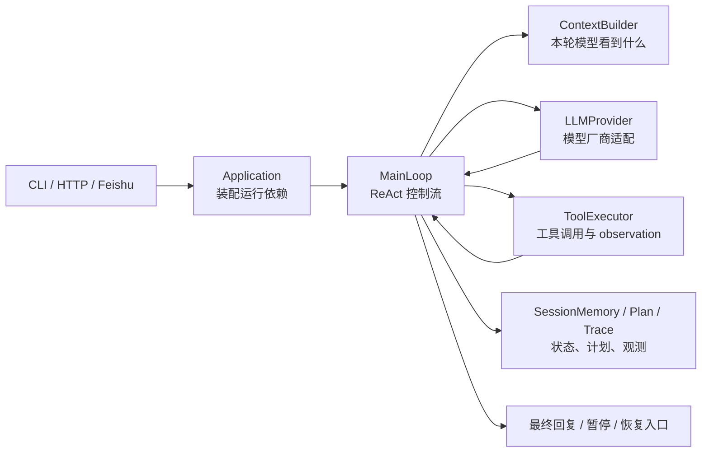
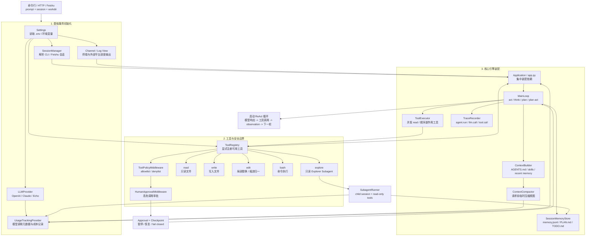

欢迎来到 `tiny-claw` 的架构教程。

这套教程不是为了教你用几行代码包一个聊天接口，也不是为了把所有能力塞进一个巨大 Agent 类里。它要回答的是一个更工程化的问题：当大模型开始读取文件、修改代码、执行命令、接入外部平台，并在长任务中持续运行时，我们应该怎样给它一套可控、可恢复、可观察的运行环境？

在这个教程里，我们把这套运行环境称为 Harness（驾驭工程 / 管控运行时）。模型负责推理和生成意图，Harness 负责把这些意图安全地放进真实工作区：管理上下文、暴露工具、隔离会话、保存计划、拦截高危操作、记录运行轨迹。

`tiny-claw` 是这套思想的 Python CLI 骨架实现。它小，但不是玩具；它刻意把边界做清楚，让每个新增能力都有自己的位置。

## 为什么需要重新搭一套底座

很多 Agent 原型一开始都很顺利：拼一个 system prompt，调用一个模型 SDK，再给模型几个工具，一个 demo 很快就能跑起来。

真正的问题通常出现在第二阶段。

- 模型读了几个大文件后，上下文开始膨胀，下一轮回答忽然变钝。
- 工具越来越多，模型每轮都看到一大串能力说明，反而不知道该用哪个。
- 运行状态只存在内存里，任务中断后人类无法接手，也无法恢复。
- 文件编辑、命令执行、外部平台回调混在主循环里，一个小改动可能影响整个 runtime。
- 高危工具调用需要人工审批，但 HTTP 请求和聊天平台事件不能一直阻塞等待。
- 真实模型调用、工具结果、审批恢复、Subagent 探索散落在日志里，很难还原一次运行到底发生了什么。

这些问题不是多写几句 prompt 就能解决的。它们本质上是运行时边界问题。

`tiny-claw` 的出发点是：不要先追求一个无所不能的上层框架，而是先把 Agent 的物理世界拆清楚。入口是入口，装配是装配，主循环是主循环，Provider 是 Provider，工具是工具，状态是状态，外部平台是外部平台。

## tiny-claw 的核心判断

`tiny-claw` 的架构围绕四个判断展开。

第一，入口必须薄。CLI、HTTP、Feishu 只负责把外部请求转成一次 `Application.run()`，不能把业务逻辑写进入口层。

第二，主循环必须稳定。`MainLoop` 只协调上下文、模型、工具、记忆和停止条件，不直接理解 OpenAI/Claude SDK，也不实现具体工具。

第三，状态必须外部可见。session memory、`PLAN.md`、`TODO.md`、approval checkpoint、trace JSON 都应该落在可检查的位置，而不是被藏在复杂对象里。

第四，工具必须默认受控。模型能看到什么工具、能不能写文件、什么时候暂停审批，都应该由运行时边界决定，而不是靠模型自觉。

这也是整套教程的主线：从最小 CLI 骨架出发，一步一步搭出一个能运行、能行动、能恢复、能接入平台、能观察自己的 Agent Harness。

## 项目架构图

先看最短运行链路。一次请求进入 `tiny-claw` 后，会被入口层转成 session-scoped run，再由 `Application` 装配出上下文、Provider、工具和状态存储，最后交给 `MainLoop` 进入 ReAct 循环。

再看完整一点的总地图。它不是每个类的完整依赖图，而是一次 Agent 请求从入口进入、完成装配、穿过工具安全边界、进入 ReAct 主循环时的主要模块关系。

如果只记住一句话：`Application` 是装配点，`MainLoop` 是控制流核心，`ContextBuilder` 决定模型看到什么，`ToolRegistry` 决定模型能做什么，`SessionMemoryStore` 和 tracing 让运行结果可恢复、可追踪。

更完整的模块边界可以配合阅读 [架构设计](../ARCHITECTURE.md)。

## 六大部分怎么读

这套教程按实现演进拆成六个部分。你可以顺序阅读，也可以按自己正在改的模块跳读。

### 第一部分：基础运行时

对应 01-03。

这部分先搭出最小可运行骨架：`tiny-claw` 命令入口、`Application` 装配层、`MainLoop` 主循环和 Provider 适配层。读完后，你应该能解释为什么入口不能直接调 SDK，为什么主循环不能知道具体厂商 payload，为什么 Echo Provider 对测试很重要。

### 第二部分：工具与安全边界

对应 04-06、14、16-18、28。

Agent 从“能回答”变成“能行动”之后，风险也一起进入系统。这部分围绕 `ToolRegistry`、`ToolExecutor`、`EditTool`、middleware、allowlist/denylist 和人工审批展开。重点不是工具有多少，而是工具如何默认受控、如何顺序或并发执行、如何在高危调用前暂停。

### 第三部分：上下文、记忆与计划

对应 07-09、11-12。

这部分回答三个问题：模型本轮看到什么，跨轮记住什么，长任务如何继续。`AGENTS.md`、skill、recent memory、`PLAN.md`、`TODO.md`、ContextCompactor 和工具错误 SOP 都属于上下文工程的一部分。

### 第四部分：外部集成与审批恢复

对应 10、19-22。

Feishu 不是第二套 runtime，审批也不是阻塞等待。这部分讲外部平台如何复用 `Application.run()`，以及高危工具调用如何通过 approval 和 checkpoint 暂停、恢复、失败关闭。

### 第五部分：Subagent 与可观测性

对应 23-27、29。

当父 Agent 需要大量探索时，不能把所有中间工具结果塞回父上下文。Explorer Subagent 通过 child session 隔离探索过程，只把精炼报告回流。Tracing 则把主循环、模型调用、工具调用、审批恢复和 Subagent 统一记录为可回放的 JSON 决策树。

### 第六部分：测试与验收

对应 13、15、21、27，并和其他章节交叉出现。

Agent runtime 不能只靠真实模型跑通一次。FakeProvider、单元测试、CLI smoke test、live demo 各自证明不同层次的行为。这部分帮助你区分什么应该稳定自动化，什么只能作为真实模型路径的补充验收。

## 开始之前

建议先读 [01：从零搭建一个分层 Python Agent CLI 框架](01-分层-python-智能体-cli-框架.md)。那一篇会从最小骨架开始，把 `tiny-claw` 的入口、装配层和 `_internal` 私有边界搭起来。

如果你已经熟悉项目结构，可以直接跳到 [教程索引](README.md) 按模块阅读。

---

> 来源：本文整理自 `tiny-claw/docs/tutorial/00-开篇-从黑盒-agent-到可控-harness.md`。
> 项目地址：[barry166/tiny-claw](https://github.com/barry166/tiny-claw)。
