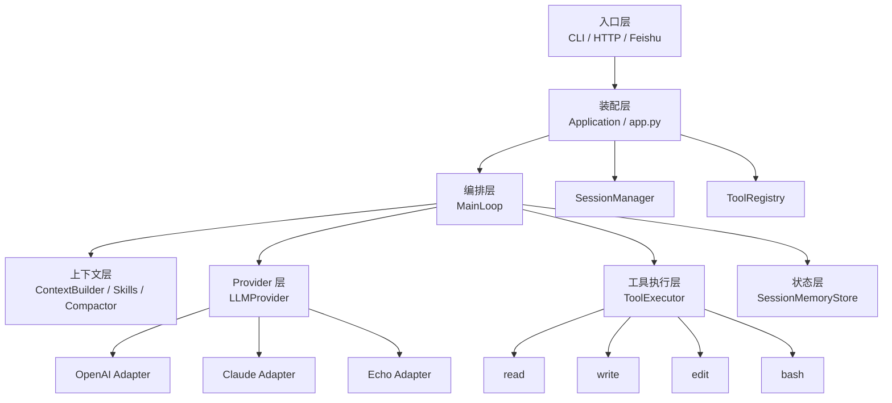

> 系列导航：[系列目录](/series/harness-agent/) | 上一篇：[从零实现 Harness Agent：从黑盒 Agent 到可控运行时](/2026/06/09/harness-agent/harness-agent-00-intro-black-box-agent-to-controllable-harness/) | 下一篇：[从零实现 Harness Agent：模型无关的 ReAct 主循环](/2026/06/09/harness-agent/harness-agent-02-provider-neutral-react-main-loop/)

## 本节目标

> 导读：本篇属于第一部分「基础运行时」，是整套 Agent Harness 的地基：先把 CLI、应用装配和私有实现边界搭起来。

本节要实现的是 `tiny-claw` 的基础运行骨架：一个可以通过 `tiny-claw` 命令启动、支持 `health` / `run` / `serve` 子命令、并且内部已经预留 Agent 核心边界的 Python CLI 框架。

完成这一节后，项目不只是一个能打印 hello world 的命令行脚本，而是具备下面这些基础能力：

- 用户可以通过 `tiny-claw run "..."` 发起一次 Agent 请求。
- CLI、HTTP 服务和未来外部平台入口可以复用同一个 `Application`。
- Provider、工具、上下文、记忆和外部集成有各自独立目录和职责。
- 后续新增 OpenAI / Claude Provider、`read` / `edit` 工具、Session 记忆或 Feishu 回调时，不需要推翻入口和主循环。

换句话说，本节的目标是先搭好“可扩展的 Agent CLI 底座”，后续文章里的 Provider、工具系统、Plan Mode、Feishu 集成和上下文压缩，都会长在这套底座上。

## 摘要

一个 Agent CLI 最容易失控的地方，不是模型回答不够聪明，而是入口、模型、工具、状态和外部平台逐渐缠在一起。`tiny-claw` 的第一步不是堆能力，而是先建立一套分层骨架：入口只接请求，装配层只组依赖，主循环只负责编排，Provider、工具、上下文和记忆各自守住边界。本文适合正在把 Agent 原型推进到可维护项目的开发者阅读。

读完后，你会理解 `tiny-claw` 为什么采用类似 Go 项目中 `cmd/internal` 的边界思想，以及后续新增模型厂商、工具或平台入口时，应该沿哪条依赖线扩展。

## 背景与问题

很多 Agent 原型都从一个文件开始。它解析命令行参数，拼 system prompt，调用模型，执行工具，保存状态，最后把结果打印到终端。这个阶段的目标是证明“跑得起来”，所以单文件实现非常合理。

真正的问题出现在第二阶段：原型开始长出真实产品的形状。

- 终端入口之外，还要接 HTTP webhook、Feishu 事件，未来可能还有 Slack 或 Web UI。
- 本地开发需要 echo provider，真实使用需要 OpenAI 或 Claude。
- 工具从只读扩展到写文件、局部编辑、执行命令，不同能力有完全不同的风险。
- 对话需要按 CLI session、Feishu chat、工作区隔离记忆。
- 长任务需要计划文件，不能只靠模型短期上下文记住。

如果这些能力继续堆在同一层，系统会逐渐变成“能跑但不敢改”的代码。一次小改动可能同时影响 CLI、模型请求、工具权限和外部平台行为。

`tiny-claw` 的核心判断是：Agent 框架首先要解决的是边界问题。模型可以换，工具可以加，入口可以扩展，但控制流边界不能随功能膨胀而坍缩。

## 设计目标

- **入口薄**：CLI、HTTP、Feishu 只负责把外部请求转换成内部调用。
- **装配集中**：运行依赖统一在 `app.py` 创建，底层模块不自行读取环境变量。
- **主循环稳定**：`MainLoop` 只协调上下文、Provider、工具、记忆和停止条件。
- **厂商隔离**：OpenAI、Claude、Echo 的差异收敛在 Provider 适配层。
- **工具受控**：工具是否暴露由配置、skill 和主循环共同决定。
- **状态隔离**：Session、memory、plan files 不由入口层直接操作。
- **可测试**：核心模块能注入 fake provider、fake tools 和临时状态目录。

## 整体方案

可以把 `tiny-claw` 理解成一条从“外部输入”到“Agent 运行”的管道。每一层只回答自己的问题。

- 入口层回答：请求从哪里来，参数是什么？
- 装配层回答：本次运行需要哪些依赖？
- 编排层回答：模型本轮看到什么，能调用什么，结果如何进入下一轮？
- Provider 层回答：内部消息如何翻译成具体模型厂商请求？
- 工具层回答：某个能力如何被安全执行？
- Session/Memory 层回答：这次请求属于哪条对话线？
- Integration 层回答：外部平台事件如何转成一次 Agent run？



这张图里最重要的不是节点数量，而是箭头方向。入口调用应用，应用装配主循环，主循环依赖抽象协议，具体 SDK 和具体工具实现停留在边界外侧。

## 核心实现

项目使用 `src/` layout，并把实现细节放入 `_internal`。这是一种有意设计的边界：外部用户使用命令入口，内部模块服务框架演进。

```text
src/tiny_claw/
  __main__.py
  cli.py
  _internal/
    app.py
    context/
    engine/
    integrations/
    memory/
    provider/
    session/
    tools/
```

`cli.py` 是薄入口。它解析 `health`、`run`、`serve`，然后交给 handler。入口层不会创建 Provider，不会注册工具，也不会拼接完整上下文。

```python
settings = Settings.from_env(...)
app = build_application(settings)
return handler(args, app)
```

`app.py` 是 composition root。它把所有运行时依赖集中装配出来：Provider、SessionManager、SessionMemoryStore、ToolRegistry 和 MainLoop。

```python
engine = MainLoop(
    provider=resolved_provider,
    context_builder=ContextBuilder(workdir=settings.workdir),
    context_compactor=ContextCompactor(...),
    memory=memory,
    tools=tools,
)
```

这个设计带来的直接收益是：`MainLoop` 不需要知道配置来自 `.env` 还是系统环境变量，也不需要知道 OpenAIProvider 如何初始化。测试时可以绕过真实模型，直接注入 fake provider。

命令入口在 `pyproject.toml` 中声明：

```toml
[project.scripts]
tiny-claw = "tiny_claw.cli:main"
```

模块入口由 `__main__.py` 支持：

```bash
uv run python -m tiny_claw --help
```

## 使用方式

安装开发依赖后，可以先查看 CLI 能力：

```bash
uv sync --dev
uv run tiny-claw --help
uv run tiny-claw health
uv run python -m tiny_claw --help
```

真实模型运行：

```bash
OPENAI_API_KEY=<your-openai-api-key> uv run tiny-claw run "hello"
```

离线 smoke test：

```bash
TINY_CLAW_PROVIDER=echo uv run tiny-claw run "hello"
```

启动统一 HTTP 事件服务：

```bash
uv run tiny-claw serve --host 0.0.0.0 --port 8000
```

如果只想确认当前配置、Provider、工具和状态目录：

```bash
uv run tiny-claw health
```

## 测试与验证

基础验证命令：

```bash
uv run ruff check .
uv run ruff format --check .
uv run mypy src
uv run pytest
```

CLI 冒烟测试：

```bash
uv run tiny-claw --help
uv run tiny-claw health
uv run python -m tiny_claw --help
```

框架骨架相关测试：

- `tests/test_cli.py`：命令解析、帮助信息、模式参数。
- `tests/test_app.py`：应用装配、Provider 注入、工具注册。
- `tests/test_settings.py`：环境变量、`.env` 和默认配置。
- `tests/test_engine.py`：主循环基础行为和依赖注入路径。

## 设计取舍与注意事项

`tiny-claw` 没有在第一版引入复杂框架，而是刻意使用标准库和少量明确依赖。CLI 使用 `argparse`，不是因为 Typer 或 Click 不好，而是当前需求更看重依赖少、边界清楚、行为可预测。

`_internal` 不是装饰性目录。它表达的是：内部模块可以为了框架演进而调整，外部用户不应该把这些模块当成稳定公开 API。真正稳定的入口是 `tiny-claw`、`python -m tiny_claw`，以及未来明确暴露的接口。

`app.py` 作为唯一装配层，是这个架构里很关键的约束。不要在工具、Provider、engine 里散落读取环境变量或创建全局对象的逻辑；否则测试和外部集成会越来越难维护。

`MainLoop` 不持有全局工作目录。本轮运行的 workdir 来自 `SessionRef`，这为 CLI session、Feishu chat 和未来外部平台保持同一套隔离规则打下基础。

当前项目是 CLI 优先。HTTP 服务是事件入口，不是一个完整 Web 应用框架；外部平台应该通过 adapter 和 channel 复用同一个 `Application`，而不是另起一套 Agent runtime。

## 总结

- Agent 框架越早建立边界，后续叠加工具、Provider 和外部入口时越稳。
- `tiny-claw` 把入口、装配、编排、Provider、工具、上下文和状态管理拆成独立层。
- `app.py` 是依赖汇合点，`MainLoop` 是控制流核心，但二者都不承担具体 SDK 或工具实现细节。
- `_internal` 明确了私有实现边界，让外部使用方式保持简单。
- 这套骨架的价值不是“目录多”，而是让每个新增能力都有清楚的位置。

按编号继续阅读：[02：模型无关 ReAct 主循环](02-模型无关-react-主循环.md) 会把这个骨架里的控制流核心拆出来。

---

> 来源：本文整理自 `tiny-claw/docs/tutorial/01-分层-python-智能体-cli-框架.md`。
> 项目地址：[barry166/tiny-claw](https://github.com/barry166/tiny-claw)。
