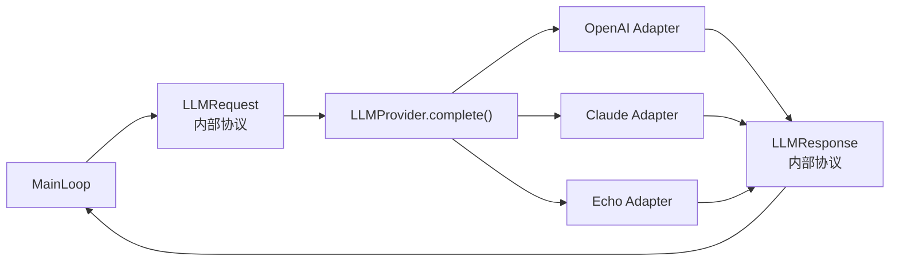

> 系列导航：[系列目录](/series/harness-agent/) | 上一篇：[从零实现 Harness Agent：模型无关的 ReAct 主循环](/2026/06/09/harness-agent/harness-agent-02-provider-neutral-react-main-loop/) | 下一篇：[从零实现 Harness Agent：构建默认受控的工具系统](/2026/06/09/harness-agent/harness-agent-04-controlled-tool-system/)

## 本节目标

> 导读：本篇属于第一部分「基础运行时」，聚焦模型接入层：用 Provider 隔离厂商 SDK 与消息格式差异。

本节要实现的是 `tiny-claw` 的模型 Provider 适配层：让 OpenAI、Claude 和本地 Echo Provider 都能通过同一套内部协议接入 Agent 主循环。

完成这一节后，系统会具备下面这些能力：

- 默认使用 OpenAI Provider 运行真实模型请求。
- 可以通过配置切换到 Claude / Anthropic Provider。
- 可以显式启用 Echo Provider 做离线 smoke test。
- `MainLoop` 只认识 `LLMProvider.complete()`，不直接依赖任何厂商 SDK。
- Provider 负责把内部 `Message`、`ToolDefinition`、`ToolCall` 转换成厂商请求与响应。

这一节的关键目标是建立一个“协议翻译层”：内部 schema 是框架的稳定语言，OpenAI 和 Claude 只是不同方言。

## 摘要

模型接入层不应该把厂商差异扩散到 Agent 主循环里。`tiny-claw` 通过 Provider 适配层同时支持 OpenAI、Claude 和本地 Echo Provider，并把差异限制在 `provider/` 目录中。本文介绍如何让 engine 只面对统一的 `LLMRequest`、`LLMResponse` 和内部消息 schema，同时保留真实模型运行与离线开发能力。

## 背景与问题

不同模型厂商的 API 结构并不一致：消息格式、工具调用格式、结束原因、SDK 初始化和错误形态都可能不同。如果主循环直接使用某个厂商 SDK，就会带来几个问题。

- 新增 provider 时需要改主循环。
- 工具定义和 tool call 转换散落在多个模块。
- fake 测试难以复用真实运行路径。
- 离线开发需要 API key，不利于快速 smoke test。

因此需要一个 Provider 适配层，把厂商 API 转换成项目内部统一协议。

## 设计目标

- **统一协议**：engine 只认识 `LLMProvider.complete()`。
- **厂商隔离**：OpenAI/Claude SDK 细节不进入 engine。
- **工具调用兼容**：Provider 负责内部工具定义和厂商 payload 的相互转换。
- **离线可用**：Echo Provider 用于本地 smoke test。
- **配置清晰**：通过 `TINY_CLAW_PROVIDER` 和 API key 选择运行时。
- **可测试**：Provider 可以被 fake provider 替代。

## 整体方案

Provider 层位于 `src/tiny_claw/_internal/provider/`。`base.py` 定义 provider-neutral 协议，具体 provider 负责转换内部 schema 和厂商请求。



## 核心实现

关键文件：

- `src/tiny_claw/_internal/provider/base.py`
- `src/tiny_claw/_internal/provider/openai.py`
- `src/tiny_claw/_internal/provider/claude.py`
- `src/tiny_claw/_internal/provider/echo.py`
- `src/tiny_claw/_internal/settings.py`
- `src/tiny_claw/_internal/app.py`

`app.py` 按配置创建 provider：

```python
def _build_provider(settings: Settings) -> LLMProvider:
    if settings.provider_name == "echo":
        return EchoProvider(model=settings.model)
    if settings.provider_name == "openai":
        return OpenAIProvider(...)
    if settings.provider_name in {"claude", "anthropic"}:
        return ClaudeProvider(...)
```

默认 provider 是 OpenAI：

```python
provider_name: str = "openai"
model: str = DEFAULT_OPENAI_MODEL
```

Echo Provider 仍然保留，用于不依赖网络和 API key 的 smoke test。

## 使用方式

默认 OpenAI：

```bash
OPENAI_API_KEY=<your-openai-api-key> uv run tiny-claw run "hello"
```

OpenAI-compatible base URL：

```bash
OPENAI_API_KEY=<your-openai-api-key> \
OPENAI_BASE_URL=https://example.test/v1 \
uv run tiny-claw run "hello"
```

Claude：

```bash
TINY_CLAW_PROVIDER=claude \
ANTHROPIC_API_KEY=<your-anthropic-api-key> \
uv run tiny-claw run "hello"
```

离线 echo：

```bash
TINY_CLAW_PROVIDER=echo uv run tiny-claw health
TINY_CLAW_PROVIDER=echo uv run tiny-claw run "hello"
```

常用配置项：

```text
TINY_CLAW_PROVIDER=openai|claude|anthropic|echo
TINY_CLAW_MODEL=<model-name>
TINY_CLAW_MAX_TOKENS=1024
OPENAI_API_KEY / OPENAI_KEY
OPENAI_BASE_URL
ANTHROPIC_API_KEY / CLAUDE_KEY
```

## 测试与验证

Provider 相关测试：

```bash
uv run pytest tests/test_provider_openai.py
uv run pytest tests/test_provider_claude.py
uv run pytest tests/test_app.py
uv run pytest tests/test_settings.py
```

Live 测试存在网络和额度依赖，适合本地手动验证：

```bash
OPENAI_API_KEY=<your-openai-api-key> uv run pytest tests/test_provider_openai_live.py
```

完整验证：

```bash
uv run ruff check .
uv run ruff format --check .
uv run mypy src
uv run pytest
```

## 设计取舍与注意事项

默认 Provider 选择 OpenAI，是为了让 CLI 第一体验接近真实 Agent，而不是返回 echo 模板。但 Echo Provider 仍然保留，并且需要显式启用；它的价值是离线 smoke test 和无密钥环境下的快速验证。

Provider 只做一件事：把内部协议翻译成厂商请求，再把厂商响应翻译回内部协议。它不决定工具权限，不读取 session memory，也不改变主循环状态。这样才能保证新增模型厂商时，只新增 adapter，而不是重写 engine。

配置加载采用“补缺”语义：源码根 `.env`、当前目录 `.env` 和系统环境变量按顺序填充缺失项，不覆盖已读取值。这个策略牺牲了一点覆盖灵活性，但换来更可预测的全局 CLI 行为。Live 测试则需要单独看待：它能证明真实 SDK 路径可用，但不适合无条件进入所有 CI。

## 总结

- Provider 适配层让模型厂商差异不污染 Agent 主循环。
- OpenAI、Claude 和 Echo 共用同一套内部消息协议。
- Echo Provider 保留了离线开发和 smoke test 能力。
- 新增模型厂商时，应优先新增 provider adapter，而不是修改 engine。

按编号继续阅读：[04：受控工具系统](04-受控工具系统.md) 会让模型从“会回答”走向“能行动”时仍然有权限边界。

---

> 来源：本文整理自 `tiny-claw/docs/tutorial/03-模型-provider-适配层.md`。
> 项目地址：[barry166/tiny-claw](https://github.com/barry166/tiny-claw)。
