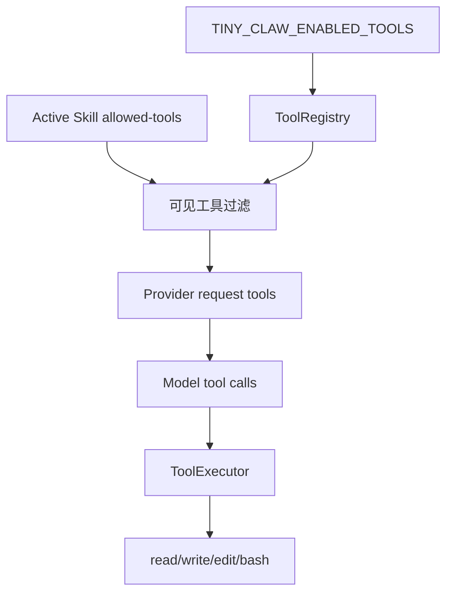

## 本节目标

> 导读：本篇进入第二部分「工具与安全边界」，先从总入口解释 Agent 从回答走向行动时，工具能力为什么必须默认受控。

本节要实现的是 `tiny-claw` 的受控工具系统：让模型只能看到被显式启用、并且经过当前上下文策略过滤后的工具。

完成这一节后，系统会具备下面这些能力：

- 内置 `read`、`write`、`edit`、`bash` 工具都通过统一 `Tool` 协议暴露。
- 默认只启用低风险的 `read` 工具。
- 用户可以通过 `TINY_CLAW_ENABLED_TOOLS` 显式扩大工具能力。
- active skill 可以通过 `allowed-tools` 进一步收窄工具，但不能提权。
- `MainLoop` 每轮只把最终可见工具定义传给 Provider。

这一节的关键目标是把工具看成“权限边界”，而不是单纯的功能列表。

## 摘要

工具让 Agent 从“会聊天”变成“能执行”，也把真实副作用带进了系统。`tiny-claw` 通过统一 Tool 协议、`ToolRegistry`、显式环境变量启用和 skill 级权限收窄，控制模型每轮能看到和调用哪些工具。本文介绍这个工具系统的边界、用法和扩展方式。

## 背景与问题

Agent 工具通常包含文件读取、文件写入、局部编辑、命令执行等能力。它们一旦暴露给模型，就可能产生真实副作用。

风险包括：

- 模型在没有明确授权时修改文件。
- skill 文档要求执行某个命令，间接绕过全局权限。
- 工具参数不受约束，访问工作区外路径。
- 新工具注册后默认暴露，导致能力面扩大。

因此，工具系统需要两层控制：工具实现本身要安全，工具是否暴露也要安全。

## 设计目标

- **显式启用**：默认只启用低风险工具。
- **统一协议**：所有工具都实现相同接口。
- **权限可收窄**：active skill 只能减少工具，不能增加工具。
- **路径受限**：文件类工具限制在工作区内。
- **可测试**：工具实现和工具注册可以分别测试。
- **可扩展**：新增工具不需要修改 Provider 或主循环协议。

## 整体方案

工具系统由三层组成：

1. `Tool` 协议：定义工具名称、描述、参数 schema 和 `run()`。
2. `ToolRegistry`：注册、查找和调用工具。
3. `MainLoop`：根据全局启用工具和 active skill 计算本轮可见工具。



## 核心实现

工具协议在 `src/tiny_claw/_internal/tools/base.py` 中定义。每个工具提供：

- `name`
- `description`
- `parameters`
- `run(input)`

应用装配层注册当前启用的工具：

```python
available_tools = {
    "bash": BashTool(workdir=resolved_workdir),
    "edit": EditTool(root=resolved_workdir),
    "read": ReadTool(root=resolved_workdir),
    "write": WriteTool(root=resolved_workdir),
}
for name in enabled_tools:
    registry.register(available_tools[name])
```

默认启用工具在 `settings.py` 中定义：

```python
DEFAULT_ENABLED_TOOLS = ("read",)
SUPPORTED_TOOLS = {"bash", "edit", "read", "write"}
```

如果 active skill 声明了 `allowed-tools`，主循环会取交集：

```python
if context.allowed_tools is not None:
    registered_tool_definitions = tuple(
        definition
        for definition in registered_tool_definitions
        if definition.name in allowed_tools
    )
```

## 使用方式

默认只启用 `read`：

```bash
uv run tiny-claw health
```

显式启用多个工具：

```bash
TINY_CLAW_ENABLED_TOOLS=read,edit \
uv run tiny-claw run "修改 README 中的一段描述"
```

启用完整本地执行能力：

```bash
TINY_CLAW_ENABLED_TOOLS=read,write,edit,bash \
uv run tiny-claw run --mode act "实现并验证这个功能"
```

查看当前配置：

```bash
uv run tiny-claw health
```

## 测试与验证

工具系统测试：

```bash
uv run pytest tests/test_tools.py
uv run pytest tests/test_tool_executor.py
uv run pytest tests/test_settings.py
uv run pytest tests/test_engine.py
```

CLI 冒烟：

```bash
TINY_CLAW_PROVIDER=echo TINY_CLAW_ENABLED_TOOLS=read uv run tiny-claw health
```

完整验证：

```bash
uv run ruff check .
uv run ruff format --check .
uv run mypy src
uv run pytest
```

## 设计取舍与注意事项

工具系统的核心取舍是默认保守。`read` 是默认启用工具，因为它没有写入副作用；`write`、`edit` 和 `bash` 都必须显式开启。尤其是 `bash`，它能执行任意 shell 命令，应该只在任务明确需要运行命令时暴露。

skill 文件不能提权，这一点非常关键。SOP 可以告诉模型“这类任务建议使用 read”，但不能让一个未启用的工具突然变得可见。工具描述也不是安全边界，它只是给模型看的说明；真正的边界必须在工具注册、路径校验和运行时过滤里完成。

新增工具时，需要同步 `SUPPORTED_TOOLS`、应用装配和测试。否则工具可能存在于代码里，却无法通过配置启用，或者启用后没有足够测试覆盖。

## 总结

- Agent 工具能力需要“实现安全”和“暴露安全”两道边界。
- `TINY_CLAW_ENABLED_TOOLS` 是全局能力开关。
- active skill 的 `allowed-tools` 只能进一步收窄工具。
- 工具系统独立于 Provider 和 MainLoop，便于扩展和测试。

按工具专题继续阅读：[05：安全局部编辑工具](05-安全局部编辑工具.md) 会把工具边界落到真实文件修改场景里。

---

> 来源：本文整理自 `tiny-claw/docs/tutorial/04-受控工具系统.md`。
> 项目地址：[barry166/tiny-claw](https://github.com/barry166/tiny-claw)。
