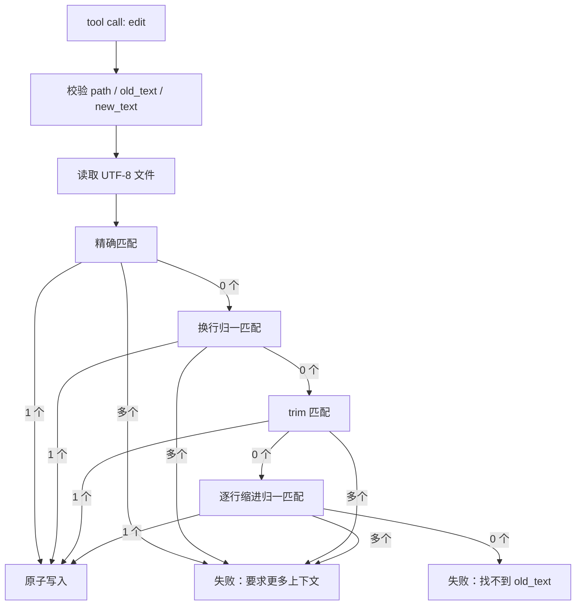

> 系列导航：[系列目录](/series/harness-agent/) | 上一篇：[从零实现 Harness Agent：构建默认受控的工具系统](/2026/06/09/harness-agent/harness-agent-04-controlled-tool-system/) | 下一篇：[从零实现 Harness Agent：设计多工具并发执行器](/2026/06/09/harness-agent/harness-agent-06-parallel-tool-executor/)

## 本节目标

> 导读：本篇属于第二部分「工具与安全边界」，把权限边界落到真实文件修改场景：`EditTool` 如何安全地执行局部替换。

本节要实现的是 `edit` 工具：一个让 Agent 修改已有文件局部文本、而不是重写整个文件的安全编辑能力。

完成这一节后，系统会具备下面这些能力：

- 模型可以通过 `path`、`old_text`、`new_text` 请求局部替换。
- 工具会校验目标文件必须位于工作区内、存在、不是目录，并且是 UTF-8 文本。
- 工具会要求 `old_text` 唯一匹配；找不到或匹配多处都不会写文件。
- 工具能兼容换行差异、首尾空白和常见缩进差异。
- 写入使用原子替换，并尽量保留原文件权限。

这一节的关键目标是把“模型生成修改意图”和“系统安全落盘”分开，让工具承担匹配和保存的确定性工作。

## 摘要

让 Agent 修改文件时，最危险的选择往往是整文件重写。`edit` 工具让 Agent 只修改已有文件中的局部文本，并通过路径约束、唯一匹配、分层降级匹配、原子写入和权限保留降低误操作风险。适合正在设计 Agent 文件编辑能力、工具系统或代码修改流程的开发者阅读。

## 背景与问题

让 Agent 修改文件有两种常见方式：整文件写入和局部编辑。整文件写入实现简单，但风险很高。模型可能没有读到完整文件，或者在生成新文件内容时丢失注释、格式、用户未提交改动和边缘逻辑。

局部编辑更适合 Agent 场景：模型提供要替换的 `old_text` 和 `new_text`，工具在真实文件中查找并替换。这样可以把“生成代码”和“安全修改文件”拆开，让工具承担匹配、唯一性和保存职责。

但局部编辑也有难点：

- `old_text` 可能有换行符差异。
- 模型可能复制了多余空行或遗漏缩进。
- `old_text` 可能匹配多处。
- 目标文件可能不存在、是目录、不是 UTF-8，或在工作区外。

`EditTool` 的设计就是围绕这些风险展开。

## 设计目标

- **安全性**：只允许编辑工作区内已有 UTF-8 文件。
- **局部性**：只替换模型明确给出的文本片段。
- **唯一性**：匹配 0 次或多次都不写文件。
- **鲁棒性**：兼容常见换行、首尾空白和缩进差异。
- **可恢复性**：失败时返回明确错误，帮助模型调整输入。
- **工程一致性**：作为普通 Tool 接入 `ToolRegistry` 和 `ToolExecutor`。

## 整体方案

`EditTool` 接收三个参数：

- `path`：工作区内相对路径。
- `old_text`：要替换的已有文本。
- `new_text`：替换后的文本，可为空字符串以表示删除。

工具先校验路径和文件，再读取文本，随后按多个策略查找唯一匹配。只有找到恰好一个匹配时，才执行原子写入。



## 核心实现

核心文件是 `src/tiny_claw/_internal/tools/builtin/edit.py`。

工具声明遵循统一 Tool 协议：

```python
@dataclass(frozen=True)
class EditTool:
    root: Path

    @property
    def name(self) -> str:
        return "edit"
```

参数 schema 要求 `path`、`old_text`、`new_text` 都存在，并禁止额外字段：

```python
"required": ["path", "old_text", "new_text"],
"additionalProperties": False,
```

运行时先做基础校验：

```python
if not old_text:
    raise ToolError("edit tool requires a non-empty 'old_text' field")
if old_text == new_text:
    raise ToolError("edit tool requires 'old_text' and 'new_text' to be different")
```

匹配策略按从严格到宽松的顺序执行：

```python
for candidate in (
    _exact_match(content, old_text),
    _newline_normalized_match(content, old_text),
    _trim_space_match(content, old_text),
    _line_by_line_normalized_match(content, old_text),
):
    if candidate.spans:
        return candidate
```

如果匹配多处，工具不会猜测要改哪一处，而是返回行号提示：

```python
raise ToolError(
    "edit tool found multiple matches ... please provide more context"
)
```

写入使用临时文件和 `os.replace()`，并保留原文件权限：

```python
shutil.copystat(target, temp_path)
os.chmod(temp_path, stat_result.st_mode)
os.replace(temp_path, target)
```

成功后 observation 会包含路径、匹配策略、起始行、字节数和片段预览，方便模型继续判断。

## 使用方式

`edit` 默认不启用。需要显式开启：

```bash
TINY_CLAW_ENABLED_TOOLS=read,edit \
uv run tiny-claw run "把 README 中的某段说明改得更清楚"
```

典型工具输入：

```json
{
  "path": "README.md",
  "old_text": "hello",
  "new_text": "hello tiny-claw"
}
```

如果要删除文本，可以传空字符串：

```json
{
  "path": "notes.txt",
  "old_text": "temporary line\n",
  "new_text": ""
}
```

推荐调用方式是先 `read` 再 `edit`。这样模型能基于最新文件内容构造足够唯一的 `old_text`。

## 测试与验证

工具单元测试：

```bash
uv run pytest tests/test_tools.py
```

Engine 流程测试：

```bash
uv run pytest tests/test_engine.py
```

真实 Provider demo：

```bash
OPENAI_API_KEY=<your-openai-api-key> uv run python tests/demo_edit_flow.py
```

完整验证：

```bash
uv run ruff check .
uv run ruff format --check .
uv run mypy src
uv run pytest
```

测试覆盖的关键场景包括：精确匹配、多行替换、删除文本、换行归一、首尾空白、缩进归一、文件权限保留、路径越界、缺失文件、多匹配和非 UTF-8 文件。

## 设计取舍与注意事项

`edit` 和 `write` 的职责刻意分开：`edit` 只修改已有文件，创建文件交给 `write`。这个边界能避免模型在“想改一小段”的时候意外生成整份文件内容，也让工具失败语义更清楚。

匹配策略没有使用 fuzzy edit-distance 或语义级匹配。原因很简单：编辑工具宁愿失败，也不应该猜错。换行归一、trim 和逐行缩进归一是为了兼容模型复制文本时的常见格式误差，但每一层仍然要求唯一匹配。

缩进处理也保持保守。混合 tab 和 space 时，工具使用字面共同前缀，不推断视觉宽度。成功 observation 会返回 snippet，帮助模型理解修改位置，但不会返回完整文件，避免一次小编辑制造新的上下文膨胀。

## 总结

- `edit` 比整文件重写更适合 Agent 修改已有文件。
- 唯一匹配是安全编辑的核心边界。
- 分层匹配提高成功率，但不会牺牲确定性。
- 原子写入和权限保留让工具更接近真实工程使用。
- 写类工具必须显式启用，避免默认扩大副作用面。

按工具专题继续阅读：[06：多工具并发执行器](06-多工具并发执行器.md) 会讨论多个工具调用如何在安全前提下调度。

---

> 来源：本文整理自 `tiny-claw/docs/tutorial/05-安全局部编辑工具.md`。
> 项目地址：[barry166/tiny-claw](https://github.com/barry166/tiny-claw)。
