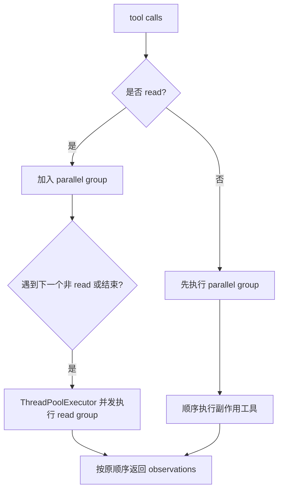

## 本节目标

> 导读：本篇属于第二部分「工具与安全边界」，讨论工具调度：并发不是单纯性能优化，而是由工具语义决定的执行策略。

本节要实现的是 `ToolExecutor` 的多工具调度能力：当模型同一轮返回多个 tool call 时，系统可以并发执行安全的只读工具，同时保持有副作用工具顺序执行。

完成这一节后，系统会具备下面这些能力：

- 同一轮连续多个 `read` 调用可以进入并发执行组。
- `write`、`edit`、`bash` 等副作用工具会保持顺序执行。
- 并发执行后的 tool observation 仍按模型原始 tool call 顺序返回。
- 单个工具失败不会吞掉同组其他工具结果。
- CLI 或 Feishu 等 channel 可以继续收到工具调用和工具结果事件。

这一节的关键目标是把“并发”作为工具语义的一部分，而不是简单的性能开关。

## 摘要

现代模型可能在同一轮响应中返回多个 tool call。`tiny-claw` 的 `ToolExecutor` 将并行安全的 `read` 调用批量并发执行，同时保持 `write`、`edit`、`bash` 等副作用工具顺序执行。本文介绍这一执行策略如何在效率和安全之间取得平衡。

## 背景与问题

当模型需要理解一个项目时，它可能同时读取多个文件。例如同一轮请求中返回：

```text
read pyproject.toml
read README.md
read src/tiny_claw/cli.py
```

如果全部串行执行，效率较低；如果全部并发执行，又可能让写文件、编辑文件、执行命令等副作用互相干扰。

工具执行器需要回答两个问题：

- 哪些工具可以并发？
- 并发后的 observation 顺序如何保持和模型 tool call 对齐？

`ToolExecutor` 采用保守策略：只把 `read` 视为并行安全，其余工具默认顺序执行。

## 设计目标

- **效率**：多个连续 `read` 可以并发。
- **安全**：副作用工具不并发，避免写冲突和命令竞争。
- **顺序稳定**：返回 observation 的顺序与模型 tool call 顺序一致。
- **错误隔离**：一个工具失败不影响同组其他工具 observation。
- **可观测**：每个工具调用和结果都能通过 channel 和日志输出。
- **可扩展**：后续可以引入工具级并发声明。

## 整体方案

`ToolExecutor.run_tool_calls()` 会扫描模型返回的 tool calls，把连续的并行安全工具收集成 group。遇到非并行安全工具时，先执行已有并行 group，再顺序执行当前工具。



## 核心实现

核心文件是 `src/tiny_claw/_internal/engine/tool_executor.py`。

当前并行安全工具白名单只有 `read`：

```python
PARALLEL_SAFE_TOOL_NAMES = {"read"}
```

执行入口：

```python
def run_tool_calls(
    self,
    tool_calls: tuple[ToolCall, ...],
    *,
    channel: Channel | None = None,
) -> tuple[Message, ...]:
```

并行 group 使用 `ThreadPoolExecutor`，并限制最大 worker 数：

```python
max_workers = min(self.max_parallel_tools, len(tool_calls))
with ThreadPoolExecutor(max_workers=max_workers) as executor:
    observations = tuple(executor.map(self._execute_one, tool_calls))
```

`executor.map()` 会按输入顺序产出结果，因此即使并发执行完成顺序不同，返回给模型的 observation 顺序仍然稳定。

对于单个工具调用，执行器会通知 channel：

```python
notify_channel(partial(channel.on_tool_call, tool_call))
observation = self._execute_one(tool_call)
notify_channel(partial(channel.on_tool_result, call=tool_call, result=observation))
```

这让 CLI、Feishu 或未来其他外部通道可以展示进度。

## 使用方式

这个模块是内部执行层，用户不直接调用 `ToolExecutor`。它会在 `MainLoop` 处理模型 tool calls 时自动使用。

启用读取工具：

```bash
TINY_CLAW_ENABLED_TOOLS=read uv run tiny-claw run "分析项目结构"
```

启用更多工具时，执行策略仍然保守：

```bash
TINY_CLAW_ENABLED_TOOLS=read,write,edit,bash \
uv run tiny-claw run "实现并验证功能"
```

此时多个连续 `read` 可以并发，但 `write`、`edit`、`bash` 会顺序执行。

## 测试与验证

工具执行器测试：

```bash
uv run pytest tests/test_tool_executor.py
```

重点测试包括：

- 连续 `read` 并发执行。
- 并发 `read` 的 observation 顺序保持不变。
- 非并行工具会切断 parallel group。
- 并行 group 中一个工具失败时，其他工具仍返回正常 observation。
- `max_parallel_tools` 小于 1 时拒绝初始化。

相关 Engine 测试：

```bash
uv run pytest tests/test_engine.py
```

全量验证：

```bash
uv run ruff check .
uv run ruff format --check .
uv run mypy src
uv run pytest
```

## 设计取舍与注意事项

并发在这里不是一个纯性能开关，而是一种工具语义承诺。`read` 被视为并行安全，是因为它只读取文件；`write`、`edit`、`bash` 即使在某些场景下看起来也能并发，默认仍然顺序执行，因为它们可能修改同一文件、依赖当前目录状态，或启动长时间运行的命令。

observation 顺序必须和模型返回的 tool call 顺序一致。否则模型下一轮看到的结果会错位，以为第一个结果对应第二个调用。这就是为什么并发执行后仍要按原始顺序收集返回值。

未来如果新增工具，不能因为实现上线程安全就直接加入并发白名单。并发安全要从工具语义判断：它是否有副作用，是否依赖执行顺序，是否会改变后续工具看到的世界。

## 总结

- 同轮多个只读工具调用可以安全并发，提升项目扫描效率。
- 副作用工具保持顺序执行，优先保证正确性。
- `ToolExecutor` 把工具调度从 `MainLoop` 中拆出来，便于测试和扩展。
- 稳定的 observation 顺序是多工具并发的关键约束。

按编号继续阅读：[07：Skill 上下文系统](07-技能感知上下文引擎.md) 会进入上下文工程；如果你想继续工具并发专题，可以跳到 [28：工具并发模型](28-tool-concurrency-boundaries.md)。

---

> 来源：本文整理自 `tiny-claw/docs/tutorial/06-多工具并发执行器.md`。
> 项目地址：[barry166/tiny-claw](https://github.com/barry166/tiny-claw)。
