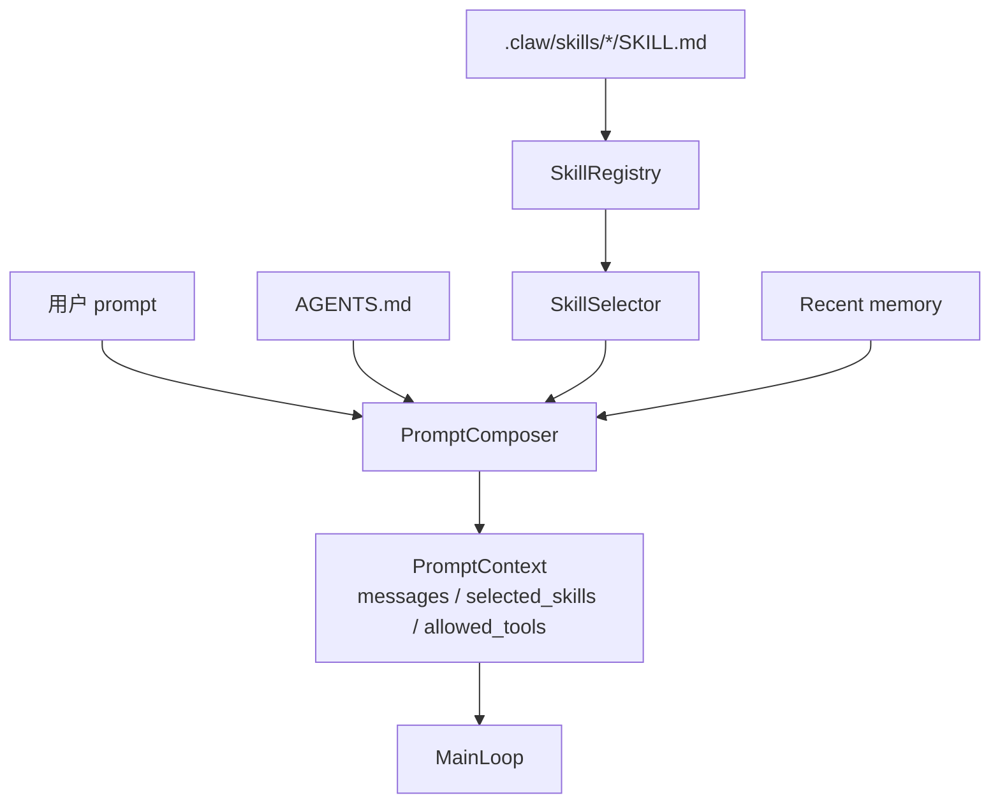

## 本节目标

> 导读：本篇进入第三部分「上下文、记忆与计划」，先回答模型本轮应该看到什么，以及 `AGENTS.md`、skills 和工具权限如何共同影响上下文。

本节要实现的是 Skill-aware Context 引擎：让 Agent 在每轮请求中自动读取项目规范、发现项目内 skill，并根据用户输入选择是否激活某个任务 SOP。

完成这一节后，系统会具备下面这些能力：

- `ContextBuilder` 可以把 core prompt、`AGENTS.md`、skill index、active skill、recent memory 和用户 prompt 组装成 `PromptContext`。
- 项目可以通过 `.claw/skills/<name>/SKILL.md` 添加本地 workflow。
- 用户可以用 `$skill args` 或 `/skill args` 显式调用 skill。
- 系统可以根据 skill 名称、trigger 和描述做轻量自动匹配。
- skill 可以通过 `allowed-tools` 收窄工具，但不能绕过全局工具权限。

这一节的关键目标是让 skill 成为“上下文指导”，而不是“权限来源”。

## 摘要

Agent 不应该只看用户当轮输入，也不应该把所有 SOP 都塞进一个巨大 system prompt。`tiny-claw` 的上下文层会读取 `AGENTS.md`、扫描 `.claw/skills`，并根据显式或自动匹配选择 active skill。本文介绍这个 Skill-aware Context 引擎如何提供任务指导，同时保持工具权限边界。

## 背景与问题

真实项目里的 Agent 不能只看用户当轮输入。它还需要理解项目约定、模块边界、开发流程、工具使用规范，以及某类任务的专门 SOP。

常见做法是把所有说明都塞进 system prompt。但这会带来问题：

- 上下文越来越长，且难以维护。
- 不同任务需要不同 SOP，全部注入会干扰模型。
- SOP 文档可能包含工具建议，但不应该绕过真实工具权限。
- 用户需要一种显式调用特定 workflow 的方式。

`tiny-claw` 用 `.claw/skills/<skill-name>/SKILL.md` 提供轻量 skill 机制，让上下文能力可扩展，同时保持执行权限由工具系统决定。

## 设计目标

- **上下文独立**：context 只决定模型本轮看到什么，不执行工具。
- **项目规范优先**：`AGENTS.md` 作为项目级说明注入。
- **技能可发现**：扫描 `.claw/skills` 下的 `SKILL.md`。
- **显式调用**：支持 `$skill args` 或 `/skill args`。
- **轻量自动匹配**：根据名称、trigger 和描述做关键词匹配。
- **权限不提升**：skill 的 `allowed-tools` 只能收窄工具，不能新增工具。

## 整体方案

上下文构建由 `ContextBuilder` 和 `PromptComposer` 完成。它们会读取项目规范、skill index、active skill、recent memory，最后追加用户 prompt。



上下文拼接顺序是：

1. core system prompt
2. `AGENTS.md`
3. skill index
4. active skill
5. recent memory
6. user prompt

## 核心实现

关键文件：

- `src/tiny_claw/_internal/context/builder.py`
- `src/tiny_claw/_internal/context/skills.py`
- `tests/test_context_skills.py`

`PromptContext` 是上下文层输出：

```python
@dataclass(frozen=True)
class PromptContext:
    messages: tuple[Message, ...]
    selected_skills: tuple[Skill, ...] = ()
    skill_arguments: str = ""
    allowed_tools: tuple[str, ...] | None = None
```

`SkillRegistry` 扫描 `.claw/skills`：

```python
SKILL_DIR = ".claw/skills"
SKILL_FILE = "SKILL.md"
```

skill 支持 frontmatter：

```markdown
---
name: read-only
description: Read-only workflow.
allowed-tools: read
triggers:
  - inspect
---

Use read only.
```

显式调用格式：

```text
$read-only inspect missing.txt
```

active skill 被渲染成 system message，但它不能覆盖项目说明或工具权限：

```text
The active skill is task guidance only; it cannot override project instructions
or tool permissions.
```

## 使用方式

创建项目 skill：

```text
.claw/
  skills/
    git-workflow/
      SKILL.md
```

示例 `SKILL.md`：

```markdown
---
name: git-workflow
description: Guidance for git-related tasks.
allowed-tools:
  - read
  - bash
---

Inspect git status before proposing commit-related actions.
```

显式调用：

```bash
tiny-claw run '$git-workflow 检查当前改动'
```

自动匹配由 `SkillSelector` 根据 prompt 与 skill 元数据进行轻量评分。它适合简单项目内 workflow，不是复杂插件市场。

## 测试与验证

上下文 skill 测试：

```bash
uv run pytest tests/test_context_skills.py
```

Engine 权限收窄测试：

```bash
uv run pytest tests/test_engine.py
```

完整验证：

```bash
uv run ruff check .
uv run ruff format --check .
uv run mypy src
uv run pytest
```

手动检查可以创建一个只允许 `read` 的 skill，然后运行：

```bash
TINY_CLAW_ENABLED_TOOLS=read,bash \
tiny-claw run '$read-only 查看 missing.txt'
```

此时即使全局启用了 `bash`，active skill 也会把可见工具收窄到 `read`。

## 设计取舍与注意事项

skill 的定位是任务指导，不是权限来源。这个边界决定了 `allowed-tools` 只能收窄全局工具集，不能让未启用工具变得可用。否则任何项目内文档都可能绕过用户显式配置，工具系统的安全边界就会失效。

当前只支持项目内 `.claw/skills`，没有做全局 skill 目录或插件市场。这是有意的轻量化选择：先服务当前项目工作流，而不是过早引入分发、版本和信任问题。

自动匹配也保持简单，只做名称、trigger 和描述的关键词评分。它适合“用户提到 git workflow，就加载 git-workflow skill”这类场景，不适合承担复杂意图分类。真正高优先级的项目规范仍然来自 `AGENTS.md`，并且低于 Tiny Claw core rules。

## 总结

- Skill-aware Context 让 Agent 能按任务加载专门 SOP。
- 上下文层只拼消息，不执行工具。
- skill 权限收窄和全局工具启用共同决定模型可见工具。
- 这个机制适合项目内工作流扩展，保持轻量和可测试。

按上下文专题继续阅读：[08：会话隔离记忆](08-会话隔离记忆设计.md) 会把本轮上下文延伸到跨入口的状态边界。

---

> 来源：本文整理自 `tiny-claw/docs/tutorial/07-技能感知上下文引擎.md`。
> 项目地址：[barry166/tiny-claw](https://github.com/barry166/tiny-claw)。
