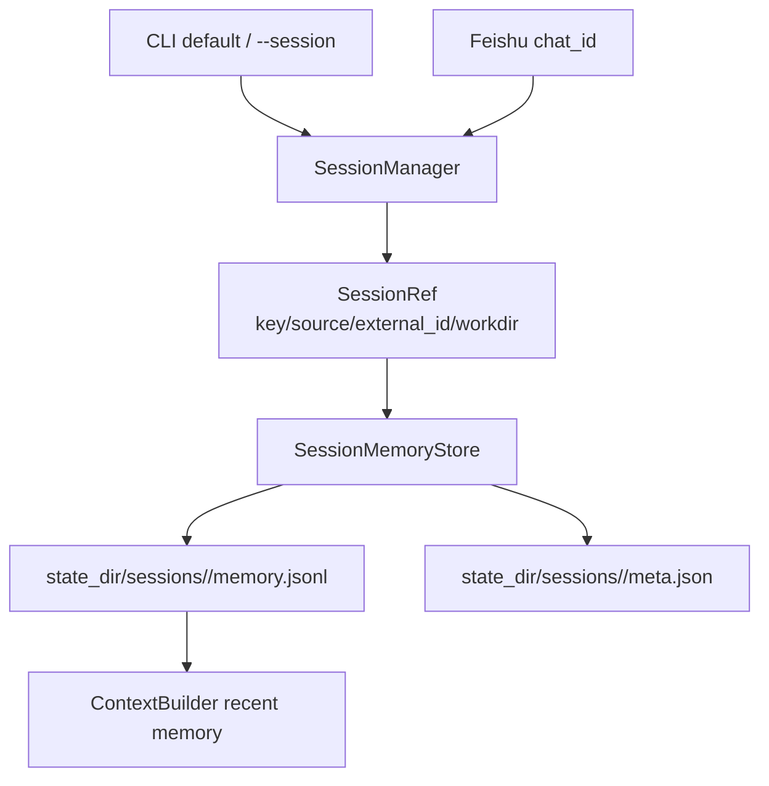

> 系列导航：[系列目录](/series/harness-agent/) | 上一篇：[从零实现 Harness Agent：构建 Skill 感知上下文引擎](/2026/06/09/harness-agent/harness-agent-07-skill-aware-context-engine/) | 下一篇：[从零实现 Harness Agent：可恢复 Plan Mode 设计](/2026/06/09/harness-agent/harness-agent-09-resumable-plan-mode/)

## 本节目标

> 导读：本篇属于第三部分「上下文、记忆与计划」，聚焦跨入口状态：CLI、Feishu 和后续 Subagent 为什么必须拥有独立会话线。

本节要实现的是 session-scoped memory：让 CLI 默认会话、CLI 命名会话和 Feishu chat 都拥有独立的记忆与状态目录。

完成这一节后，系统会具备下面这些能力：

- `tiny-claw run` 使用当前工作区的默认 CLI session。
- `tiny-claw run --session <name>` 可以创建命名会话。
- Feishu 入口可以按 `chat_id` 自动隔离上下文。
- 每条 session 都有稳定 `SessionRef` 和独立 `memory.jsonl`。
- 后续 Plan Mode 可以把 `PLAN.md/TODO.md` 放入同一 session 状态目录。

这一节的关键目标是把 session 做成“对话线”，避免不同入口和不同任务之间发生上下文串线。

## 摘要

一套 Agent runtime 可能同时服务终端、命名任务和外部聊天平台。`tiny-claw` 支持 CLI 默认会话、CLI 命名会话和 Feishu chat 会话，并为每条会话维护独立记忆。本文介绍 `SessionManager` 和 `SessionMemoryStore` 如何把不同入口映射到稳定 session key，避免上下文串线。

## 背景与问题

Agent 一旦支持多入口，就会遇到记忆隔离问题。同一个运行时可能同时服务：

- 用户在终端中的默认 CLI 会话。
- 用户通过 `--session debug-login` 指定的命名会话。
- 外部平台里不同 chat 的消息。

如果这些请求都读写同一个 `memory.jsonl`，模型可能把一个会话里的上下文带到另一个会话里，造成错误回复甚至误操作。

因此，session 层需要回答一个基础问题：这次请求属于哪一条对话线？

## 设计目标

- **入口隔离**：CLI 和 Feishu 不共享默认记忆。
- **命名会话**：CLI 支持 `--session` 手动隔离任务。
- **稳定 key**：同一 workdir、source、external id 得到稳定 session key。
- **文件系统可见**：session 元信息和记忆存为普通文件。
- **职责单一**：session 层只解析会话，不拼 prompt、不执行工具。
- **可测试**：session 解析和记忆读写可独立验证。

## 整体方案

`SessionManager` 将入口来源和外部 ID 转成 `SessionRef`。`SessionMemoryStore` 再根据 `SessionRef.key` 选择文件目录。



session key 由三部分组成：

```text
<source>-<workdir_hash>-<external_id>
```

这样同名 session 在不同项目目录下不会互相污染。

## 核心实现

关键文件：

- `src/tiny_claw/_internal/session/manager.py`
- `src/tiny_claw/_internal/memory/file_store.py`
- `tests/test_session.py`
- `tests/test_e2e_sessions.py`

`SessionRef` 保存本轮运行上下文：

```python
@dataclass(frozen=True)
class SessionRef:
    key: str
    source: str
    external_id: str
    workdir: Path
    display_name: str
```

CLI 默认会话：

```python
def resolve_cli(self, session_name: str | None = None) -> SessionRef:
    name = _normalize_segment(session_name or "default")
```

Feishu 会话按 chat id 隔离：

```python
def resolve_feishu_chat(self, chat_id: str) -> SessionRef:
    external_id=f"chat:{normalized_chat_id}"
```

记忆文件使用 JSONL：

```python
payload = {"key": key, "value": value}
file.write(json.dumps(payload, ensure_ascii=True) + "\n")
```

上下文层读取最近记忆：

```python
recent_memory = session_memory.read_recent(limit=5)
```

## 使用方式

默认 CLI 会话：

```bash
tiny-claw run "解释当前项目"
```

命名 CLI 会话：

```bash
tiny-claw run --session debug-login "继续这个调试会话"
```

指定状态目录：

```bash
TINY_CLAW_STATE_DIR=.tmp-state \
tiny-claw run --session demo "hello"
```

Feishu 入口内部会自动按 `chat_id` 隔离，用户不需要手动传 session name。

状态目录大致结构：

```text
state_dir/
  sessions/
    <session-key>/
      meta.json
      memory.jsonl
      plan/
        PLAN.md
        TODO.md
```

## 测试与验证

session 单元测试：

```bash
uv run pytest tests/test_session.py
```

端到端 session 测试：

```bash
uv run pytest tests/test_e2e_sessions.py
```

CLI 冒烟：

```bash
TINY_CLAW_PROVIDER=echo TINY_CLAW_STATE_DIR=.tmp-state \
uv run tiny-claw run --session demo "hello tiny claw"
```

测试结束后可以删除临时状态目录：

```bash
rm -rf .tmp-state
```

## 设计取舍与注意事项

session key 包含 workdir hash，是为了让不同项目里的同名会话互不干扰。`debug` 这个 session 名在两个项目里可能都存在，但它们不应该共享记忆和计划文件。

当前 memory 是轻量 JSONL，而不是长期知识库、向量数据库或知识图谱。它只记录最近运行线索，是否进入模型上下文由 context 层决定。存储层不应该偷偷改变 prompt 策略。

Feishu 使用 `chat_id`，不是 `message_id`，因为一条消息不是一条对话线。`Application.run()` 要求 session workdir 与应用 workdir 一致，也是为了和工具注册保持一致：工具是在应用 workdir 下创建的，不能拿另一个 workdir 的 session 来复用。

## 总结

- Session 层让多入口 Agent 不共享错误上下文。
- CLI 默认会话、命名会话、Feishu chat 都能独立存储记忆。
- 文件系统状态简单透明，便于调试和测试。
- session 只解决“这次请求属于哪条线”，不承担上下文策略和工具执行。

按上下文专题继续阅读：[09：可恢复 Plan Mode](09-可恢复计划模式.md) 会把长任务计划也放进 session-scoped 状态。

---

> 来源：本文整理自 `tiny-claw/docs/tutorial/08-会话隔离记忆设计.md`。
> 项目地址：[barry166/tiny-claw](https://github.com/barry166/tiny-claw)。
