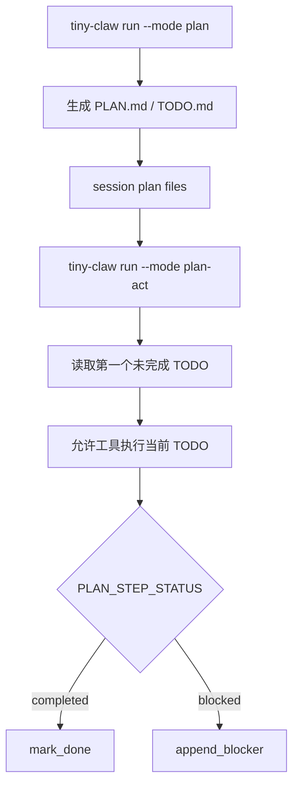

## 本节目标

本节要实现的是 session-scoped Plan Mode：让 Agent 可以先把长任务规划保存为 `PLAN.md` 和 `TODO.md`，再通过 `plan-act` 从当前未完成 TODO 继续执行。

完成这一节后，系统会具备下面这些能力：

- `tiny-claw run --mode plan "..."` 可以创建或恢复当前 session 的计划文件。
- `PLAN.md` 保存目标理解、架构设计、约束、风险和验证策略。
- `TODO.md` 使用稳定 checkbox ID 记录可执行任务。
- `tiny-claw run --mode plan-act "..."` 可以读取第一个未完成 TODO 并执行。
- 最终回复声明 `PLAN_STEP_STATUS: completed` 且本步没有工具错误时，当前 TODO 会被标记为完成；阻塞时可以追加 blocker。

这一节的关键目标是把“计划”从模型短期上下文里拿出来，变成可恢复、可检查、可解析的任务状态。

## 摘要

长任务计划如果只存在于模型回复里，很快就会丢失、重复或不可恢复。`tiny-claw` 的 Plan Mode 把计划写入 session-scoped 的 `PLAN.md` 和 `TODO.md`，并通过 `plan-act` 从第一个未完成 TODO 继续执行。本文介绍这个轻量计划文件协议、运行模式边界和执行生命周期。

## 背景与问题

复杂任务通常需要先规划再执行。例如搭建项目骨架、重构模块、接入外部平台，都不适合让模型直接开始改文件。它们需要目标理解、架构设计、任务拆分、风险和验证策略。

如果计划只存在于模型上下文里，会有几个问题：

- 会话中断后计划丢失。
- 上下文压缩后计划细节可能消失。
- 用户无法方便地检查和调整计划。
- 执行阶段不知道当前应该做哪一个 TODO。

`tiny-claw` 用 Markdown 文件作为计划状态源：人能读，模型也容易读，测试也能解析。

## 设计目标

- **可恢复**：计划保存到 session 状态目录。
- **可读可改**：使用 Markdown，而不是私有二进制格式。
- **职责分离**：`plan` 只规划，不执行工具。
- **逐步执行**：`plan-act` 只执行当前未完成 TODO。
- **状态可解析**：TODO 有稳定 ID，可打勾和记录 blocker。
- **上下文清洁**：plan 文件是状态源，memory 只记录轻量摘要。

## 整体方案

Plan Mode 有两个核心文件：

```text
sessions/<session-key>/plan/
  PLAN.md
  TODO.md
```

`PLAN.md` 保存目标理解、架构设计、技术选型、约束、风险和验证策略。`TODO.md` 保存可解析的 checkbox 列表，每项带稳定 ID。执行阶段只有在模型明确返回 `PLAN_STEP_STATUS: completed`，并且本轮没有工具错误时，才会把当前 TODO 打勾。



## 核心实现

关键文件：

- `src/tiny_claw/_internal/context/plan.py`
- `src/tiny_claw/_internal/engine/main_loop.py`
- `src/tiny_claw/cli.py`
- `tests/test_context_plan.py`
- `tests/test_plan_mode_openai_live.py`

`PlanFiles` 管理 session 级文件：

```python
@classmethod
def from_session_root(cls, session_root: Path) -> PlanFiles:
    return cls(root=session_root / "plan")
```

TODO 使用稳定 ID：

```text
TODO.md

- [ ] TC-001 创建项目文件
- [ ] TC-002 添加测试
```

Parser 可以找到第一个未完成项：

```python
def next_open_item(todo_text: str) -> TodoItem | None:
    for item in PlanMarkdownParser.items(todo_text):
        if not item.done:
            return item
```

执行阶段要求模型在最终回复中输出状态标记：

```text
PLAN_STEP_STATUS: completed
PLAN_STEP_STATUS: blocked
```

`plan-act` 执行阶段的 prompt 明确允许工具：

```text
Plan-Act execution phase is ON...
You may call the available tools, create files, edit files, and run commands...
```

这避免了规划阶段“不能执行工具”的约束污染执行阶段。

状态更新仍然保持保守：如果本步出现过工具错误，即使最终回复包含 completed，也会转为记录 blocker，避免把一次未被验证的执行误标为完成。

## 使用方式

创建计划：

```bash
tiny-claw run --mode plan "设计一个基础 Python CLI 框架"
```

按计划执行：

```bash
tiny-claw run --mode plan-act "按照计划继续执行"
```

使用命名 session 隔离计划：

```bash
tiny-claw run --session nextjs --mode plan "设计 Next.js 基础框架"
tiny-claw run --session nextjs --mode plan-act "继续执行"
```

如果需要工具执行，显式启用：

```bash
TINY_CLAW_ENABLED_TOOLS=read,write,edit,bash \
tiny-claw run --mode plan-act "执行当前 TODO"
```

## 测试与验证

Plan parser 测试：

```bash
uv run pytest tests/test_context_plan.py
```

Engine 和 CLI 测试：

```bash
uv run pytest tests/test_engine.py
uv run pytest tests/test_cli.py
```

OpenAI live e2e 测试需要真实 key：

```bash
OPENAI_API_KEY=<your-openai-api-key> uv run pytest tests/test_plan_mode_openai_live.py
```

完整验证：

```bash
uv run ruff check .
uv run ruff format --check .
uv run mypy src
uv run pytest
```

## 设计取舍与注意事项

`plan` 模式不暴露工具，也不执行工具调用。这不是能力缺失，而是语义边界：规划阶段应该产出任务结构，不应该顺手修改项目。执行阶段交给 `plan-act`，它会读取当前未完成 TODO，并明确允许工具执行。

`plan-act` 也没有和普通 `act` 合并。普通 `act` 是自由执行请求；`plan-act` 是按计划执行当前 TODO。把二者混在一起，会让模型在有计划和无计划场景下的行为变得模糊。

当前每个 session 只维护一组 plan 文件，不支持多个 active plan、归档或重置。Markdown 文件使用进程内锁和原子写入，跨进程锁还没有实现。Live e2e 能验证真实模型行为，但依赖网络和 key，不适合无条件放入所有 CI。

## 总结

- Plan Mode 把长任务状态从模型上下文外部化到文件。
- `PLAN.md/TODO.md` 同时适合人读、模型读和测试解析。
- `plan-act` 让执行从当前未完成 TODO 开始，而不是自由发挥。
- 规划阶段和执行阶段的 prompt 边界必须清晰，否则模型会自我阻塞。

---

> 来源：本文整理自 `tiny-claw/docs/tutorial/09-可恢复计划模式.md`。
