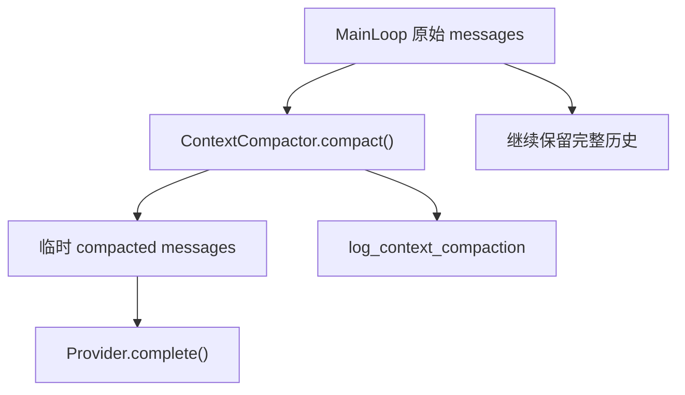

## 本节目标

本节要实现的是 `ContextCompactor`：在每次请求 Provider 前，为过长的消息历史生成一个临时压缩视图，避免工具输出撑爆上下文。

完成这一节后，系统会具备下面这些能力：

- 当消息总字符数未超过预算时，Provider 请求保持原样。
- 当上下文过长时，旧工具输出会被替换成短 mask。
- 最近工具输出会保留头尾片段，便于模型继续理解当前任务。
- 原始 messages、session memory 和 plan 状态不会被改写。
- 压缩发生时会记录原始字符数、压缩后字符数、mask/truncate 数量。

这一节的关键目标是压缩“请求视图”，而不是清洗“历史事实”。

## 摘要

工具输出可能非常长，直接进入模型请求会快速消耗上下文预算。`tiny-claw` 的 `ContextCompactor` 在 provider 请求前生成一个临时压缩视图：旧工具输出被 mask，最近工具输出保留头尾片段，原始消息历史不被改写。本文介绍这个设计如何降低上下文爆炸风险，同时保持 session 和 memory 的完整性。

## 背景与问题

Agent 在执行工具后，会把工具结果作为 observation 追加回消息历史。对于 `read`、`bash` 等工具来说，输出可能很长：

- 读取大文件。
- 测试失败输出大量日志。
- 命令 stdout/stderr 很长。
- 多轮工具结果累积。

如果每轮都把完整历史发给 provider，最终会出现请求过大、成本上升、模型注意力分散，甚至直接超过上下文限制。

一种简单做法是改写历史消息，把旧工具输出删掉。但这样会污染 session 原始记录，也让后续调试和恢复变困难。`ContextCompactor` 采用更保守的方式：只压缩本轮发给 provider 的临时视图。

## 设计目标

- **不污染历史**：不修改 MainLoop 内部原始 messages。
- **只作用于请求视图**：压缩只发生在 provider 请求前。
- **优先压缩工具输出**：system、user、assistant tool calls 保持原样。
- **保留近期信息**：最近工具输出保留 head-tail。
- **旧输出降噪**：早期工具输出替换成短 observation mask。
- **可观测**：压缩发生时记录原始字符数、压缩后字符数和压缩数量。

## 整体方案

主循环每轮请求 provider 前调用 compactor：



压缩策略：

- 总字符数未超过预算：不改动。
- 超过预算：只处理 `Role.TOOL` 消息。
- 旧工具结果：替换为短 mask，说明工具名和原始长度。
- 最近工具结果：保留开头和结尾，中间插入截断标记。
- 最后一条 user message 和 assistant tool calls 不压缩。

## 核心实现

关键文件：

- `src/tiny_claw/_internal/context/compactor.py`
- `src/tiny_claw/_internal/engine/main_loop.py`
- `src/tiny_claw/_internal/engine/log_view.py`
- `tests/test_context_compactor.py`

`ContextCompactor` 默认配置：

```python
ContextCompactor(
    max_chars=120_000,
    retain_last_messages=8,
    old_tool_result_mask_chars=240,
    recent_tool_result_head_chars=2_000,
    recent_tool_result_tail_chars=2_000,
)
```

压缩结果包含统计信息：

```python
@dataclass(frozen=True)
class CompactionResult:
    messages: tuple[Message, ...]
    original_chars: int
    compacted_chars: int
    max_chars: int
    masked_tool_results: int = 0
    truncated_tool_results: int = 0
```

旧工具输出 mask 示例：

```text
[早期工具输出已清理以节省上下文。工具名: read。原始长度: 50000 chars。]
```

最近工具输出采用 head-tail：

```text
<head>

...[中间内容已截断，原始长度 50000 chars]...

<tail>
```

主循环中只把压缩结果传给 provider：

```python
compaction = self.context_compactor.compact(messages)
response = self.provider.complete(
    LLMRequest(messages=compaction.messages, ...)
)
```

`messages` 原始列表继续保留完整内容。

## 使用方式

这是内部上下文保护机制，用户不需要手动调用。只要通过 `tiny-claw run` 或 Feishu 入口触发 MainLoop，就会在 provider 请求前执行。

相关默认值目前是内部 settings 字段，不通过环境变量暴露：

```text
context_max_chars=120000
context_retain_last_messages=8
context_old_tool_result_mask_chars=240
context_recent_tool_result_head_chars=2000
context_recent_tool_result_tail_chars=2000
```

如果希望观察压缩行为，可以把日志级别调高并构造长工具输出场景：

```bash
TINY_CLAW_LOG_LEVEL=INFO \
TINY_CLAW_ENABLED_TOOLS=read,bash \
uv run tiny-claw run "读取并分析一个很大的输出"
```

## 测试与验证

Compactor 单元测试：

```bash
uv run pytest tests/test_context_compactor.py
```

主循环接入测试：

```bash
uv run pytest tests/test_engine.py
```

Settings 默认字段测试：

```bash
uv run pytest tests/test_settings.py
```

完整验证：

```bash
uv run ruff check .
uv run ruff format --check .
uv run mypy src
uv run pytest
```

测试重点包括：

- 未超过预算时不改动。
- 旧 tool result 被 mask。
- 最近 tool result 被 head-tail 截断。
- assistant tool calls 不被修改。
- provider 收到压缩视图，但主循环原始历史不被污染。

## 设计取舍与注意事项

`ContextCompactor` 当前不是语义摘要器。它不调用模型生成 summary，而是做可解释的 mask 和 head-tail 截断。这种策略不聪明，但稳定、便宜、容易测试。

压缩优先针对 tool result，而不是 system/user 核心指令。工具输出通常最长，也最容易重复；核心约束和最后的用户请求则更应该保留。配置暂不开放为环境变量，是为了避免在压缩策略还很年轻时扩大用户配置面。

即使压缩后仍超预算，当前也只记录日志，不做更激进的删除。未来如果引入模型摘要或多级压缩，也应该继续保持一个边界：压缩的是 provider 请求视图，不是原始历史事实。

## 总结

- Context Compactor 解决的是工具输出导致 provider 请求过大的问题。
- 它只压缩临时请求视图，不改写 session、memory 或主循环历史。
- 旧工具输出 mask，近期工具输出保留头尾，是一种保守可解释策略。
- 日志统计让上下文压缩行为可观测、可测试。

---

> 来源：本文整理自 `tiny-claw/docs/tutorial/11-上下文压缩器.md`。
