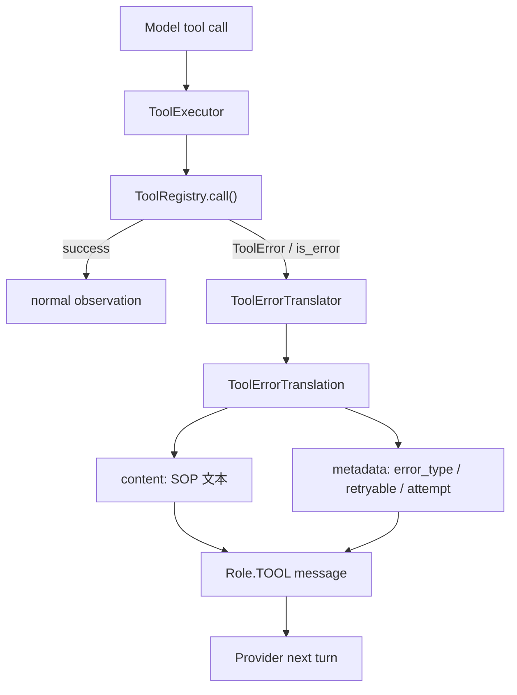
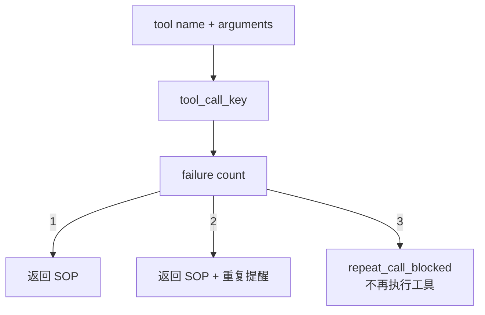

> 系列导航：[系列目录](/series/harness-agent/) | 上一篇：[从零实现 Harness Agent：上下文压缩器设计](/2026/06/09/harness-agent/harness-agent-11-context-compactor/) | 下一篇：[从零实现 Harness Agent：Agent CLI 测试策略](/2026/06/09/harness-agent/harness-agent-13-agent-cli-testing-strategy/)

## 本节目标

> 导读：本篇属于第三部分「上下文、记忆与计划」，关注失败反馈：让工具错误成为下一轮推理可用的恢复线索。

本节要实现的是工具错误 SOP 兜底：当工具调用失败时，系统把原始错误翻译成模型可理解、用户可观测、测试可断言的结构化反馈。

完成这一节后，系统会具备下面这些能力：

- `read` 找不到文件、`edit` 找不到 `old_text`、`bash` 超时等错误会被归类。
- tool observation 会包含错误摘要、原始错误、下一步建议、不要做什么和失败次数。
- metadata 会记录 `error_type`、`retryable`、`attempt`、`suggested_tool` 等字段。
- SOP 只建议当前真正可见的工具，避免诱导模型调用不存在的能力。
- 同一工具同一参数连续失败达到阈值后，会触发重复失败熔断。

这一节的关键目标是把“工具错误”变成下一轮推理材料，而不是一段模型难以使用的原始报错。

## 摘要

工具失败时，如果只把原始错误返回给模型，Agent 很容易重复同一组参数、误判操作成功，或者尝试不存在的工具。`tiny-claw` 的工具错误兜底模块把失败翻译成结构化 SOP：错在哪里、下一步建议、不要做什么、是否可重试。本文介绍这个模块的设计、接入点和验证方式。

## 背景与问题

Agent 工具调用失败是常态，而不是异常边缘场景。例如：

- `read` 找不到文件。
- `edit` 找不到 `old_text`。
- `edit` 匹配到多处，不知道该改哪一处。
- `bash` 命令超时或非零退出。
- 模型请求了当前不可见的工具。

如果工具 observation 只包含原始错误，模型不一定能正确恢复。它可能继续用完全相同的参数重试，或者在最终回复中声称工具执行成功。

因此，工具执行层需要把原始错误翻译成模型可行动的反馈。

## 设计目标

- **模型可理解**：错误内容包含摘要、原始错误、下一步建议和禁止动作。
- **机器可读**：metadata 保存 `error_type`、`retryable`、`attempt` 等字段。
- **尊重工具可见性**：只建议当前真正可见的工具。
- **阻止重复失败**：同一工具同一参数连续失败达到阈值后熔断。
- **用户可见**：日志和 Feishu channel 能提示错误兜底已触发。
- **不自动修复**：模块只给建议，不替模型执行下一步。

## 整体方案

工具错误兜底位于 `ToolExecutor` 和 `ToolErrorTranslator` 之间。工具执行失败后，执行器不直接返回原始错误，而是生成结构化 translation，再渲染成 tool observation。



重复失败保护独立于具体错误类型：



## 核心实现

关键文件：

- `src/tiny_claw/_internal/engine/tool_feedback.py`
- `src/tiny_claw/_internal/engine/tool_executor.py`
- `src/tiny_claw/_internal/engine/log_view.py`
- `src/tiny_claw/_internal/integrations/feishu/bot.py`
- `tests/test_tool_executor.py`
- `tests/test_tool_error_sop_e2e_print.py`

错误翻译结果：

```python
@dataclass(frozen=True)
class ToolErrorTranslation:
    error_type: str
    summary: str
    next_action: str
    avoid: str
    retryable: bool
    suggested_tool: str | None = None
```

渲染内容包含固定结构：

```text
工具失败：...

原始错误：
...

下一步建议：
...

不要做：
...

失败次数：1
```

metadata 用于测试、日志和外部通道：

```python
{
    "error_type": self.error_type,
    "retryable": self.retryable,
    "attempt": attempt_count,
}
```

工具可见性由 `MainLoop` 传给 `ToolExecutor`：

```python
ToolExecutor(
    tools=self.tools,
    visible_tool_names=tuple(definition.name for definition in registered_tool_definitions),
)
```

例如 `read` 找不到文件时，如果 `bash` 可见，会建议查看父目录；如果 `bash` 不可见，则不会诱导模型调用 `bash`。

重复失败阈值：

```python
REPEAT_FAILURE_BLOCK_ATTEMPT = 3
```

第三次同参失败会返回 `repeat_call_blocked`，并且不再执行工具。

## 使用方式

这是内部工具执行兜底机制，用户不直接调用。只要模型调用工具并失败，就会进入该路径。

示例场景：

```bash
TINY_CLAW_ENABLED_TOOLS=read,bash \
uv run tiny-claw run "读取 src/missing.py，如果没有就判断目录里有什么"
```

模型下一轮会看到类似 observation：

```text
工具失败：read 找不到目标文件：src/missing.py。

下一步建议：
先调用 bash 查看父目录是否存在以及文件名是否写错，例如：ls src

不要做：
不要用完全相同的 path 直接重复 read。
```

Feishu 通道会发送简短提示：

```text
工具 read 失败，已触发错误兜底：read_path_not_found。建议下一步：bash。
```

## 测试与验证

工具错误翻译测试：

```bash
uv run pytest tests/test_tool_executor.py
```

日志和 Feishu 提示测试：

```bash
uv run pytest tests/test_log_view.py tests/test_feishu_integration.py
```

打印型 E2E：

```bash
uv run pytest -s tests/test_tool_error_sop_e2e_print.py
```

该 E2E 使用 deterministic fake provider，不依赖真实 API key，重点打印模型下一轮实际看到的 tool observation。

完整验证：

```bash
uv run ruff check .
uv run ruff format --check .
uv run mypy src
uv run pytest
```

## 设计取舍与注意事项

工具错误兜底只翻译错误，不自动执行下一步工具。它的职责是让模型获得更好的下一轮推理材料，而不是替模型做决定。这样可以保持 ReAct 流程的可解释性：模型仍然需要根据 observation 选择下一步。

SOP 必须尊重当前可见工具。如果当前没有暴露 `bash`，就不能建议模型去 `ls`；否则“兜底提示”本身就会制造工具幻觉。重复失败熔断也保持窄边界，只处理“同工具 + 同参数”的连续失败，不试图解决所有循环问题。

第三次重复失败时，执行器不会再运行工具，而是直接返回 `repeat_call_blocked` observation。这个判断只针对“同一工具名 + 同一参数”的连续失败；如果模型调整了参数或换用其他可见工具，就会进入新的执行路径。

## 总结

- 原始工具错误不适合作为唯一反馈，模型需要明确下一步建议。
- `ToolErrorTranslator` 把错误转成 content + metadata 的结构化 observation。
- 可见工具过滤避免错误兜底反过来制造工具幻觉。
- 重复失败熔断能阻止模型原地打转。
- 用户侧日志和 Feishu 提示让自恢复过程可观测。

按编号继续阅读：[13：Agent CLI 测试策略](13-智能体-cli-测试策略.md) 会把这些运行时边界转成可回归的验证体系。

---

> 来源：本文整理自 `tiny-claw/docs/tutorial/12-工具错误-sop-兜底机制.md`。
> 项目地址：[barry166/tiny-claw](https://github.com/barry166/tiny-claw)。
