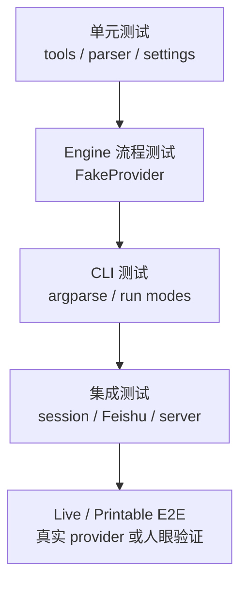

> 系列导航：[系列目录](/series/harness-agent/) | 上一篇：[从零实现 Harness Agent：工具错误 SOP 兜底机制](/2026/06/09/harness-agent/harness-agent-12-tool-error-sop-fallback/) | 下一篇：[从零实现 Harness Agent：Edit 工具的降级匹配管线](/2026/06/09/harness-agent/harness-agent-14-edit-degraded-matching-pipeline/)

## 本节目标

> 导读：本篇进入第六部分「测试与验收」，从整体上梳理 Agent runtime 的不同层次应该如何被验证。

本节要建立的是 `tiny-claw` 的测试分层：用不同类型的测试分别验证工具、主循环、上下文、session、Plan Mode、外部集成和真实 Provider 行为。

完成这一节后，项目会具备下面这些验证能力：

- 工具和 parser 可以通过单元测试锁住边界条件。
- `MainLoop` 可以用 FakeProvider 稳定验证多轮工具调用。
- CLI 参数、帮助信息和运行模式可以被自动化测试覆盖。
- Feishu、session 和 plan files 可以在不依赖真实平台的情况下测试。
- live provider demo 和 printable E2E 可以作为真实行为补充验收。

这一节的关键目标是承认 Agent 不是纯函数，然后用分层测试把不稳定性关在合适的位置。

## 摘要

Agent CLI 的行为横跨模型、工具、文件系统、session、plan 文件和外部平台，只测单个函数远远不够。`tiny-claw` 通过单元测试、FakeProvider 流程测试、真实 Provider demo、Feishu 集成测试和打印型 E2E，覆盖从内部协议到用户入口的关键链路。本文介绍这套测试分层适合验证什么，以及哪些测试不应该无条件进入 CI。

## 背景与问题

Agent 框架的测试难点在于：很多行为不是纯函数。

- 模型输出不稳定，不能直接依赖真实模型做大部分自动化断言。
- 工具会读写文件、执行命令，存在副作用。
- Session 和 Plan Mode 会写状态文件。
- Feishu 等平台入口依赖外部 SDK 和异步消息。
- 上下文压缩和错误兜底需要验证模型下一轮看到了什么。

因此，测试体系需要分层：稳定路径用 fake 和单元测试锁住，真实模型和人工可读输出作为补充验收。

## 设计目标

- **稳定性**：核心行为不依赖真实模型随机输出。
- **覆盖链路**：从 parser、tool、engine 到 CLI 和 HTTP 都有测试。
- **副作用可控**：文件系统操作使用临时目录。
- **真实可验**：保留 live provider demo 和 printable E2E。
- **回归友好**：常规测试能在本地快速运行。
- **边界清晰**：live 测试不和普通 CI 混淆。

## 整体方案

测试分成五层：



每层关注不同风险：

- 单元测试：函数和工具边界。
- Engine 测试：多轮 ReAct 编排。
- CLI 测试：参数、帮助、命令行为。
- 集成测试：session、HTTP、Feishu adapter。
- Live/E2E：真实模型行为和模型可见 observation。

## 核心实现

关键测试文件：

- `tests/test_tools.py`
- `tests/test_tool_executor.py`
- `tests/test_engine.py`
- `tests/test_context_plan.py`
- `tests/test_context_compactor.py`
- `tests/test_context_skills.py`
- `tests/test_session.py`
- `tests/test_e2e_sessions.py`
- `tests/test_feishu_integration.py`
- `tests/test_provider_openai.py`
- `tests/test_provider_claude.py`
- `tests/test_provider_openai_live.py`
- `tests/test_plan_mode_openai_live.py`
- `tests/demo_edit_flow.py`
- `tests/test_tool_error_sop_e2e_print.py`

Engine 测试使用 FakeProvider 构造多轮响应。例如：

```text
FakeProvider -> tool_call(read)
ToolExecutor -> Role.TOOL observation
FakeProvider -> tool_call(edit)
ToolExecutor -> Role.TOOL observation
FakeProvider -> final answer
```

这种方式能稳定验证：

- 工具定义是否暴露给 provider。
- tool observation 是否进入下一轮请求。
- 文件副作用是否真实发生。
- 主循环是否正确停止。

Plan Mode 使用 parser 和 engine 双层测试：

- `tests/test_context_plan.py` 验证 `PLAN.md/TODO.md` 格式解析。
- `tests/test_engine.py` 验证 `plan`、`plan-act` 模式流转。
- `tests/test_plan_mode_openai_live.py` 作为真实 provider 补充验收。

Feishu 使用 fake SDK/channel 验证 adapter 行为，避免测试依赖真实平台。

## 使用方式

日常开发推荐先跑聚焦测试：

```bash
uv run pytest tests/test_tools.py
uv run pytest tests/test_tool_executor.py
uv run pytest tests/test_engine.py
```

修改上下文相关模块：

```bash
uv run pytest tests/test_context_skills.py
uv run pytest tests/test_context_plan.py
uv run pytest tests/test_context_compactor.py
```

修改外部集成：

```bash
uv run pytest tests/test_feishu_integration.py
```

完整回归：

```bash
uv run ruff check .
uv run ruff format --check .
uv run mypy src
uv run pytest
```

真实 Provider demo：

```bash
OPENAI_API_KEY=<your-openai-api-key> uv run python tests/demo_edit_flow.py
```

打印型工具错误 E2E：

```bash
uv run pytest -s tests/test_tool_error_sop_e2e_print.py
```

## 测试与验证

模块级验证建议：

- Provider：`tests/test_provider_openai.py`、`tests/test_provider_claude.py`
- 工具：`tests/test_tools.py`
- 工具执行器：`tests/test_tool_executor.py`
- 主循环：`tests/test_engine.py`
- Session：`tests/test_session.py`、`tests/test_e2e_sessions.py`
- Plan：`tests/test_context_plan.py`、`tests/test_plan_mode_openai_live.py`
- Feishu：`tests/test_feishu_integration.py`

CLI 冒烟：

```bash
uv run tiny-claw --help
uv run tiny-claw serve --help
TINY_CLAW_PROVIDER=echo TINY_CLAW_STATE_DIR=.tmp-state uv run tiny-claw health
TINY_CLAW_PROVIDER=echo TINY_CLAW_STATE_DIR=.tmp-state uv run tiny-claw run "hello tiny claw"
uv run python -m tiny_claw --help
```

测试结束后删除临时状态目录：

```bash
rm -rf .tmp-state
```

## 设计取舍与注意事项

大部分自动化测试使用 fake provider，这是 Agent 框架测试稳定性的基础。真实模型输出有概率波动，适合做 live demo 和补充验收，不适合作为每次回归的主要断言来源。

打印型 E2E 的定位也要清楚：它让维护者看到模型下一轮实际收到的 observation，尤其适合验证工具错误 SOP 这类“给模型看的内容”。但它不替代单元测试，也不应该把所有行为都写成脆弱的字符串断言。

有文件副作用的测试使用 `tmp_path`，外部平台测试 fake SDK/channel，都是为了把风险关在测试边界里。文档、架构和 CLI 行为变更后，也应该跑 help 和 smoke test，因为用户首先接触到的是命令体验。

## 总结

- Agent CLI 需要分层测试，而不是只测最终回复。
- FakeProvider 是稳定验证多轮工具调用的关键。
- 状态文件、工具副作用和外部平台入口都需要独立测试。
- Live demo 和 printable E2E 是补充验收，不应替代常规回归。
- 一套清晰测试命令能让框架演进更可控。

按编号继续阅读：[14：edit 分层降级匹配管线](14-edit-分层降级匹配管线.md) 会继续深入文件编辑工具的匹配策略；按测试专题也可以跳到 [15：真实 Provider edit demo](15-真实-provider-edit-demo.md)。

---

> 来源：本文整理自 `tiny-claw/docs/tutorial/13-智能体-cli-测试策略.md`。
> 项目地址：[barry166/tiny-claw](https://github.com/barry166/tiny-claw)。
