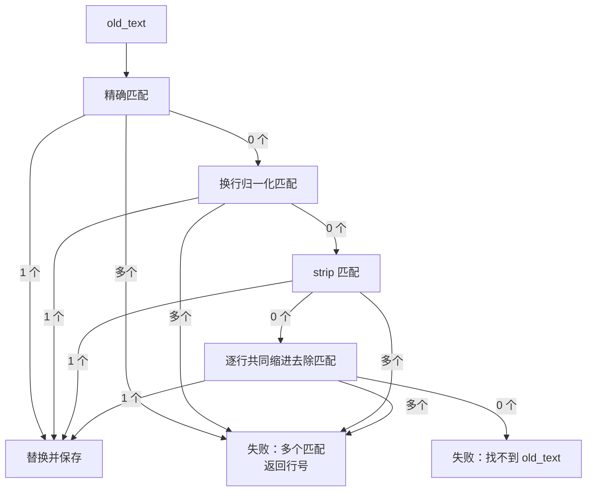

## 本节目标

> 导读：本篇回到第二部分「工具与安全边界」，深入 `EditTool` 的匹配策略：提高可用性，但不牺牲唯一、连续、可解释的安全边界。

本节要实现的是 `edit` 工具的分层降级匹配管线：在不牺牲唯一性和连续 span 的前提下，兼容模型常见的换行、首尾空白和缩进偏差。

完成这一节后，你会理解为什么安全编辑工具不能只做严格字符串匹配，也不能走过度模糊匹配。

## 摘要

本文要说明 `edit` 工具如何在修改文件时找到正确的 `old_text`。它适合正在设计 Agent 文件编辑工具、代码修改工具或自动化重构工具的开发者阅读。读完后，你会理解为什么 `edit` 既不能只做严格字符串匹配，也不能过度模糊匹配，以及如何用分层降级匹配在可用性和安全性之间取得平衡。

## 背景与问题

局部编辑工具的输入通常很简单：目标文件路径、要替换的旧文本和替换后的新文本。真正困难的是第二步：工具要在真实文件中找到 `old_text` 对应的位置。

在理想情况下，模型给出的 `old_text` 和文件内容完全一致，直接字符串查找即可。但真实工程里经常出现更微妙的情况：

- 文件使用 CRLF，模型输出的是 LF。
- 模型复制代码块时多带了首尾空行。
- 模型从 `read` 结果中理解了代码，但给出的多行片段没有包含原文件缩进。
- 某段文本在文件中出现多次，工具无法判断应该修改哪一个。
- 模型误把 `read` 工具展示的行号也放进了 `old_text`。

如果工具只支持精确匹配，就会因为小格式差异频繁失败。如果工具使用过度模糊的匹配，例如编辑距离、语义相似或跨段拼接，就可能把错误位置改掉。对文件编辑工具来说，失败通常比猜错更安全。

因此 `edit` 的匹配策略采用一条保守的 Degradation Pipeline：从严格匹配开始，逐层放宽格式要求，但每一层都必须映射到原文件中的连续文本片段，并且只允许唯一匹配。

## 设计目标

- **安全性**：任何宽松匹配都不能跳过唯一性校验。
- **确定性**：匹配结果必须是原文件中的连续 span，不能跨段拼接或重排行。
- **易用性**：兼容模型常见的换行、首尾空白和缩进误差。
- **可解释性**：成功结果要说明使用了哪种匹配策略。
- **可恢复性**：找不到或匹配多处时不写文件，并给出可行动错误。
- **与工具边界一致**：匹配逻辑只负责定位局部文本，创建文件和整文件覆盖仍由其他工具负责。

## 整体方案

`edit` 工具会按固定顺序尝试四层匹配：

1. 精确匹配。
2. 换行归一化匹配。
3. `old_text.strip()` 后匹配。
4. 逐行共同缩进去除匹配。

每一层都会先收集候选 span，再统一判断数量：

- `0` 个候选：进入下一层。
- `1` 个候选：执行替换并保存。
- 多个候选：立即失败，不修改文件，并返回匹配行号。



这个方案的关键不是“尽可能匹配成功”，而是“只在足够确定时匹配成功”。一旦某一层发现多个候选，工具不会继续尝试更宽松的下一层，因为下一层只会更不确定。

## 核心实现

核心文件是 `src/tiny_claw/_internal/tools/builtin/edit.py`。

匹配入口集中在 `_find_unique_match()`：

```python
def _find_unique_match(content: str, old_text: str) -> MatchResult | None:
    for candidate in (
        _exact_match(content, old_text),
        _newline_normalized_match(content, old_text),
        _trim_space_match(content, old_text),
        _line_by_line_normalized_match(content, old_text),
    ):
        if candidate.spans:
            return candidate
    return None
```

这里返回的是第一个有候选的匹配结果。真正决定是否替换的逻辑在 `EditTool.run()` 中：

```python
match = _find_unique_match(original, old_text)
if match is None:
    raise ToolError(...)
if len(match.spans) > 1:
    raise ToolError(...)
```

这种拆法让每个匹配函数只负责“找候选”，而不是负责“是否可以写入”。唯一性校验由调用方统一处理，避免不同策略出现不一致的成功条件。

### 精确匹配

精确匹配就是直接查找 `old_text`：

```python
def _exact_match(content: str, old_text: str) -> MatchResult:
    return MatchResult(
        strategy="exact",
        search_text=old_text,
        spans=_literal_spans(content, old_text),
    )
```

它是最可靠的策略。如果模型先 `read` 再复制完整片段，通常会命中这一层。

### 换行归一化匹配

换行归一化用于处理 CRLF、CR 和 LF 差异。实现时会把文件内容和 `old_text` 都归一成 LF，但返回的 span 仍然映射回原始文件偏移。

```python
normalized_content, offset_map = _normalize_newlines_with_offsets(content)
normalized_old_text = _normalize_newlines(old_text)
```

这一步的设计重点是 offset map。工具不能只在归一化字符串上替换，否则会破坏原文件的换行风格。匹配可以在归一化视图中完成，写入仍然要落回原文件的真实 span。

### 首尾空白裁剪匹配

模型输出代码块时，首尾多一个空行很常见。`_trim_space_match()` 只裁掉 `old_text` 的首尾空白，不会改动文件内容中的内部空白：

```python
trimmed = old_text.strip()
```

这层适合处理“复制多了空行”的场景，但不会容忍中间任意空白差异。这样仍然保持较强确定性。

### 逐行共同缩进去除匹配

多行代码片段最常见的问题是缩进。模型可能给出：

```python
message = f"Hello, {name}!"
return message
```

而真实文件中是：

```python
    message = f"Hello, {name}!"
    return message
```

逐行共同缩进去除匹配会比较“去掉共同缩进后的行内容”。它只处理每一行共有的字面缩进前缀：

```python
old_lines = _strip_common_indent_lines(old_text.strip("\r\n"))
```

实现中使用的是字面前缀，而不是视觉宽度。也就是说，tab 和 space 不会被强行视为等价缩进。这是一个保守选择：混合缩进时宁愿失败，也不要推断错误。

当缩进归一匹配唯一成功时，工具还会在必要时给未缩进的 `new_text` 继承匹配位置的缩进：

```python
if match.strategy != "line_by_line_normalized" or not match.indent:
    return replacement_text
return _apply_indent_if_unindented(replacement_text, match.indent)
```

这样模型可以给出更自然的无缩进代码片段，工具负责把它落回正确代码块。

## 使用方式

匹配策略是 `edit` 工具内部行为，用户不需要显式选择。推荐的使用方式是先读取文件，再基于读取结果提供足够上下文：

```bash
TINY_CLAW_ENABLED_TOOLS=read,edit \
uv run tiny-claw run "读取 greeting.py，把 greet 函数里的返回逻辑改成大写问候"
```

典型工具参数：

```json
{
  "path": "greeting.py",
  "old_text": "message = f\"Hello, {name}!\"\nreturn message",
  "new_text": "message = f\"Hi, {name}!\"\nreturn message.upper()"
}
```

如果文件中的代码带缩进，而 `old_text` 没带缩进，只要逐行内容和共同缩进能唯一对应，工具会使用 `line_by_line_normalized` 策略完成替换。

多匹配时，工具不会修改文件。此时应该给 `old_text` 增加更多上下文，例如包含函数名附近的代码或前后相邻行。

## 测试与验证

匹配策略的主要测试位于 `tests/test_tools.py`。可以运行：

```bash
uv run pytest tests/test_tools.py
```

关键覆盖场景包括：

- 精确替换。
- 多行替换。
- 删除文本。
- CRLF / LF 换行归一。
- `old_text.strip()` 匹配。
- 逐行共同缩进去除匹配。
- 未缩进 `new_text` 继承匹配位置缩进。
- 混合 tab / space 的不可靠场景失败。
- 找不到 `old_text`。
- 多处匹配时返回错误。
- `read` 行号误放入 `old_text` 时给出提示。

完整工程验证建议运行：

```bash
uv run ruff check .
uv run ruff format --check .
uv run mypy src
uv run pytest
```

## 设计取舍与注意事项

第一，匹配管线没有实现 fuzzy edit-distance。编辑距离看起来能提高成功率，但对文件修改工具来说，它会引入难以解释的误匹配风险。`edit` 的原则是：可以失败，但不能猜错。

第二，宽松匹配仍然要求连续 span。工具不会把文件中多个不相邻片段拼起来，也不会重排行顺序。这样可以保证替换动作等价于一次局部字符串替换。

第三，多匹配会立即失败，而不是继续尝试更宽松策略。因为一旦严格层已经出现多个候选，下一层只会扩大候选集合或降低确定性。

第四，缩进归一只处理共同字面前缀，不推断 tab 宽度。这样牺牲了一点便利性，但避免了在混合缩进代码中做危险猜测。

第五，匹配策略不是权限控制。路径边界、UTF-8 校验、文件存在校验和原子写入仍然由 `EditTool.run()` 的其他部分负责。

## 总结

- `edit` 的匹配管线用分层降级提高可用性。
- 每一层都必须满足唯一匹配，安全性优先于成功率。
- 换行、首尾空白和共同缩进是 Agent 编辑中最值得兼容的格式差异。
- 匹配结果必须回到原文件连续 span，保证替换行为可解释。
- 后续扩展匹配策略时，不能破坏“唯一、连续、可解释”这三个边界。

按编号继续阅读：[15：真实 Provider edit demo](15-真实-provider-edit-demo.md) 会用真实模型路径补充验证编辑工具。

---

> 来源：本文整理自 `tiny-claw/docs/tutorial/14-edit-分层降级匹配管线.md`。
> 项目地址：[barry166/tiny-claw](https://github.com/barry166/tiny-claw)。
