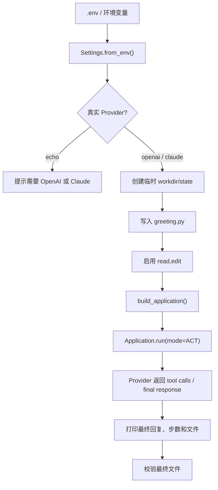

> 系列导航：[系列目录](/series/harness-agent/) | 上一篇：[从零实现 Harness Agent：Edit 工具的降级匹配管线](/2026/06/09/harness-agent/harness-agent-14-edit-degraded-matching-pipeline/) | 下一篇：[从零实现 Harness Agent：Tool Middleware 链式执行](/2026/06/09/harness-agent/harness-agent-16-tool-middleware-chain/)

## 本节目标

> 导读：本篇属于第六部分「测试与验收」，用真实 Provider 路径补上 fake provider 无法证明的一环：模型是否真的会按工具描述完成编辑。

本节要补充的是真实 Provider 下的编辑流程验收：用脚本验证模型能否在真实工具描述下完成 `read + edit`。

完成这一节后，你会知道 fake provider 与 live demo 分别证明什么，以及如何判断真实模型路径是否真的可用。

## 摘要

本文说明如何用 `tests/demo_edit_flow.py` 跑一次真实 Provider 下的 `read + edit` 文件编辑流程。它适合项目使用者、Agent 框架开发者和后续维护者阅读。读完后，你会知道怎么配置真实模型、怎么判断编辑是否真的生效，以及为什么这类 live demo 只能做补充验收，不能替代稳定的自动化测试。

## 背景与问题

FakeProvider 可以稳定验证 Engine 编排，但它回答不了一个现实问题：真实模型看到工具描述后，会不会按预期调用 `read` 和 `edit`？

对 `edit` 这样的工具来说，这个问题很重要。工具本身已经有严格校验，但真实模型还需要做到几件事：

- 理解应该先读取文件，而不是直接猜测内容。
- 构造足够唯一的 `old_text`。
- 在多行代码缺少缩进时，仍然给出能被工具匹配的片段。
- 在最终回复中正确说明工具是否执行成功。

这些行为无法完全通过单元测试证明。真实 Provider demo 的目标是提供一个人工可读、脚本可断言的验收入口：它创建临时文件，让真实模型完成一次编辑任务，最后用文件内容判断成败。

## 设计目标

- **真实性**：使用当前配置的真实 Provider，而不是 FakeProvider。
- **可观察性**：打印 Provider、初始文件、最终回复和最终文件。
- **安全性**：使用临时工作区，不修改项目源文件。
- **可断言**：最终文件必须等于预期内容，否则 demo 失败。
- **配置复用**：通过 `.env` 或环境变量读取 Provider 配置。
- **边界清晰**：作为手动或补充验收，不混入普通单元测试。

## 整体方案

`tests/demo_edit_flow.py` 会执行一条很小但完整的路径：

1. 从环境读取基础 settings。
2. 如果当前 Provider 是 `echo`，提示需要真实 Provider 并退出。
3. 创建临时 workdir 和 state dir。
4. 写入一个待修改的 `greeting.py`。
5. 设置 `TINY_CLAW_ENABLED_TOOLS=read,edit`。
6. 调用 `build_application(Settings.from_env())`。
7. 运行一次 `RunMode.ACT`。
8. 打印最终回复、停止原因、步数和最终文件。
9. 断言最终文件是否等于预期内容。



这个 demo 的定位是“真实行为验收”。它不覆盖所有边界，只挑一个典型编辑任务：读 `greeting.py`，替换函数体里的两行，再检查最终文件。够小，失败时也容易看出是哪一层出了问题。

## 核心实现

关键文件是 `tests/demo_edit_flow.py`。

脚本首先读取配置，并拒绝使用 `echo`：

```python
base_settings = Settings.from_env()
if base_settings.provider_name == "echo":
    print("This demo needs a real provider, not echo.")
    return 2
```

然后创建临时目录，准备待修改文件：

```python
with TemporaryDirectory() as tmp:
    workdir = Path(tmp) / "workdir"
    state_dir = Path(tmp) / "state"
    workdir.mkdir()

    target = workdir / "greeting.py"
    target.write_text(INITIAL_FILE, encoding="utf-8")
```

脚本在运行前显式启用工具：

```python
os.environ["TINY_CLAW_WORKDIR"] = str(workdir)
os.environ["TINY_CLAW_STATE_DIR"] = str(state_dir)
os.environ["TINY_CLAW_ENABLED_TOOLS"] = "read,edit"
```

这一步很重要。`edit` 是写类工具，不应该默认暴露给模型。demo 也必须像真实使用一样显式启用。

Prompt 会明确要求模型先读文件，再编辑函数体：

```text
1. 先使用 read 工具读取 greeting.py。
2. 再使用 edit 工具只替换函数体里的下面两行。
```

最后，脚本读取最终文件并做断言：

```python
if final_file != EXPECTED_FILE:
    print("DEMO RESULT: failed; real provider did not produce the expected edit.")
    return 1

print("DEMO RESULT: passed; real provider produced the expected edit.")
```

这个断言避免 demo 只凭最终回复判断成功。对文件编辑工具来说，最终文件才是事实来源。

## 使用方式

先在环境或项目 `.env` 中配置真实 Provider。OpenAI 示例：

```bash
OPENAI_API_KEY=<your-openai-api-key>
OPENAI_BASE_URL=<optional-openai-compatible-base-url>
TINY_CLAW_PROVIDER=openai
```

运行 demo：

```bash
TINY_CLAW_PROVIDER=openai uv run python tests/demo_edit_flow.py
```

Claude / Anthropic 示例：

```bash
TINY_CLAW_PROVIDER=claude \
ANTHROPIC_API_KEY=<your-anthropic-api-key> \
uv run python tests/demo_edit_flow.py
```

脚本会打印这些部分：

```text
=== Provider ===
openai

=== Initial File ===
...

=== Final Response ===
...

=== Final File ===
...

DEMO RESULT: passed; real provider produced the expected edit.
```

脚本不会额外整理逐条 tool observation。如果需要看更细的工具调用过程，应结合运行日志排查。不要把真实 API key 写入文档、日志或提交记录。`.env` 应保持在 git ignore 中。

## 测试与验证

这个 demo 本身就是手动验收命令：

```bash
TINY_CLAW_PROVIDER=openai uv run python tests/demo_edit_flow.py
```

建议在以下情况运行：

- 修改 `EditTool` 描述、参数 schema 或匹配策略后。
- 修改 Provider 的 tool call 转换逻辑后。
- 修改 `MainLoop` 工具策略或 `ToolExecutor` 后。
- 准备对外展示 `edit` 工具真实能力前。

常规自动化测试仍然应该先运行：

```bash
uv run pytest tests/test_tools.py
uv run pytest tests/test_engine.py
```

完整回归：

```bash
uv run ruff check .
uv run ruff format --check .
uv run mypy src
uv run pytest
```

如果 live demo 失败，不一定说明工具实现有 bug。常见原因包括：

- Provider 未正确配置。
- 网络或兼容 API 服务不可用。
- 模型没有按 prompt 调用工具。
- 模型构造的 `old_text` 不够唯一。
- 工具策略没有启用 `read,edit`。

排查时先看脚本打印的 Provider、最终回复、步数和最终文件，再结合日志判断失败发生在哪一层。

## 设计取舍与注意事项

第一，live demo 不放进普通单元测试路径。真实模型测试会受到网络、额度、模型版本和服务状态影响，把它做成每次 CI 的硬门槛会很脆。

第二，demo 使用临时工作区。它验证真实文件编辑副作用，但不触碰项目源文件。这让 demo 可以安全重复执行。

第三，脚本显式拒绝 `echo` provider。`echo` 适合 CLI smoke test，但不能证明真实模型理解工具描述。

第四，最终文件断言比最终回复更重要。模型可能声称修改成功，但文件没有变化；也可能工具成功了，但最终回复措辞不同。demo 以文件内容作为验收标准。

第五，Prompt 写得相对明确，这是验收脚本的合理设计。它不是要测试模型在任意模糊指令下的能力，而是验证工具链在清晰任务下能否真实生效。

## 总结

- FakeProvider 适合证明 Engine 编排，真实 Provider demo 负责补一刀：模型路径是否真的可用。
- `tests/demo_edit_flow.py` 使用临时目录和最终文件断言，适合手动验收。
- `edit` 作为写类工具必须显式启用，demo 也遵守这个边界。
- live demo 不应替代单元测试和 Engine 流程测试。
- 真实验收时不要暴露 API key、base URL 或本地私有路径。

按编号继续阅读：[16：通用 Tool Middleware](16-通用-tool-middleware-链式执行.md) 会把运行时策略和审批能力接入工具链。

---

> 来源：本文整理自 `tiny-claw/docs/tutorial/15-真实-provider-edit-demo.md`。
> 项目地址：[barry166/tiny-claw](https://github.com/barry166/tiny-claw)。
