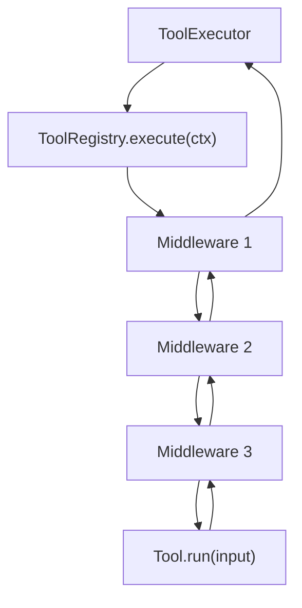

## 摘要

本文要说明 `tiny-claw` 如何把工具调用从“直接执行 Tool”升级为“经过通用 middleware 链后再执行 Tool”。这个模块适合 AI Agent 框架开发者、工具系统维护者和希望扩展运行时拦截能力的读者。读完后，你会理解 `ToolRegistry.use(...)` 的注册语义、middleware 的调用顺序，以及为什么高危审批、审计、策略控制都不应该写死在单个工具里。

## 背景与问题

早期工具系统只需要完成一件事：模型返回 tool call，`ToolExecutor` 找到对应工具并调用 `Tool.run()`。当工具能力变多后，执行前后的横切逻辑也会出现：

- 运行时策略：某些会话允许 `read`，但禁止 `bash`。
- 风险拦截：命令或文件修改参数命中高危规则时，需要暂停等待人工审批。
- 审计记录：记录谁、在什么 session、对哪个 workdir 调用了什么工具。
- 未来扩展：限流、沙箱切换、观测指标、成本统计等。

如果这些逻辑直接塞进 `ToolExecutor` 或每个工具实现，会导致两个问题：主循环变重，工具实现也被运行时策略污染。更合适的做法是把工具执行抽象成一条链：每个 middleware 可以选择继续调用下一个节点，也可以直接返回结果。

## 设计目标

- **通用性**：middleware 不绑定某个具体工具或具体审批渠道。
- **顺序明确**：按 `registry.use(...)` 注册顺序进入，按栈式顺序返回。
- **可短路**：策略拒绝、审批暂停等场景可以不执行真实工具。
- **兼容旧接口**：保留 `ToolRegistry.call(...)`，让已有直接调用不被打断。
- **可测试**：注册顺序、短路行为、结果状态都能单独测试。
- **与现有架构一致**：工具执行仍由 `ToolExecutor` 发起，工具注册仍由应用装配层完成。

## 整体方案

工具执行模型从直接调用变成链式调用：



每个 middleware 的接口都很小：接收 `ToolExecutionContext` 和 `next`，返回 `ToolExecutionResult`。它可以：

- 调用 `next(ctx)`，让后续 middleware 或真实工具继续执行。
- 返回 `completed`，表示已经完成。
- 返回 `denied`，表示工具调用被拒绝。
- 返回 `suspended`，表示当前 run 需要暂停。

这个设计把“工具是什么”和“工具调用前要经过哪些运行时规则”分开了。

## 核心实现

关键文件：

- `src/tiny_claw/_internal/tools/middleware.py`
- `src/tiny_claw/_internal/tools/registry.py`
- `src/tiny_claw/_internal/engine/tool_executor.py`
- `src/tiny_claw/_internal/app.py`

核心协议：

```python
ToolNext = Callable[[ToolExecutionContext], ToolExecutionResult]

class ToolMiddleware(Protocol):
    def __call__(self, ctx: ToolExecutionContext, next: ToolNext) -> ToolExecutionResult:
        ...
```

`ToolExecutionContext` 承载一次工具调用所需的运行时信息：

- `tool_call_id`
- `tool_name`
- `arguments`
- `session`
- `workdir`
- `visible_tool_names`
- `metadata`

`ToolExecutionResult` 明确区分三种状态：

```python
ToolExecutionStatus = Literal["completed", "denied", "suspended"]
```

`ToolRegistry` 负责注册 middleware 并组装调用链：

```python
def use(self, middleware: ToolMiddleware) -> None:
    self._middlewares.append(middleware)

def execute(self, ctx: ToolExecutionContext) -> ToolExecutionResult:
    def terminal(current: ToolExecutionContext) -> ToolExecutionResult:
        output = self.get(current.tool_name).run(ToolInput(arguments=current.arguments))
        return ToolExecutionResult.completed(output)

    next_step: ToolNext = terminal
    for middleware in reversed(self._middlewares):
        ...
    return next_step(ctx)
```

这里使用 `reversed(self._middlewares)` 组装链，是为了让注册顺序等于执行进入顺序。比如：

```python
registry.use(first)
registry.use(second)
```

实际事件顺序是：

```text
first-before
second-before
Tool.run
second-after
first-after
```

`ToolExecutor` 不再直接调用 `registry.call(...)`，而是构造上下文并调用：

```python
execution = self.tools.execute(
    ToolExecutionContext(
        tool_call_id=tool_call.id,
        tool_name=tool_call.name,
        arguments=tool_call.arguments,
        session=session,
        workdir=workdir,
        visible_tool_names=self._visible_tool_names(),
        metadata=metadata or {},
    )
)
```

## 使用方式

middleware 在应用装配层注册。当前注册入口位于 `src/tiny_claw/_internal/app.py`：

```python
registry.use(ToolPolicyMiddleware(...))
registry.use(HumanApprovalMiddleware(...))
```

新增 middleware 时，推荐遵循这个形态：

```python
def audit_middleware(ctx: ToolExecutionContext, next: ToolNext) -> ToolExecutionResult:
    # 记录调用前信息
    result = next(ctx)
    # 记录调用后结果
    return result
```

如果 middleware 要阻止真实工具执行，可以直接返回：

```python
return ToolExecutionResult.denied(
    "工具调用被运行时策略拒绝。",
    metadata={"error_type": "tool_policy_denied"},
)
```

如果是需要人工介入的场景，则返回 `suspended`，交给主循环停止当前 run。

普通用户不需要直接调用 middleware。它是系统内部扩展点，随着 `tiny-claw run` 或 Feishu 消息进入工具执行链路时自动生效。

## 测试与验证

middleware 的核心行为由 `tests/test_tools.py` 覆盖：

```bash
uv run pytest tests/test_tools.py
```

重点测试包括：

- `test_tool_registry_executes_middlewares_in_registration_order`
- `test_tool_registry_middleware_can_short_circuit`
- `test_tool_policy_middleware_allows_default_empty_policy`
- `test_tool_policy_middleware_denies_denylist_and_allowlist`

工具执行器集成验证：

```bash
uv run pytest tests/test_tool_executor.py
uv run pytest tests/test_engine.py
```

完整回归：

```bash
uv run ruff check .
uv run ruff format --check .
uv run mypy src
uv run pytest
```

## 设计取舍与注意事项

这个 middleware 设计刻意没有引入 `before_call`、`after_call` 之类的多钩子接口。多钩子看起来更细，但调用关系会变复杂：异常、短路、暂停、恢复都需要定义一套组合规则。链式 middleware 的优势是简单：是否继续执行，只看有没有调用 `next(ctx)`。

`ToolRegistry.call(...)` 被保留为兼容封装，但新的运行时路径应优先使用 `execute(ctx)`。否则 middleware 链不会生效。

middleware 本身不应该知道模型 provider，也不应该直接向 Feishu、Slack 等平台发送消息。需要外部通知时，应通过上下文 metadata 或抽象接口交给 adapter。这样工具系统的扩展点不会被某个集成平台绑死。

## 总结

- `ToolRegistry.use(...)` 提供了通用工具执行扩展点。
- middleware 按注册顺序进入，支持继续执行或短路返回。
- `ToolExecutionResult` 用 `completed/denied/suspended` 明确表达运行状态。
- 高危审批、运行时策略、审计等横切能力可以放进链路，而不是污染工具实现。
- 新执行路径保留旧接口兼容，但主流程应走 `registry.execute(ctx)`。

---

> 来源：本文整理自 `tiny-claw/docs/tutorial/16-通用-tool-middleware-链式执行.md`。
> 项目地址：[barry166/tiny-claw](https://github.com/barry166/tiny-claw)。
