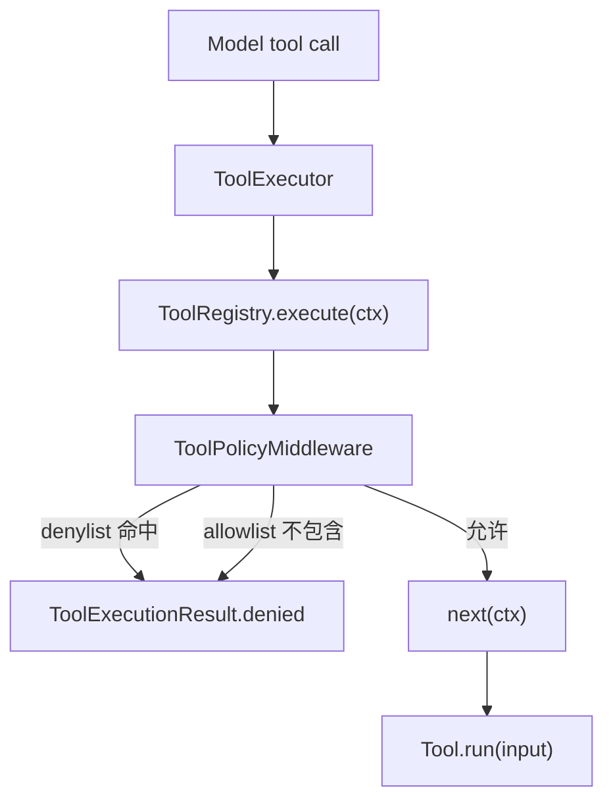

> 系列导航：[系列目录](/series/harness-agent/) | 上一篇：[从零实现 Harness Agent：Tool Middleware 链式执行](/2026/06/09/harness-agent/harness-agent-16-tool-middleware-chain/) | 下一篇：[从零实现 Harness Agent：高危工具调用人工审批](/2026/06/09/harness-agent/harness-agent-18-human-approval-middleware/)

## 本节目标

> 导读：本篇属于第二部分「工具与安全边界」，聚焦工具名级别的运行时策略：注册了工具，不等于当前运行一定允许调用。

本节要实现的是工具名级别的运行时 allowlist / denylist 策略：在工具已经注册之后，进一步控制当前运行是否允许调用某个工具。

完成这一节后，你会理解全局工具启用、skill 收窄和运行时策略之间的边界。

## 摘要

本文要说明 `tiny-claw` 如何在“模型可见工具”之外，再加一层运行时 allowlist / denylist 策略。这个模块适合项目使用者、工具系统维护者和需要控制不同环境工具权限的开发者。读完后，你会知道 `TINY_CLAW_ENABLED_TOOLS`、`TINY_CLAW_TOOL_ALLOWLIST`、`TINY_CLAW_TOOL_DENYLIST` 分别解决什么问题，以及运行时拒绝如何通过 middleware 返回给主循环。

## 背景与问题

工具权限有两个不同问题，不能混在一起：

- 哪些工具对模型可见？
- 即使模型发起了工具调用，运行时是否允许执行？

`TINY_CLAW_ENABLED_TOOLS` 解决的是第一层：模型请求时能看到哪些工具定义。它适合做全局能力开关，比如默认只启用 `read`，需要编辑时才启用 `write` 或 `edit`。

但真实工程里还需要第二层运行时策略。例如：

- CI 环境允许 `read` 和 `write`，但禁止 `bash`。
- 某个 workspace 只允许读，不允许改。
- Feishu 入口可以启用工具定义，但运行时策略仍要阻断某些工具。
- 测试中需要验证模型即使发出某个 tool call，也不会真的执行。

因此，工具系统需要在可见性之外，再有一个可配置、可测试、可短路的运行时策略模块。

## 设计目标

- **职责分离**：可见工具和运行时允许执行的工具分开配置。
- **默认兼容**：空 allowlist / denylist 不改变现有行为。
- **拒绝优先**：denylist 命中时立即拒绝。
- **显式收窄**：allowlist 非空时，不在列表内的工具全部拒绝。
- **可观测**：拒绝结果带上 `error_type` 和策略来源。
- **不改工具接口**：工具本身仍只实现 `Tool.run()`。

## 整体方案

运行时策略作为第一个通用 middleware 注册到工具链：



规则顺序是：

1. `ToolExecutor` 仍按模型可见工具和已注册工具处理 unknown / visibility 问题。
2. 命中 `denylist`，直接拒绝。
3. `allowlist` 非空且工具不在其中，直接拒绝。
4. 否则继续调用后续 middleware 或真实工具。

## 核心实现

关键文件：

- `src/tiny_claw/_internal/tools/policy.py`
- `src/tiny_claw/_internal/settings.py`
- `src/tiny_claw/_internal/app.py`
- `tests/test_settings.py`
- `tests/test_tools.py`

`ToolPolicyMiddleware` 的接口很小：

```python
@dataclass(frozen=True)
class ToolPolicyMiddleware:
    allowlist: tuple[str, ...] = ()
    denylist: tuple[str, ...] = ()

    def __call__(self, ctx: ToolExecutionContext, next: ToolNext) -> ToolExecutionResult:
        ...
```

denylist 拒绝：

```python
if ctx.tool_name in self.denylist:
    return ToolExecutionResult.denied(
        f"工具调用被运行时策略拒绝：{ctx.tool_name} 在 denylist 中。",
        metadata={"error_type": "tool_policy_denied", "tool_policy": "denylist"},
    )
```

allowlist 收窄：

```python
if self.allowlist and ctx.tool_name not in self.allowlist:
    return ToolExecutionResult.denied(
        f"工具调用被运行时策略拒绝：{ctx.tool_name} 不在 allowlist 中。",
        metadata={"error_type": "tool_policy_denied", "tool_policy": "allowlist"},
    )
```

配置从环境变量读取：

```python
TINY_CLAW_TOOL_ALLOWLIST=read,write
TINY_CLAW_TOOL_DENYLIST=bash
```

应用装配层统一注册：

```python
registry.use(
    ToolPolicyMiddleware(
        allowlist=settings.tool_allowlist,
        denylist=settings.tool_denylist,
    )
)
```

## 使用方式

默认行为：不设置 allowlist / denylist 时，不额外收窄运行时工具。

只允许 `read` 和 `write` 实际执行：

```bash
TINY_CLAW_ENABLED_TOOLS=read,write,edit,bash \
TINY_CLAW_TOOL_ALLOWLIST=read,write \
uv run tiny-claw run --mode act "读取并写入一个说明文件"
```

显式禁止 `bash`：

```bash
TINY_CLAW_ENABLED_TOOLS=read,write,edit,bash \
TINY_CLAW_TOOL_DENYLIST=bash \
uv run tiny-claw run --mode act "检查项目并尝试运行命令"
```

同时设置 allowlist 和 denylist 时，denylist 先命中。推荐把 denylist 用作最后防线，把 allowlist 用作环境级收窄。

配置校验会拒绝未知工具名。当前支持的工具名来自 `SUPPORTED_TOOLS`：

```text
bash, edit, read, write
```

## 测试与验证

配置读取测试：

```bash
uv run pytest tests/test_settings.py
```

运行时策略测试：

```bash
uv run pytest tests/test_tools.py
```

关键测试点：

- 默认空策略允许继续执行。
- denylist 命中时返回 `denied`。
- allowlist 非空且工具不在列表内时返回 `denied`。
- 配置中的未知工具名会触发 `ConfigurationError`。

完整验证：

```bash
uv run ruff check .
uv run ruff format --check .
uv run mypy src
uv run pytest
```

## 设计取舍与注意事项

`TINY_CLAW_ENABLED_TOOLS` 不是 allowlist，它控制的是模型可见工具。模型看不到的工具通常不会被主动调用，但这并不等于运行时策略。allowlist / denylist 是工具调用进入执行链之后的硬性判断。

空 allowlist 的语义是“不启用 allowlist 收窄”，不是“禁止全部工具”。这样可以保持默认兼容，避免升级后现有工具调用全部被拒绝。

denylist 优先于 allowlist。这个规则更容易理解，也符合安全直觉：明确禁止的工具不应该被其他配置重新放行。

当前策略粒度是工具名级别，不检查参数。参数级风险判断由 `HumanApprovalMiddleware` 和 `DefaultRiskPolicy` 负责。后续如果需要 session 级、chat 级或用户级策略，可以扩展 middleware 的输入配置，但不建议把参数规则混入这个模块。

## 总结

- 可见工具和运行时执行策略是两层边界。
- `ToolPolicyMiddleware` 用 allowlist / denylist 实现工具名级短路拒绝。
- 默认空配置保持现有行为，适合平滑启用。
- denylist 优先，allowlist 非空时收窄允许范围。
- 参数级风险不属于本模块，应交给风险审批策略处理。

按工具专题继续阅读：[18：高危工具审批 middleware](18-高危工具调用人工审批-middleware.md) 会处理策略之外需要人工决策的副作用调用。

---

> 来源：本文整理自 `tiny-claw/docs/tutorial/17-运行时工具策略-allowlist-denylist.md`。
> 项目地址：[barry166/tiny-claw](https://github.com/barry166/tiny-claw)。
