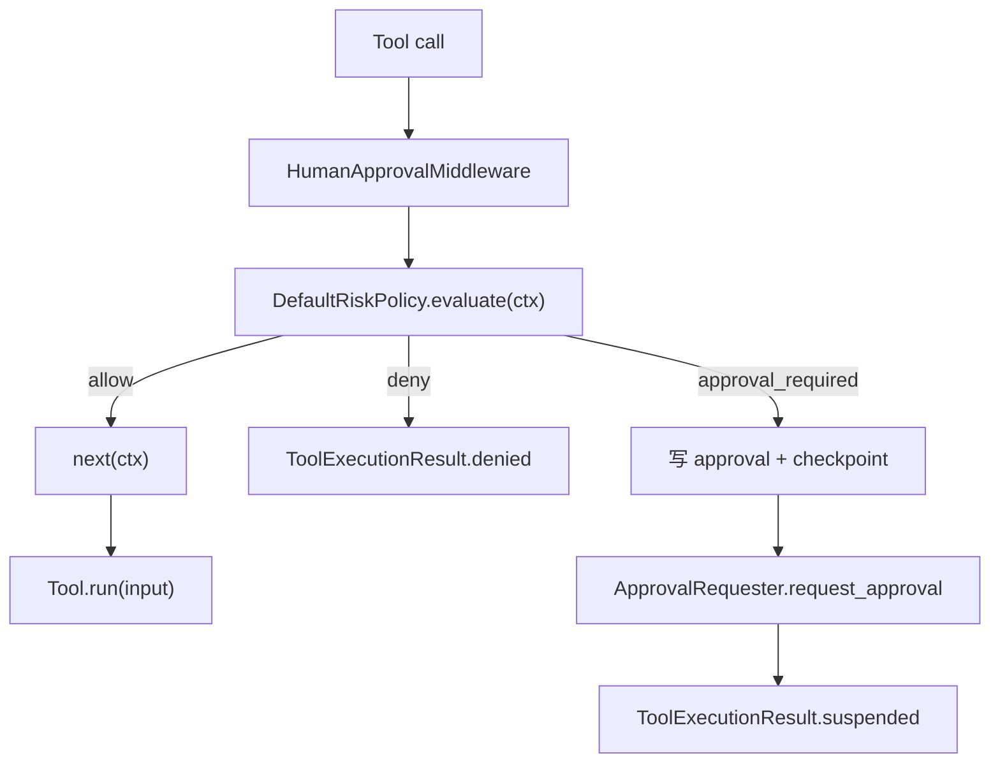

## 本节目标

> 导读：本篇属于第二部分「工具与安全边界」，处理高危副作用：当风险命中时暂停运行，把决策交给人工审批。

本节要实现的是高危工具调用的人工审批 middleware：当工具参数命中风险策略时，暂停当前 run，而不是直接执行副作用。

完成这一节后，你会理解风险评估、审批记录、暂停状态和工具执行链之间的关系。

## 摘要

本文要说明 `tiny-claw` 如何用通用 `HumanApprovalMiddleware` 拦截高危工具调用，并在执行真实工具前暂停等待人工决策。这个模块适合 AI Agent 框架开发者、安全策略维护者和需要把人工审批接入工具链的读者。读完后，你会理解高危规则如何评估、审批请求如何持久化，以及为什么飞书不是一个工具，而只是审批通知和回复的 adapter。

## 背景与问题

AI Agent 一旦拥有 `bash`、`write`、`edit` 这类工具，就能产生真实副作用。即使模型通常会避免明显危险请求，工程系统也不能把安全边界寄托在模型自觉上。

典型高风险场景包括：

- shell 命令删除文件、强制重置 git、提权执行、发布部署。
- 写入或编辑 `.env`、密钥文件、CI 配置、lockfile。
- 一次编辑删除大量内容。

这些操作不一定永远不能执行。有些任务确实需要修改 lockfile 或运行发布命令。更合理的策略是：低风险直接执行，高风险暂停并交给人工审批。

## 设计目标

- **通用审批**：审批 middleware 不绑定飞书，也不绑定某个 UI。
- **参数级风险判断**：不只看工具名，还检查命令和文件路径。
- **不阻塞进程**：高危调用返回 `suspended`，让当前 run 停止。
- **持久化可恢复**：审批和 checkpoint 写入状态目录。
- **失败关闭**：缺 checkpoint、过期、状态不对、参数不匹配时拒绝执行。
- **不改工具接口**：`Tool.run()` 不知道审批存在。

## 整体方案

人工审批是一个运行时 middleware：



`HumanApprovalMiddleware` 只负责通用审批流程：

1. 检查本次调用是否已经带有 approved approval id。
2. 未审批时调用 `DefaultRiskPolicy.evaluate(ctx)`。
3. 低风险调用 `next(ctx)`。
4. 需要审批时写入 approval 和 checkpoint。
5. 通过 `ApprovalRequester` 发送审批请求。
6. 返回 `suspended`，让主循环停止当前 run。

飞书只实现通知和命令 adapter，不进入工具注册表，也不会暴露给模型。

## 核心实现

关键文件：

- `src/tiny_claw/_internal/approval.py`
- `src/tiny_claw/_internal/tools/middleware.py`
- `src/tiny_claw/_internal/engine/main_loop.py`
- `src/tiny_claw/_internal/engine/tool_executor.py`
- `src/tiny_claw/_internal/app.py`

风险评估入口：

```python
@dataclass(frozen=True)
class DefaultRiskPolicy:
    approval_required_tools: tuple[str, ...] = ("bash", "write", "edit")

    def evaluate(self, ctx: ToolExecutionContext) -> RiskDecision:
        ...
```

`bash` 高危规则包含：

- `rm` / `rmdir`
- `sudo`
- `git reset --hard`
- `git clean`
- `git push --force`
- `curl|wget ... | sh`
- `chmod` / `chown`
- `kill` / `pkill`
- `dd` / `mkfs`
- `deploy` / `publish` / `release`

文件修改高危规则包含：

- `.env`、`.env.local`、`.env.production`
- `pyproject.toml`
- `uv.lock`、`poetry.lock`
- `package-lock.json`、`pnpm-lock.yaml`、`yarn.lock`
- `.github/workflows/`、`.gitlab-ci`
- 路径中包含 `secret` 或 `key`
- `edit` 一次删除 20 行及以上

需要审批时，middleware 要求上下文里存在 `RunCheckpointDraft`：

```python
draft = ctx.metadata.get(CHECKPOINT_DRAFT_METADATA_KEY)
if not isinstance(draft, RunCheckpointDraft):
    return ToolExecutionResult.denied(
        "工具调用需要人工审批，但缺少可恢复 checkpoint。",
        metadata={"error_type": "approval_checkpoint_missing"},
    )
```

这条规则很重要：不能恢复的审批请求不应该被创建。

状态写入后返回暂停：

```python
return ToolExecutionResult.suspended(
    ToolSuspension(
        approval_id=approval.id,
        checkpoint_id=approval.checkpoint_id,
        reason="; ".join(approval.risk_reasons),
        content=content,
    )
)
```

`ToolExecutor` 会把 `suspended` 转成 tool observation，并带上：

- `suspended=True`
- `error_type=tool_approval_required`
- `approval_id`
- `checkpoint_id`

`MainLoop` 看到 suspended 后返回 `stop_reason="approval_required"`。

## 使用方式

启用审批 middleware：

```bash
TINY_CLAW_APPROVAL_PROVIDER=feishu \
TINY_CLAW_ENABLED_TOOLS=read,write,edit,bash \
uv run tiny-claw serve --host 0.0.0.0 --port 8000
```

配置需要审批的工具：

```bash
TINY_CLAW_APPROVAL_REQUIRED_TOOLS=bash,write,edit
```

配置审批过期时间：

```bash
TINY_CLAW_APPROVAL_TIMEOUT_SECONDS=3600
```

`TINY_CLAW_APPROVAL_PROVIDER` 当前支持：

```text
off, feishu
```

它的含义是“是否注册通用 `HumanApprovalMiddleware`，以及当前运行入口是否具备对应审批通知通道”。它不是“注册飞书审批工具”。模型不应该看到一个叫飞书审批的工具。

## 测试与验证

审批 middleware 的 engine 级测试：

```bash
uv run pytest tests/test_engine.py
```

重点覆盖：

- 高危工具调用返回 `approval_required`。
- suspended 后真实工具没有执行。
- approval 和 checkpoint 被写入状态目录。
- approved 后执行原始 frozen tool call。
- rejected 后注入拒绝 observation。
- approved 后即使工具执行失败，审批也会被消费，避免重复执行。

配置测试：

```bash
uv run pytest tests/test_settings.py
```

完整验证：

```bash
uv run ruff check .
uv run ruff format --check .
uv run mypy src
uv run pytest
```

## 设计取舍与注意事项

审批 middleware 是同步链路，但它不等待人工点击或回复。同步只表示工具调用链本身是同步函数；一旦需要审批，middleware 立即返回 `suspended`，主循环停止。

风险规则是 v1 级别的启发式规则，不是完整安全沙箱。它适合挡住高危意图和敏感文件修改，但不能替代操作系统权限、容器隔离或代码审查。

`TINY_CLAW_APPROVAL_PROVIDER=feishu` 不代表系统自动拥有任意平台审批能力。当前已实现的是 Feishu 文本命令审批。互动卡片按钮、CLI 审批命令、Slack adapter 都属于待确认或后续扩展。

当 provider 在生成 tool call 前自行拒绝，例如直接回复“不能执行 rm -rf”，middleware 不会运行。这不是 middleware 失效，而是因为工具调用没有进入执行链。

## 总结

- `HumanApprovalMiddleware` 是通用审批模块，不是飞书专用逻辑。
- `DefaultRiskPolicy` 用工具名和参数共同判断风险。
- 高危调用会持久化 approval 和 checkpoint，然后返回 suspended。
- 主循环不阻塞等待人工，而是以 `approval_required` 停止当前 run。
- 飞书只是审批通知和回复 adapter，不暴露给模型。

按审批专题继续阅读：[19：审批 checkpoint 暂停恢复](19-审批-checkpoint-暂停恢复.md) 会让人工决策之后可以安全继续原始运行。

---

> 来源：本文整理自 `tiny-claw/docs/tutorial/18-高危工具调用人工审批-middleware.md`。
> 项目地址：[barry166/tiny-claw](https://github.com/barry166/tiny-claw)。
