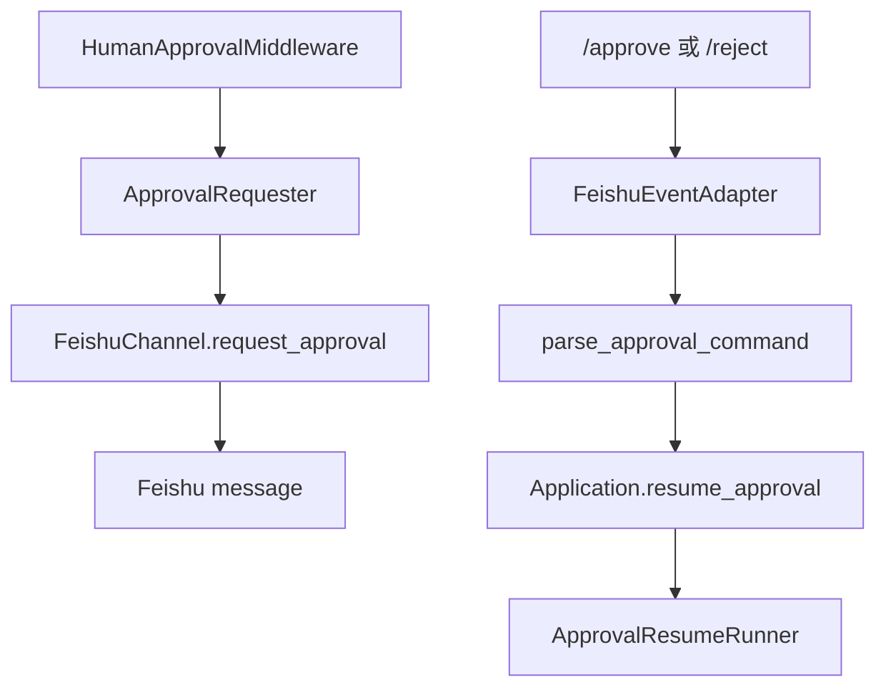

## 本节目标

> 导读：本篇属于第四部分「外部集成与审批恢复」，说明 Feishu 在审批体系中是平台 adapter，而不是模型可见工具。

本节要实现的是 Feishu 审批 adapter：把审批通知和 `/approve` / `/reject` 命令接入通用审批流程，同时保持工具系统不依赖平台 SDK。

完成这一节后，你会理解为什么飞书是外部 adapter，而不是模型可见工具。

## 摘要

本文要说明 `tiny-claw` 如何把 Feishu 接入人工审批流程，同时保持工具系统和外部平台解耦。这个模块适合外部集成维护者、Agent 平台开发者和需要在聊天工具中审批高危操作的读者。读完后，你会理解 `FeishuChannel.request_approval(...)`、`/approve`、`/reject` 的职责边界，以及为什么飞书不应该注册成模型可见工具。

## 背景与问题

当高危工具调用需要人工审批时，一个直觉方案是“做一个飞书审批工具”。这个方案看似直接，但会把边界搞乱：

- 模型会看到平台审批工具，可能主动调用它。
- 工具系统会依赖 Feishu SDK。
- 将来接 Slack、Web UI 或 CLI 审批时，需要改工具链。
- 审批回复属于外部事件，不属于模型发起的 tool call。

更清晰的设计是：审批逻辑属于通用 `HumanApprovalMiddleware`，Feishu 只做两件事：

1. 收到审批请求时，把消息发到对应聊天。
2. 收到 `/approve` 或 `/reject` 命令时，调用应用恢复接口。

也就是说，Feishu 是 adapter，不是 tool。

## 设计目标

- **平台解耦**：审批 middleware 不依赖 Feishu。
- **不暴露给模型**：Feishu 审批不是模型可见工具。
- **复用会话隔离**：按 Feishu `chat_id` 恢复对应 session。
- **命令简单**：v1 使用文本命令，不依赖互动卡片。
- **异步友好**：Feishu 事件处理不阻塞主事件循环。
- **可测试**：用 fake sender / fake sdk channel 验证消息和路由。

## 整体方案

Feishu 审批由两条路径组成：



发送审批消息时，`MainLoop` 将当前 channel 放入 tool context metadata：

```python
context_metadata={
    CHECKPOINT_DRAFT_METADATA_KEY: draft,
    "approval_requester": resolved_channel,
}
```

如果当前 channel 是 `FeishuChannel`，它就满足 `ApprovalRequester` 协议，可以发送审批消息。

收到审批命令时，Feishu event adapter 不进入普通 `Application.run()`，而是直接走 `Application.resume_approval(...)`。

## 核心实现

关键文件：

- `src/tiny_claw/_internal/integrations/feishu/bot.py`
- `src/tiny_claw/_internal/integrations/feishu/events.py`
- `src/tiny_claw/_internal/app.py`
- `src/tiny_claw/_internal/approval.py`
- `tests/test_feishu_integration.py`

`FeishuChannel` 既是运行进度 channel，也是审批 requester：

```python
@dataclass(frozen=True)
class FeishuChannel(Channel):
    sender: FeishuMessageSender | None = None

    def request_approval(self, request: ApprovalRequest) -> ApprovalDispatchResult:
        ...
```

审批消息包含：

- `approval_id`
- session 显示名
- workdir
- tool 名称
- 风险原因
- 过期时间
- `/approve` 和 `/reject` 命令示例

命令解析由正则完成：

```python
APPROVAL_COMMAND_PATTERN = re.compile(
    r"^/(?P<command>approve|reject)\s+(?P<approval_id>[A-Za-z0-9_-]+)(?:\s+(?P<reason>.*))?$",
    re.I,
)
```

`FeishuEventAdapter._on_message(...)` 会先判断是否是审批命令：

```python
approval_command = parse_approval_command(text)
if approval_command is not None:
    asyncio.create_task(
        asyncio.to_thread(
            self._resume_approval_command,
            command=approval_command,
            session=session,
            channel=channel,
        )
    )
    return
```

不是审批命令时，才进入普通 Agent 运行：

```python
self.app.run(
    prompt=text,
    max_steps=self.max_steps,
    mode=self.mode,
    session=session,
    channel=channel,
)
```

恢复结果会回复到原消息：

```python
channel._send("\n".join(lines), reply=True)
```

## 使用方式

启动 Feishu 事件服务并启用审批：

```bash
TINY_CLAW_APPROVAL_PROVIDER=feishu \
TINY_CLAW_ENABLED_TOOLS=read,write,edit,bash \
FEISHU_APP_ID=cli_xxx \
FEISHU_APP_SECRET=xxx \
OPENAI_API_KEY=<your-openai-api-key> \
uv run tiny-claw serve --host 0.0.0.0 --port 8000
```

默认回调路径：

```text
POST /api/events/feishu
```

自定义路径：

```bash
uv run tiny-claw serve --feishu-path /api/events/feishu-test
```

高危工具调用被拦截后，Feishu 会收到类似命令提示：

```text
批准：/approve <approval-id>
拒绝：/reject <approval-id> 原因
```

审批通过：

```text
/approve abc123
```

审批拒绝：

```text
/reject abc123 这个文件不应该由 Agent 修改
```

## 测试与验证

Feishu 审批 adapter 测试：

```bash
uv run pytest tests/test_feishu_integration.py
```

重点覆盖：

- `FeishuChannel.request_approval(...)` 会发送审批消息。
- `parse_approval_command(...)` 能解析 approve / reject。
- 审批命令会路由到 `Application.resume_approval(...)`。
- 普通消息仍然进入 `Application.run(...)`。

Server help 和 HTTP 冒烟：

```bash
uv run tiny-claw serve --help
uv run tiny-claw serve --host 127.0.0.1 --port 8000
curl http://127.0.0.1:8000/health
```

完整验证：

```bash
uv run ruff check .
uv run ruff format --check .
uv run mypy src
uv run pytest
```

## 设计取舍与注意事项

飞书审批 v1 使用文本命令，不使用互动卡片按钮。文本命令更容易测试，也不需要额外处理按钮回调协议。互动卡片可以作为后续 adapter 增强，但不应该改变 `HumanApprovalMiddleware` 的接口。

`TINY_CLAW_APPROVAL_PROVIDER=feishu` 的语义不是“把飞书注册为工具”，而是启用通用审批 middleware，并让 Feishu channel 在对应入口中承担审批通知能力。如果从 CLI 运行并设置了 `feishu`，但没有 Feishu channel，审批请求仍会持久化；通知投递能力取决于当前运行入口是否提供了 requester。

审批命令按当前 Feishu chat 解析 session。跨 chat 使用 approval id 会被 `Application.resume_approval(...)` 拒绝，因为 approval 记录绑定了 session key。

当前没有实现审批人白名单、管理员权限校验和互动卡片签名确认。真实生产环境如果需要更强的组织级审批控制，应在 Feishu adapter 或应用恢复入口增加身份校验。

## 总结

- Feishu 是审批 adapter，不是模型可见工具。
- 审批消息发送通过 `FeishuChannel.request_approval(...)` 完成。
- `/approve` 和 `/reject` 命令走 `Application.resume_approval(...)`。
- 普通 Feishu 文本消息仍复用 `Application.run(...)`。
- 平台能力被隔离在 integration 层，审批核心保持通用。

按审批专题继续阅读：[21：审批流程测试与验证](21-审批流程测试与验证.md) 会把这条跨模块链路变成可证明的行为。

---

> 来源：本文整理自 `tiny-claw/docs/tutorial/20-飞书审批-adapter.md`。
> 项目地址：[barry166/tiny-claw](https://github.com/barry166/tiny-claw)。
