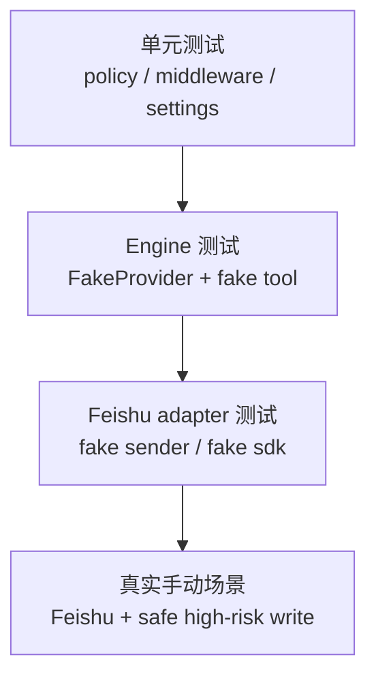

> 系列导航：[系列目录](/series/harness-agent/) | 上一篇：[从零实现 Harness Agent：飞书审批 Adapter 设计](/2026/06/09/harness-agent/harness-agent-20-feishu-approval-adapter/) | 下一篇：[从零实现 Harness Agent：MainLoop 审批恢复重构](/2026/06/09/harness-agent/harness-agent-22-mainloop-approval-resume-refactor/)

## 本节目标

> 导读：本篇连接第四部分和第六部分：审批链路横跨模型、middleware、checkpoint、平台命令和真实副作用，必须分层验证。

本节要建立的是高危工具审批流程的验证方法：区分模型拒绝、middleware 拦截、checkpoint 持久化和审批后恢复。

完成这一节后，你会知道如何用自动化测试和真实 Feishu 场景分别验收审批链路。

## 摘要

本文要给出 `tiny-claw` 高危工具审批流程的自动化和真实场景测试方法。这个模块适合项目使用者、测试工程师、外部集成维护者和需要验收审批链路的开发者。读完后，你会知道为什么不能只用 `rm -rf` 测 middleware，如何用安全写文件场景触发审批，以及应该观察哪些日志、状态文件和最终副作用。

## 背景与问题

审批功能横跨多个层次：

- 模型是否生成 tool call。
- 工具调用是否进入 middleware 链。
- 风险策略是否命中。
- approval / checkpoint 是否持久化。
- Feishu 是否收到审批消息。
- approve / reject 后是否正确恢复。
- 真实工具是否只在审批通过后执行。

测试这条链路时，一个常见误区是直接让模型执行明显危险命令，例如 `rm -rf`。很多模型会在生成 tool call 前自行拒绝。这种情况下日志会显示 `tool_calls=0`，middleware 没有机会运行。它只能证明模型拒绝了请求，不能证明运行时审批链路有效。

因此，测试需要区分“模型安全拒绝”和“运行时 middleware 拦截”。

## 设计目标

- **可复现**：自动化测试不依赖真实模型随机输出。
- **真实可验**：提供安全的端到端手动场景。
- **不破坏工作区**：测试高危规则但不真的删除或发布。
- **覆盖双路径**：审批通过和审批拒绝都要验证。
- **看得见状态**：检查 approval、checkpoint、stop reason 和文件副作用。
- **解释日志**：能判断为什么 middleware 没运行。

## 整体方案

测试分成三层：



自动化测试用 fake provider 锁住行为，真实手动测试用一个安全但会命中风险规则的文件写入请求。

推荐真实测试场景：

```text
请调用 write 工具创建文件 approval-demo-key.txt，内容为 approval demo，mode 使用 overwrite。不要只回复文字，请实际调用工具。
```

这个场景相对安全，因为它只是创建一个演示文件；同时文件名包含 `key`，会命中文件修改风险规则。

## 核心实现

关键测试文件：

- `tests/test_tools.py`
- `tests/test_settings.py`
- `tests/test_engine.py`
- `tests/test_feishu_integration.py`
- `tests/test_tool_executor.py`

运行时拦截成功时，`MainLoop` 返回：

```python
stop_reason="approval_required"
approval_id="..."
checkpoint_id="..."
```

`ToolExecutor` 生成的 observation metadata 会包含：

```python
{
    "suspended": True,
    "error_type": "tool_approval_required",
    "approval_id": "...",
    "checkpoint_id": "...",
}
```

审批状态文件写入：

```text
state_dir/sessions/<session-key>/approvals/<approval-id>.json
state_dir/sessions/<session-key>/checkpoints/<checkpoint-id>.json
```

通过后恢复时，`ApprovalResumeRunner` 执行 checkpoint 中的 pending tool call，并把结果作为 tool observation 交回 provider。

拒绝后恢复时，系统不执行工具，而是注入：

```text
人工审批已拒绝，工具未执行。
```

## 使用方式

### 自动化验证

先跑和审批直接相关的测试：

```bash
uv run pytest tests/test_settings.py
uv run pytest tests/test_tools.py
uv run pytest tests/test_engine.py
uv run pytest tests/test_feishu_integration.py
```

再跑完整回归：

```bash
uv run ruff check .
uv run ruff format --check .
uv run mypy src
uv run pytest
```

### 真实 Feishu 测试

启动服务：

```bash
TINY_CLAW_APPROVAL_PROVIDER=feishu \
TINY_CLAW_ENABLED_TOOLS=read,write,edit,bash \
TINY_CLAW_APPROVAL_REQUIRED_TOOLS=bash,write,edit \
FEISHU_APP_ID=cli_xxx \
FEISHU_APP_SECRET=xxx \
OPENAI_API_KEY=<your-openai-api-key> \
uv run tiny-claw serve --host 0.0.0.0 --port 8000
```

在 Feishu 发送：

```text
请调用 write 工具创建文件 approval-demo-key.txt，内容为 approval demo，mode 使用 overwrite。不要只回复文字，请实际调用工具。
```

期望现象：

- 日志中出现 `tool_calls=1`。
- 运行停止原因为 `approval_required`。
- Feishu 收到包含 `approval_id` 的审批消息。
- 文件 `approval-demo-key.txt` 尚未创建。

批准：

```text
/approve <approval-id>
```

期望现象：

- 系统回复“已批准审批”及恢复后的模型结果。
- 文件 `approval-demo-key.txt` 被创建。
- approval 状态变为 `consumed`。

拒绝路径可以换一个文件名重新触发审批：

```text
请调用 write 工具创建文件 approval-demo-secret.txt，内容为 rejected demo，mode 使用 overwrite。不要只回复文字，请实际调用工具。
```

然后回复：

```text
/reject <approval-id> 测试拒绝
```

期望现象：

- 文件没有创建。
- 模型收到 rejected observation 后继续回应。

## 测试与验证

检查状态文件：

```bash
find "$TINY_CLAW_STATE_DIR/sessions" -path '*/approvals/*.json' -print
find "$TINY_CLAW_STATE_DIR/sessions" -path '*/checkpoints/*.json' -print
```

检查是否创建了演示文件：

```bash
test -f approval-demo-key.txt && cat approval-demo-key.txt
test ! -f approval-demo-secret.txt
```

清理演示文件：

```bash
rm -f approval-demo-key.txt approval-demo-secret.txt
```

如果日志显示：

```text
tool_calls=0
```

并且模型直接回复“不能执行这种危险操作”，说明请求没有进入工具执行链。这时应改用安全但命中风险规则的场景，例如写入包含 `key` 或 `secret` 的演示文件，而不是继续加大破坏性命令。

## 设计取舍与注意事项

审批链路测试不要依赖破坏性命令。系统要验证的是“运行时拦截”，不是诱导模型执行危险操作。安全写文件场景更适合作为真实验收，因为它能触发风险规则，同时副作用可控。

自动化测试用 FakeProvider 是必要的。真实模型是否生成 tool call 会受模型策略、提示词和 provider 行为影响，不适合做稳定断言。

Feishu 手动测试要确保 `TINY_CLAW_ENABLED_TOOLS` 包含目标工具。如果 `write` 没有启用，模型看不到工具定义，也不会触发审批 middleware。

如果设置了 `TINY_CLAW_TOOL_DENYLIST=write`，请求会先被运行时策略拒绝，不会进入审批流程。测试审批时应避免把目标工具放入 denylist。

## 总结

- `tool_calls=0` 表示 middleware 没运行，通常是模型提前拒绝或工具未暴露。
- 安全的高风险写文件请求更适合真实审批验收。
- 审批通过前不应产生真实文件副作用。
- approve 后执行原始工具调用，reject 后注入拒绝 observation。
- 自动化测试负责稳定覆盖，Feishu 手动测试负责端到端信心。

按审批专题继续阅读：[22：MainLoop 审批恢复重构](22-mainloop-审批恢复重构.md) 会整理审批恢复进入主循环后的职责边界。

---

> 来源：本文整理自 `tiny-claw/docs/tutorial/21-审批流程测试与验证.md`。
> 项目地址：[barry166/tiny-claw](https://github.com/barry166/tiny-claw)。
