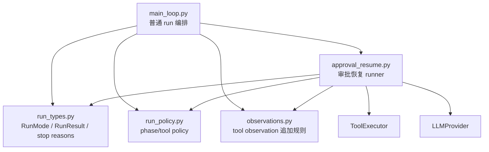

## 摘要

本文要说明 `tiny-claw` 如何在引入审批恢复后，拆分过长的 `MainLoop`，把运行类型、工具策略、observation 处理和审批恢复抽成更清晰的模块。这个模块适合后续维护者、Agent 主循环开发者和关注工程化重构的读者。读完后，你会理解这次重构保留了哪些主循环职责、抽出了哪些稳定接口，以及如何在不改变行为的前提下降低主循环复杂度。

## 背景与问题

`MainLoop` 是 Agent 框架最容易变长的文件。它天然要处理：

- provider 请求和响应。
- ReAct 多轮循环。
- 工具定义可见性。
- tool observation 追加。
- plan / think / plan-act 模式。
- 上下文压缩。
- 运行结果和记忆记录。
- 审批暂停和恢复。

引入高危工具审批后，`MainLoop` 又需要处理 checkpoint、approval resume、approved/rejected 分支。如果继续把所有逻辑放在一个文件里，维护成本会快速上升：任何人改审批恢复都必须读完整主循环，改普通 ReAct 流程也容易碰到审批细节。

因此，需要做一次以职责为边界的轻量拆分。

## 设计目标

- **行为不变**：重构不改变已有 run、plan、tool、Feishu 行为。
- **局部复杂度下降**：审批恢复从主循环中抽出。
- **类型集中**：运行模式、停止原因、结果类型集中定义。
- **策略集中**：phase 和 tool policy 规则独立测试和复用。
- **observation 规则复用**：普通 run 和 resumed run 使用同一套追加逻辑。
- **兼容导入**：`main_loop.py` 继续 re-export 关键类型，减少外部变更面。

## 整体方案

拆分后的结构：



`MainLoop` 仍然是核心编排者，但不再直接承载审批恢复的完整循环。恢复逻辑由 `ApprovalResumeRunner` 接管。

## 核心实现

关键文件：

- `src/tiny_claw/_internal/engine/main_loop.py`
- `src/tiny_claw/_internal/engine/approval_resume.py`
- `src/tiny_claw/_internal/engine/observations.py`
- `src/tiny_claw/_internal/engine/run_policy.py`
- `src/tiny_claw/_internal/engine/run_types.py`
- `tests/test_engine.py`

`run_types.py` 集中定义运行结果和停止原因：

```python
STOP_REASON_APPROVAL_REQUIRED = "approval_required"
STOP_REASON_APPROVAL_RESUME_FAILED = "approval_resume_failed"

class RunMode(StrEnum):
    ACT = "act"
    PLAN = "plan"
    THINK = "think"
    PLAN_ACT = "plan-act"
```

`RunResult` 新增审批字段：

```python
@dataclass(frozen=True)
class RunResult:
    ...
    approval_id: str | None = None
    checkpoint_id: str | None = None
```

`run_policy.py` 抽出 phase 和 tool choice 规则：

```python
def phase_for_step(*, mode: RunMode, step: int, plan_required: bool = False) -> str:
    ...

def tool_policy_for_phase(phase: str) -> ToolPolicy:
    ...
```

`observations.py` 抽出普通 run 和 resumed run 都会用到的 observation 规则：

```python
def append_tool_observations(
    messages: list[Message],
    observations: tuple[Message, ...],
) -> bool:
    messages.extend(observations)
    ...
```

审批恢复由 `ApprovalResumeRunner` 承担：

```python
@dataclass(frozen=True)
class ApprovalResumeRunner:
    provider: LLMProvider
    context_compactor: ContextCompactor
    memory: SessionMemoryStore
    tools: ToolRegistry
    checkpoint_store: FileRunCheckpointStore | None
    ...
```

`MainLoop` 保留很薄的转发方法：

```python
def resume_approved_approval(...):
    return self._approval_resume_runner().resume_approved(...)

def resume_rejected_approval(...):
    return self._approval_resume_runner().resume_rejected(...)
```

为了兼容已有导入，`main_loop.py` 仍然通过 `__all__` 暴露：

- `RunMode`
- `RunResult`
- `ToolPolicy`
- stop reason 常量
- `MainLoop`

## 使用方式

这个模块主要面向内部维护者，外部 CLI 用法不变：

```bash
uv run tiny-claw run "hello tiny claw"
uv run tiny-claw run --mode plan "生成计划"
uv run tiny-claw run --mode plan-act --session demo "继续执行"
uv run tiny-claw serve --host 0.0.0.0 --port 8000
```

代码中仍可从 `main_loop` 导入常用类型：

```python
from tiny_claw._internal.engine.main_loop import MainLoop, RunMode, RunResult
```

新增内部模块的推荐使用边界：

- 新增停止原因或 `RunResult` 字段：改 `run_types.py`。
- 调整 plan / act phase 规则：改 `run_policy.py`。
- 调整 tool observation 追加规则：改 `observations.py`。
- 调整审批恢复执行：改 `approval_resume.py`。
- 调整普通主循环编排：改 `main_loop.py`。

## 测试与验证

主循环和审批恢复行为由 engine 测试覆盖：

```bash
uv run pytest tests/test_engine.py
```

涉及 CLI 行为时，运行冒烟：

```bash
uv run tiny-claw --help
uv run tiny-claw serve --help
TINY_CLAW_PROVIDER=echo TINY_CLAW_STATE_DIR=.tmp-state uv run tiny-claw health
TINY_CLAW_PROVIDER=echo TINY_CLAW_STATE_DIR=.tmp-state uv run tiny-claw run "hello tiny claw"
uv run python -m tiny_claw --help
rm -rf .tmp-state
```

完整验证：

```bash
uv run ruff check .
uv run ruff format --check .
uv run mypy src
uv run pytest
```

这次实现阶段已用完整验证命令跑通过，测试规模为 `196 passed`。发布具体版本文档时，应以对应版本仓库的实际测试结果为准。

## 设计取舍与注意事项

这次重构没有追求把 `MainLoop` 拆到极致。普通 run 编排仍留在 `main_loop.py`，因为它是主循环的核心职责；真正被抽出去的是可独立理解、可复用的稳定模块。

`ApprovalResumeRunner` 接收 `return_result` 和 `record_and_return_result` 回调，而不是复制 `MainLoop` 的结果记录逻辑。这有点工程味，但能避免两个地方分别维护 `RunResult` 构造和 channel done 通知。

`observations.py` 看起来很小，但它不是无意义抽函数。普通运行和恢复运行都需要追加 tool observations、处理重复失败警告、判断当前 step 是否出现工具错误。把这部分集中后，后续修改 observation 规则不会漏掉恢复路径。

后续如果继续扩展审批恢复，要警惕把 `ApprovalResumeRunner` 变成第二个 `MainLoop`。它应该只负责“从 checkpoint 继续”，而不是重新定义一套主循环规则。

## 总结

- 审批恢复让 `MainLoop` 复杂度上升，必须按职责拆分。
- `run_types.py` 集中运行类型和停止原因。
- `run_policy.py` 集中 phase 和 tool policy 规则。
- `observations.py` 复用普通 run 和 resumed run 的 observation 处理。
- `approval_resume.py` 承担 approved/rejected 后的恢复流程，同时避免复制主循环全部职责。

---

> 来源：本文整理自 `tiny-claw/docs/tutorial/22-mainloop-审批恢复重构.md`。
> 项目地址：[barry166/tiny-claw](https://github.com/barry166/tiny-claw)。
