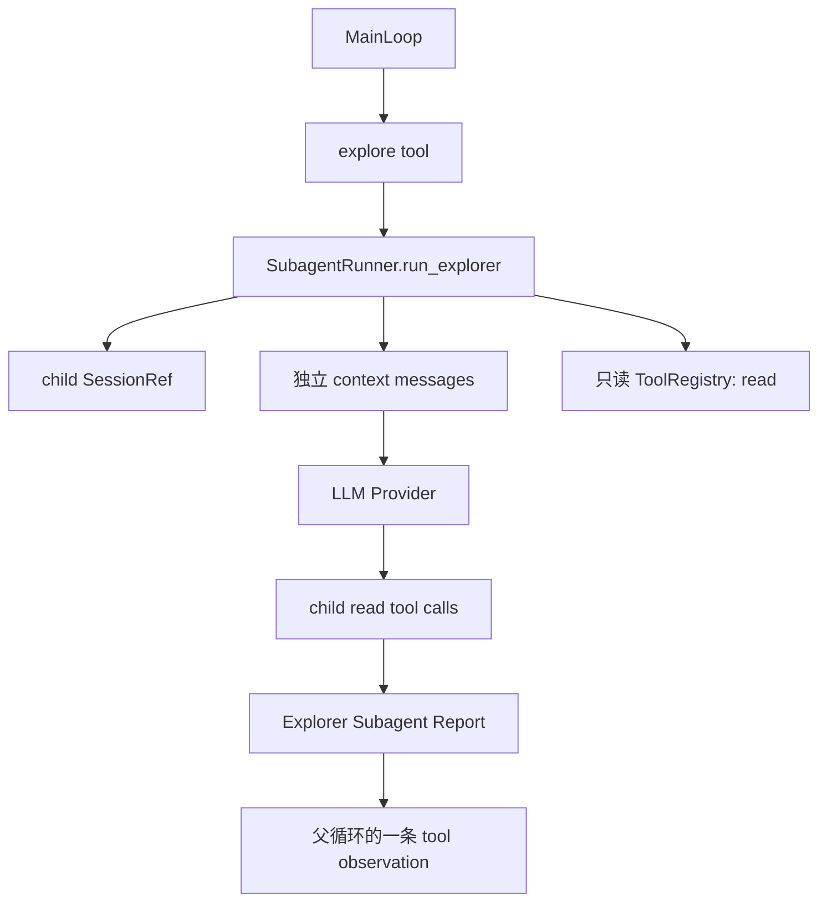

## 本节目标

> 导读：本篇进入第五部分「Subagent 与可观测性」，先解决复杂探索的上下文隔离问题：让 Explorer Subagent 在 child session 中完成阅读。

本节要实现的是同步、只读、上下文隔离的 Explorer Subagent：让复杂探索在 child session 中完成，只把精炼报告回流父循环。

完成这一节后，你会理解 Subagent 解决的是上下文隔离问题，而不是简单多调用一次模型。

## 摘要

本文要说明如何在 `tiny-claw` 中实现一个同步、只读、上下文隔离的 Explorer Subagent。它适合需要大量代码阅读、跨文件查找和日志定位的场景，读者可以了解如何把复杂探索过程移出父 Agent 上下文，只让精炼报告回流主循环。

## 背景与问题

Agent 在处理真实代码库时，经常需要先做一轮“探索”：读取多个文件、追踪调用链、查找配置、理解日志和测试。这个阶段通常会产生大量工具调用和 observation。如果这些内容全部留在父 `MainLoop` 的消息链里，后续执行阶段会承担很大的上下文压力。

Explorer Subagent 解决的是这个边界问题：父 Agent 只描述探索任务，子智能体在独立上下文里读取证据，最后返回一段极度精炼的报告。父循环不需要吸收完整探索轨迹，也不会继承子智能体的工具消息链。

## 设计目标

- **上下文隔离**：子智能体拥有独立消息链，父循环只接收最终报告。
- **只读安全**：v1 只允许 `read` 工具，避免探索阶段产生写入副作用。
- **同步简单**：父工具调用等待子智能体完成，不引入后台任务调度。
- **固定边界**：`max_steps` 和报告长度由代码常量限制，不新增运行时环境变量。
- **失败诚实**：达到步数上限时明确报告“未找到确切答案”和已查线索。
- **复用架构**：复用现有 Provider、ContextBuilder、ContextCompactor 和 SessionMemoryStore。

## 整体方案

Explorer Subagent 被实现为一个内部 runner。父工具 `explore` 调用 runner，runner 派生 child session，构造只读工具 registry，然后用同一个 provider 运行一个独立 ReAct 子循环。



## 核心实现

核心文件是 `src/tiny_claw/_internal/subagent/runner.py`。

关键常量：

```python
SUBAGENT_DEFAULT_MAX_STEPS = 6
SUBAGENT_MAX_STEPS_LIMIT = 12
SUBAGENT_RESULT_MAX_CHARS = 4_000
```

这些限制是代码内固定策略，不通过环境变量暴露。这样可以避免运行时配置面膨胀，也能保护父循环上下文。

`SubagentRunner.run_explorer()` 的主要流程是：

1. 校验并裁剪任务文本。
2. 从父 session 派生 child session。
3. 读取 child session 最近记忆。
4. 构造 Explorer 专用系统提示词和任务提示。
5. 创建只包含 `ReadTool` 的工具 registry。
6. 在子循环中调用 provider。
7. 如果模型继续请求工具，就执行 child tool calls。
8. 如果模型返回最终文本，就包装成 `[Explorer Subagent Report]`。
9. 如果达到步数上限，就返回明确的未找到报告。

只读工具 registry 的关键实现很小：

```python
def _build_read_only_tools(session: SessionRef) -> ToolRegistry:
    registry = ToolRegistry()
    registry.register(ReadTool(root=session.workdir))
    return registry
```

结果会统一包装：

```text
[Explorer Subagent Report]
child_session=<child-session-key>
stop_reason=<final | max_steps_exhausted>

<精炼报告正文>
```

## 使用方式

Explorer Subagent 不直接作为 CLI 子命令暴露，而是通过 `explore` 工具被父 Agent 调用。

启用方式：

```bash
TINY_CLAW_ENABLED_TOOLS=read,explore \
uv run tiny-claw run "请探索项目中的工具注册流程，并总结关键文件。"
```

`explore` 工具参数：

```json
{
  "task": "调查 src/tiny_claw/_internal/tools 的注册与执行链路",
  "max_steps": 6
}
```

推荐使用场景：

- 大量代码阅读。
- 跨文件查找逻辑。
- 日志定位。
- 需要先收集证据再让父 Agent 做决策的任务。

不推荐使用场景：

- 需要修改文件的任务。
- 需要执行 shell 命令的任务。
- 需要后台异步长时间运行的任务。

这些能力不属于 v1 的 Explorer Subagent。

## 测试与验证

核心测试：

```bash
uv run pytest tests/test_subagent.py
```

完整验证：

```bash
uv run ruff check .
uv run ruff format --check .
uv run mypy src
uv run pytest
```

真实 Provider 验证可以运行：

```bash
uv run pytest -s tests/test_subagent_openai_live.py
```

这个 live 测试会创建临时工作区，让父 Agent 只看到 `explore`，再观察子智能体是否通过 `read` 工具读取 fixture 文件并返回报告。

## 设计取舍与注意事项

v1 选择同步执行，而不是后台异步执行。这样父循环不需要处理任务轮询、取消、超时恢复和 partial result，整体语义更清晰：`explore` 是一次普通工具调用，返回一条普通 observation。

v1 选择只读工具，而不是继承父工具集。即使父 Agent 启用了 `write`、`edit` 或 `bash`，子智能体也只能看到 `read`。这是为了让“探索”保持低风险，避免子任务在上下文隔离的同时产生不可见副作用。

结果长度使用固定截断策略，而不是新增 `TINY_CLAW_SUBAGENT_MAX_RESULT_CHARS`。这让配置表面更小，也更符合 v1 的保守定位。

当前实现不支持多个 `explore` 并发。后续如果要做 subagent 并发，应增加专门的 subagent 并发池、限流和 provider 并发安全测试，而不是简单把 `explore` 加入普通工具并发白名单。

## 总结

- Explorer Subagent 把复杂探索过程从父 Agent 上下文中隔离出去。
- v1 同步、只读、单层，优先保证行为清晰和风险可控。
- 子智能体复用现有 Provider、上下文构建和压缩机制。
- 父循环只收到 `[Explorer Subagent Report]`，不会吸收完整子任务消息链。
- 后续扩展并发和更多工具能力时，应继续保持清晰的权限边界。

按 Subagent 专题继续阅读：[24：explore 工具 adapter](24-explore-tool-adapter.md) 会把子智能体能力接入普通工具系统。

---

> 来源：本文整理自 `tiny-claw/docs/tutorial/23-explorer-subagent-runtime.md`。
> 项目地址：[barry166/tiny-claw](https://github.com/barry166/tiny-claw)。
