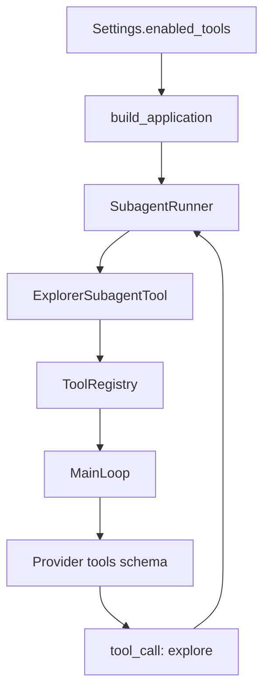

> 系列导航：[系列目录](/series/harness-agent/) | 上一篇：[从零实现 Harness Agent：Explorer Subagent 运行时](/2026/06/09/harness-agent/harness-agent-23-explorer-subagent-runtime/) | 下一篇：[从零实现 Harness Agent：Subagent 会话与记忆隔离](/2026/06/09/harness-agent/harness-agent-25-subagent-session-memory-isolation/)

## 本节目标

> 导读：本篇属于第五部分「Subagent 与可观测性」，说明如何把 Subagent 能力包装成普通工具，让父 `MainLoop` 保持无感。

本节要实现的是 `explore` 工具 adapter：把 Explorer Subagent 包装成普通 Tool，让父 `MainLoop` 不需要理解子智能体内部细节。

完成这一节后，你会理解如何把运行时能力接入工具系统，同时保持主循环简洁。

## 摘要

本文要说明 `tiny-claw` 如何把 Explorer Subagent 封装成一个普通工具 `explore`。读者可以了解如何在不污染 `MainLoop` 的前提下，把子智能体能力接入现有工具系统，并通过 `TINY_CLAW_ENABLED_TOOLS` 显式启用。

## 背景与问题

Subagent 是一种运行时能力，但父 Agent 不应该直接知道子智能体内部如何构造上下文、如何调用 provider、如何执行子工具。如果把这些细节写进 `MainLoop`，主循环会变得越来越臃肿，工具执行、状态管理和子循环编排也会纠缠在一起。

更好的边界是：把 Explorer Subagent 作为一个工具暴露给模型。父循环看到的只是一次普通 tool call；工具内部负责运行子智能体；最终返回一条普通 tool observation。

## 设计目标

- **主循环无感**：`MainLoop` 不需要理解 subagent 的内部流程。
- **统一工具协议**：`explore` 和 `read`、`write`、`edit`、`bash` 一样实现 Tool 接口。
- **显式启用**：默认不启用 `explore`，必须通过配置开启。
- **运行时上下文可传递**：工具运行时可以拿到 session、workdir 和 visible tools。
- **无新增依赖**：继续使用项目已有架构和标准库能力。
- **可测试**：schema、参数校验和父循环 observation 都可以独立测试。

## 整体方案

`ExplorerSubagentTool` 是工具系统和子智能体运行器之间的 adapter。应用装配时创建 `SubagentRunner`，再把它注入 `ExplorerSubagentTool`。如果 `TINY_CLAW_ENABLED_TOOLS` 包含 `explore`，工具注册表就会注册这个工具。



## 核心实现

关键文件：

- `src/tiny_claw/_internal/tools/builtin/explore.py`
- `src/tiny_claw/_internal/app.py`
- `src/tiny_claw/_internal/settings.py`
- `src/tiny_claw/_internal/tools/base.py`
- `src/tiny_claw/_internal/tools/registry.py`

`ExplorerSubagentTool` 定义工具名和参数 schema：

```python
class ExplorerSubagentTool:
    @property
    def name(self) -> str:
        return "explore"
```

工具参数只有两个：

- `task`：必填，探索任务说明。
- `max_steps`：可选，默认 6，上限 12。

工具执行时要求运行时 session 存在：

```python
if input.session is None:
    raise ToolError("explore tool requires a runtime session")
```

这是因为 child session 必须从 parent session 派生。

应用装配层复用同一套 provider、context builder、context compactor 和 memory：

```python
subagent_runner = SubagentRunner(
    provider=resolved_provider,
    context_builder=context_builder,
    context_compactor=context_compactor,
    memory=memory,
)
```

工具注册只在 runner 存在时提供 `explore`：

```python
if subagent_runner is not None:
    available_tools["explore"] = ExplorerSubagentTool(runner=subagent_runner)
```

为了让工具能拿到 session 和 workdir，`ToolInput` 扩展了运行时上下文：

```python
class ToolInput:
    arguments: Mapping[str, Any]
    session: SessionRef | None = None
    workdir: Path | None = None
    visible_tool_names: tuple[str, ...] = ()
    metadata: Mapping[str, Any] = field(default_factory=dict)
```

## 使用方式

默认情况下，`explore` 不会启用。需要显式配置：

```bash
TINY_CLAW_ENABLED_TOOLS=read,explore \
uv run tiny-claw run "请探索项目的工具系统入口，并总结关键调用链。"
```

如果只启用 `read`，模型看不到 `explore`：

```bash
TINY_CLAW_ENABLED_TOOLS=read uv run tiny-claw health
```

可以通过 health 输出确认当前工具集合：

```bash
uv run tiny-claw health
```

内部工具调用示例：

```json
{
  "task": "调查 docs/tutorial 中工具系统相关文档的主题边界",
  "max_steps": 6
}
```

## 测试与验证

工具 schema 和参数校验：

```bash
uv run pytest tests/test_subagent.py -k schema
```

应用装配和配置解析：

```bash
uv run pytest tests/test_app.py::test_application_registers_explicitly_enabled_tools
uv run pytest tests/test_settings.py::test_settings_reads_enabled_tools_from_environment
```

完整验证：

```bash
uv run ruff check .
uv run ruff format --check .
uv run mypy src
uv run pytest
```

## 设计取舍与注意事项

`explore` 是 opt-in 工具，不默认启用。这延续了 `tiny-claw` 的工具权限策略：新增工具不会自动扩大模型能力面。

`ExplorerSubagentTool` 只负责 adapter 工作，不承担子循环细节。真正的子循环逻辑放在 `SubagentRunner` 中。这个边界让工具层保持薄，后续如果要增加其他 subagent 类型，也可以复用类似 adapter 模式。

工具运行时上下文被加入 `ToolInput`，但不是每个工具都必须使用它。普通工具仍然可以只读取 `arguments`。这保证了向后兼容，也让需要 session 的高级工具有扩展空间。

`explore` 当前不是并发安全工具。父模型同一轮返回多个 `explore` 调用时，它们会按普通非并发工具顺序执行。

## 总结

- `explore` 把子智能体封装为标准 Tool，保持 `MainLoop` 简洁。
- 工具 schema 清晰，只暴露 `task` 和 `max_steps`。
- `TINY_CLAW_ENABLED_TOOLS` 继续作为全局能力开关。
- `ToolInput` 支持运行时上下文，为 session-aware 工具打好基础。
- 这个 adapter 模式可以作为后续更多 subagent 工具的模板。

按 Subagent 专题继续阅读：[25：Subagent 子会话隔离](25-subagent-session-memory-isolation.md) 会处理父子记忆和状态边界。

---

> 来源：本文整理自 `tiny-claw/docs/tutorial/24-explore-tool-adapter.md`。
> 项目地址：[barry166/tiny-claw](https://github.com/barry166/tiny-claw)。
