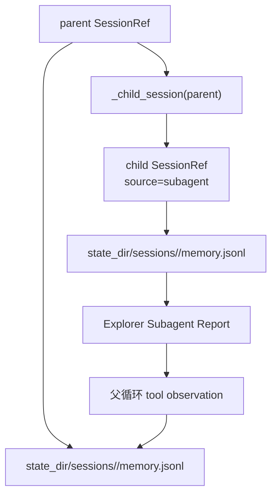

## 摘要

本文要说明 Explorer Subagent 如何通过独立 `SessionRef` 和独立 memory store 隔离子任务状态。读者可以了解 child session 的派生方式、父子 memory 的边界，以及为什么父循环只接收精炼报告而不是完整子任务消息链。

## 背景与问题

Subagent 的核心价值不是“多调用一次模型”，而是把复杂探索过程隔离出去。如果子智能体读取的文件内容、工具 observation 和中间推理都写回父 session，那么父 Agent 仍然会承受同样的上下文压力。

因此，子智能体需要自己的会话线。父 session 只记录父任务的 prompt 和最终回复；child session 记录探索任务和探索报告。父循环收到的是一条工具 observation，而不是子智能体的完整运行历史。

## 设计目标

- **父子记忆隔离**：子任务 memory 不写入父 session。
- **可追踪**：每次子任务都有稳定可打印的 child session key。
- **上下文最小回流**：父循环只接收精炼报告。
- **复用现有存储**：继续使用 `SessionMemoryStore` 和文件系统 JSONL。
- **便于测试**：可以独立断言父 memory 和 child memory 不串线。
- **为并发扩展留边界**：多个 child session 天然拥有不同状态目录。

## 整体方案

`SubagentRunner` 接收 parent `SessionRef`，通过 `_child_session(parent)` 派生一个新的 `SessionRef`。这个 child session 使用相同 workdir，但 source 为 `subagent`，key 中包含父 session key 和随机 child id。



## 核心实现

关键文件：

- `src/tiny_claw/_internal/subagent/runner.py`
- `src/tiny_claw/_internal/session/manager.py`
- `src/tiny_claw/_internal/memory/file_store.py`
- `tests/test_subagent.py`

child session 派生逻辑：

```python
def _child_session(parent: SessionRef) -> SessionRef:
    child_id = uuid.uuid4().hex[:12]
    key = f"parent-{parent.key}-explore-{child_id}"
```

child session 的关键字段：

- `source="subagent"`
- `external_id="<parent-key>:explore:<child-id>"`
- `workdir=parent.workdir`
- `display_name="explore:<parent-display-name>:<child-id>"`

运行时读取和写入 child memory：

```python
child_memory = self.memory.for_session(child_session)
recent_memory = child_memory.read_recent(limit=3)
```

子任务结束后只记录子任务的 prompt 和最终报告：

```python
memory.append("last_prompt", prompt)
memory.append("last_response", response)
```

父循环不会看到 child 的完整 tool call 链。测试会断言父 observation 中不包含 child tool call id。

## 使用方式

这个模块是内部状态边界，用户不需要直接创建 child session。启用 `explore` 后，系统会在每次工具调用时自动派生 child session：

```bash
TINY_CLAW_ENABLED_TOOLS=read,explore \
uv run tiny-claw run --session architecture "请探索工具执行链路"
```

日志中可以看到 child session：

```text
[Subagent] Explorer 子智能体启动 parent_session=... child_session=parent-...-explore-...
```

最终报告也会包含：

```text
[Explorer Subagent Report]
child_session=parent-...-explore-...
stop_reason=final
```

## 测试与验证

父子 memory 隔离测试：

```bash
uv run pytest tests/test_subagent.py -k memory
```

父循环只接收精炼 observation：

```bash
uv run pytest tests/test_subagent.py -k compact
```

完整 subagent 测试：

```bash
uv run pytest tests/test_subagent.py
```

全量验证：

```bash
uv run ruff check .
uv run ruff format --check .
uv run mypy src
uv run pytest
```

## 设计取舍与注意事项

child session 使用父 workdir，而不是重新选择工作目录。这是因为工具注册和路径边界都围绕应用 workdir 构建，子智能体应该在同一项目范围内探索。

child memory 当前只记录最近 prompt 和 response，不记录完整工具链。完整工具链仍然存在于运行时日志里，但不会写入父 session memory。这个取舍优先保护父上下文，代价是 child session 的持久审计信息比较精简。

memory 存储仍然使用 JSONL 文件。它足够透明、易测试，也和现有 session 体系一致。当前不是长期知识库，也不是向量记忆系统。

如果后续支持多个 subagent 并发，child session key 已经具备隔离基础，但还需要增加并发限流、provider 安全测试和更强的运行状态记录。

## 总结

- 子智能体通过独立 `SessionRef` 隔离探索记忆。
- 父 session 不接收子任务的完整消息链。
- child session key 让日志、报告和状态目录可以互相对齐。
- 文件系统 JSONL 继续作为轻量、透明的 memory 存储。
- 这个边界是后续 subagent 并发和审计能力的基础。

---

> 来源：本文整理自 `tiny-claw/docs/tutorial/25-subagent-session-memory-isolation.md`。
> 项目地址：[barry166/tiny-claw](https://github.com/barry166/tiny-claw)。
