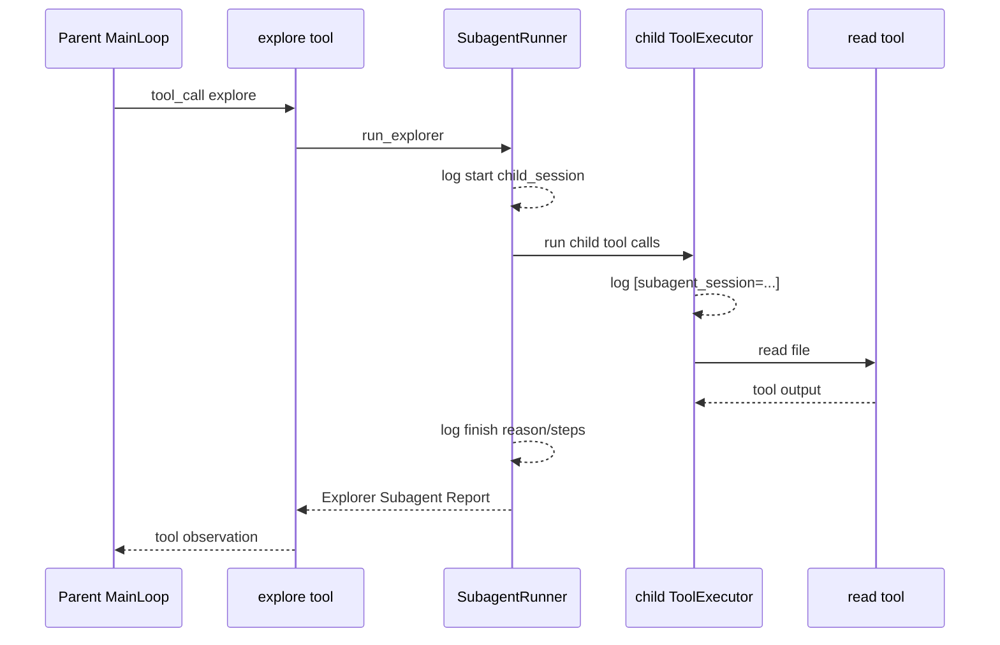

> 系列导航：[系列目录](/series/harness-agent/) | 上一篇：[从零实现 Harness Agent：Subagent 会话与记忆隔离](/2026/06/09/harness-agent/harness-agent-25-subagent-session-memory-isolation/) | 下一篇：[从零实现 Harness Agent：OpenAI Subagent 真实链路测试](/2026/06/09/harness-agent/harness-agent-27-openai-subagent-live-test/)

## 本节目标

> 导读：本篇属于第五部分「Subagent 与可观测性」，让嵌套 Agent 的启动、结束和内部工具调用在日志里有清楚归属。

本节要实现的是 Subagent 的可读日志：让启动、结束、child tool 调用和报告长度都能被维护者定位。

完成这一节后，你会理解嵌套 Agent 的日志为什么必须标记归属。

## 摘要

本文要说明如何让 Explorer Subagent 的运行过程可观察。读者可以了解 `tiny-claw` 如何记录子智能体启动、结束、内部工具调用和报告长度，以及如何通过 `subagent_session=...` 区分父工具和 child tool 日志。

## 背景与问题

一旦系统支持嵌套 Agent，日志很容易变得混乱。父 Agent 可能调用 `explore`，而 `explore` 内部又启动子智能体调用 `read`。如果日志只显示“执行工具: read”，维护者很难判断这个 `read` 属于父循环还是子循环。

可观测性必须跟上架构边界：既要看到子智能体生命周期，也要能把内部工具调用和 child session 对齐。

## 设计目标

- **生命周期清晰**：记录 Explorer 启动和结束。
- **工具归属清晰**：child 工具日志带 `subagent_session=...`。
- **父日志不变**：普通父工具调用不额外增加噪声。
- **不泄露大任务文本**：启动日志只记录 `task_chars`，不展开完整任务。
- **错误路径一致**：工具成功、失败、异常和错误兜底都支持 context。
- **测试可锁定**：日志格式有回归测试保护。

## 整体方案

可观测性分两层：

1. `SubagentRunner` 负责记录子智能体生命周期。
2. `ToolExecutor` 根据 `SessionRef.source` 给子工具日志加上下文标记。



## 核心实现

关键文件：

- `src/tiny_claw/_internal/subagent/runner.py`
- `src/tiny_claw/_internal/engine/log_view.py`
- `src/tiny_claw/_internal/engine/tool_executor.py`
- `tests/test_log_view.py`
- `tests/test_tool_executor.py`

启动日志包含：

- parent session
- child session
- max steps
- task 字符数
- workdir
- child tools

示例：

```text
[Subagent] Explorer 子智能体启动 parent_session=... child_session=... max_steps=6 task_chars=96 workdir=... tools=read
```

结束日志包含：

- child session
- stop reason
- steps
- provider
- report chars

示例：

```text
[Subagent] Explorer 子智能体结束 child_session=... reason=final steps=2/6 provider=openai report_chars=319
```

工具日志通过 `context` 参数扩展：

```python
def log_tool_call(logger, call, *, context: str | None = None) -> None:
    ...
```

`ToolExecutor` 根据 session source 生成上下文：

```python
def _tool_log_context(session: SessionRef) -> str | None:
    if session.source != "subagent":
        return None
    return f"subagent_session={session.key}"
```

child 工具日志会显示：

```text
-> 🛠 [subagent_session=parent-...-explore-...] 执行工具: read
-> ✅ 工具成功 [subagent_session=parent-...-explore-...]: read
```

## 使用方式

启用日志和 `explore`：

```bash
TINY_CLAW_LOG_LEVEL=INFO \
TINY_CLAW_ENABLED_TOOLS=read,explore \
uv run tiny-claw run "请探索项目中的工具执行链路"
```

如果运行真实 live 测试，可以直接观察完整链路：

```bash
uv run pytest -s tests/test_subagent_openai_live.py
```

关注这些日志点：

```text
执行工具: explore
Explorer 子智能体启动
[subagent_session=...] 执行工具: read
Explorer 子智能体结束
工具成功: explore
```

## 测试与验证

日志渲染测试：

```bash
uv run pytest tests/test_log_view.py
```

工具执行器 subagent 日志标记测试：

```bash
uv run pytest tests/test_tool_executor.py -k subagent
```

subagent 生命周期日志测试：

```bash
uv run pytest tests/test_subagent.py -k logs
```

完整验证：

```bash
uv run ruff check .
uv run ruff format --check .
uv run mypy src
uv run pytest
```

## 设计取舍与注意事项

启动日志记录 `task_chars`，而不是完整 task 文本。探索任务可能包含较长上下文或敏感片段，日志不应该把上下文隔离收益重新消耗掉。

`subagent_session` 只在 `session.source == "subagent"` 时出现。父工具日志保持原样，避免普通工具调用被无关上下文污染。

日志 context 被接入 `log_tool_call`、`log_tool_result`、`log_tool_error_fallback` 和 `log_tool_exception`。这样成功和失败路径都有一致的可追踪标记。

日志不是安全边界。真正的权限边界仍然由 child tool registry 决定：Explorer Subagent v1 只能看到 `read`。

## 总结

- Subagent 日志需要同时覆盖生命周期和内部工具归属。
- `subagent_session=...` 让 child tool calls 可以从父日志中清楚区分。
- 不打印完整 task，有助于保护日志体积和敏感上下文。
- 日志增强不改变工具执行语义，只提升审计和调试体验。
- 对嵌套 Agent 来说，可观测性是架构边界的一部分。

按 Subagent 专题继续阅读：[27：OpenAI Subagent live test](27-openai-subagent-live-test.md) 会用真实模型链路补充验收。

---

> 来源：本文整理自 `tiny-claw/docs/tutorial/26-subagent-observability.md`。
> 项目地址：[barry166/tiny-claw](https://github.com/barry166/tiny-claw)。
