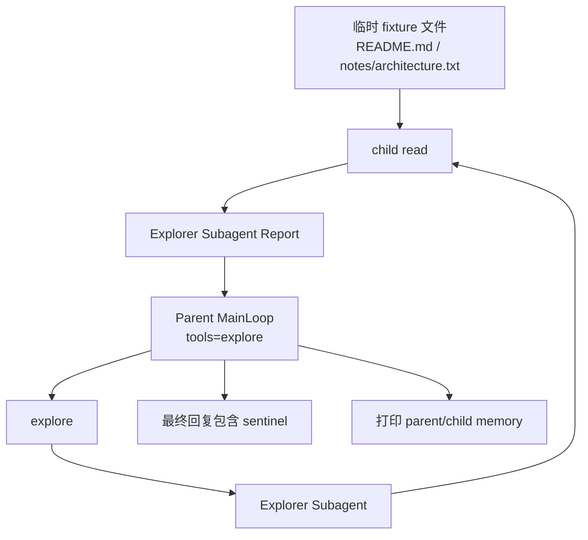

> 系列导航：[系列目录](/series/harness-agent/) | 上一篇：[从零实现 Harness Agent：Subagent 可观测性设计](/2026/06/09/harness-agent/harness-agent-26-subagent-observability/) | 下一篇：[从零实现 Harness Agent：工具并发边界设计](/2026/06/09/harness-agent/harness-agent-28-tool-concurrency-boundaries/)

## 本节目标

> 导读：本篇连接第五部分和第六部分：用真实 OpenAI-compatible Provider 补充验收 Subagent 的端到端链路。

本节要补充的是真实 OpenAI Provider 下的 Subagent E2E 验收：观察父 Agent 调用 `explore`、子智能体调用 `read`、报告回流父循环。

完成这一节后，你会知道 live test 如何补充 fake provider 测试，而不是替代它。

## 摘要

本文要说明如何用真实 OpenAI Provider 验证 Explorer Subagent 的端到端链路。读者可以学习如何设计一个可打印、可人工审计的 live 测试，验证父 Agent 调用 `explore`、子智能体调用 `read`、最终报告回流父循环。

## 背景与问题

Agent 框架的大部分行为应该用 fake provider 和单元测试锁定，但真实模型工具调用仍然需要补充验收。尤其是 Subagent：它涉及父工具调用、子循环、子工具执行、报告回流和父循环最终回复。只靠 mock 很难证明真实 Provider 下模型会正确使用工具。

live E2E 测试的目标不是替代单元测试，而是提供一条能被人眼审计的真实链路。

## 设计目标

- **真实 Provider**：使用环境中配置的 OpenAI-compatible provider。
- **临时工作区**：测试文件放在 `tmp_path` 下，不污染项目文件。
- **父工具最小化**：父 Agent 只暴露 `explore`，确保必须走 subagent。
- **证据明确**：fixture 文件包含 sentinel 字符串。
- **打印友好**：使用 `pytest -s` 打印工作区、工具、日志和 memory。
- **无强断言**：测试关注真实输出展示，缺少 key 时跳过。

## 整体方案

测试创建一个临时工作区，写入两个文件：

- `README.md`
- `notes/architecture.txt`

每个文件包含一个 sentinel。父 Agent 的 prompt 明确要求调用 `explore`，Explorer Subagent 通过 child `read` 工具读取文件，报告 sentinel，父 Agent 再基于报告输出最终回复。



## 核心实现

关键文件：

- `tests/test_subagent_openai_live.py`
- `src/tiny_claw/_internal/logging_config.py`
- `src/tiny_claw/_internal/app.py`
- `src/tiny_claw/_internal/settings.py`

测试从环境读取 OpenAI 配置：

```python
env_settings = Settings.from_env()
if not env_settings.openai_api_key:
    pytest.skip(...)
```

测试专用 settings 只启用 `explore`：

```python
live_settings = Settings(
    provider_name="openai",
    enabled_tools=("explore",),
    openai_api_key=env_settings.openai_api_key,
    openai_base_url=env_settings.openai_base_url,
)
```

fixture 使用两个 sentinel：

```text
SUBAGENT_LIVE_SENTINEL_20260610
READ_ONLY_CHILD_CONTEXT_OK
```

测试会打印：

- replay command
- workdir
- state dir
- model
- actual tools
- parent session
- fixture 内容
- 父 MainLoop 最终回复
- parent session memory
- child subagent session memory

## 使用方式

运行 live 测试：

```bash
uv run pytest -s tests/test_subagent_openai_live.py
```

需要提前配置：

```bash
OPENAI_API_KEY=<your-key>
```

如果使用 OpenAI-compatible endpoint，可配置：

```bash
OPENAI_BASE_URL=<your-compatible-base-url>
```

测试中可以观察这些关键输出：

```text
actual_tools=explore
执行工具: explore
Explorer 子智能体启动
[subagent_session=...] 执行工具: read
[Explorer Subagent Report]
父 MainLoop 最终回复
```

## 测试与验证

live 测试本身：

```bash
uv run pytest -s tests/test_subagent_openai_live.py
```

相关稳定测试：

```bash
uv run pytest tests/test_subagent.py
uv run pytest tests/test_app.py::test_application_registers_explicitly_enabled_tools
uv run pytest tests/test_settings.py::test_settings_reads_enabled_tools_from_environment
```

完整验证：

```bash
uv run ruff check .
uv run ruff format --check .
uv run mypy src
uv run pytest
```

## 设计取舍与注意事项

这个测试没有把所有输出都写成严格断言。真实模型回复存在表达差异，过多字符串断言会让测试脆弱。它更像一个 printable E2E：通过固定 fixture 和 sentinel，让维护者直接确认真实链路。

父 Agent 只暴露 `explore`，不是 `read,explore`。这样可以证明父 Agent 不能直接读取文件，必须派发 Explorer Subagent。

测试会在缺少 OpenAI key 时跳过。是否把它纳入 CI 需要根据项目运行环境决定；如果 CI 没有稳定 live provider，建议只在本地或专门的 live job 中运行。

不要在文章、日志或测试输出中写入真实密钥。测试可以显示 provider 名称和模型名，但不应该打印 API key。

## 总结

- Subagent 的真实链路需要 live E2E 补充验证。
- 只暴露 `explore` 可以证明父循环确实通过子智能体探索。
- sentinel fixture 让人工审计更可靠。
- `pytest -s` 适合展示模型工具调用和 session memory。
- live 测试是补充验收，不替代稳定的单元测试和 fake provider 测试。

按编号继续阅读：[28：工具并发边界](28-tool-concurrency-boundaries.md) 会回到工具调度层，梳理 `read` 与 `explore` 的并发差异。

---

> 来源：本文整理自 `tiny-claw/docs/tutorial/27-openai-subagent-live-test.md`。
> 项目地址：[barry166/tiny-claw](https://github.com/barry166/tiny-claw)。
