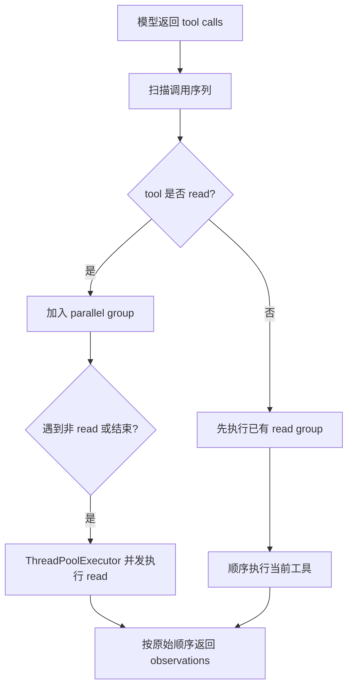

## 摘要

本文要说明 `tiny-claw` 当前的工具并发边界：同一轮连续 `read` 可以并发执行，但 `write`、`edit`、`bash` 和 `explore` 会顺序执行。读者可以了解为什么并发不是简单的性能开关，而是工具语义、安全边界和 Provider 成本共同决定的架构选择。

## 背景与问题

现代模型可能在一轮响应中返回多个 tool calls。对于代码阅读任务，并发读取多个文件可以明显降低等待时间。但对写文件、编辑文件、执行 shell 命令或启动子智能体来说，并发可能带来副作用冲突、状态竞争或不可控的 token/API 消耗。

因此，工具执行器需要区分“可以并发的工具”和“必须顺序执行的工具”。这个边界应该由工具语义决定，而不是由实现是否线程安全决定。

## 设计目标

- **安全优先**：只并发低风险工具。
- **顺序稳定**：并发后的 observation 顺序仍与模型 tool call 顺序一致。
- **副作用隔离**：写入、编辑、命令执行和子智能体启动默认顺序执行。
- **成本可控**：不让多个 subagent 在没有限流的情况下同时启动模型子循环。
- **可扩展**：后续可以引入 subagent 专用并发策略。
- **可测试**：并发和 barrier 行为有自动化测试覆盖。

## 整体方案

当前 `ToolExecutor` 使用一个并发安全白名单：

```python
PARALLEL_SAFE_TOOL_NAMES = {"read"}
```

扫描 tool calls 时，连续 `read` 会组成并发组。遇到非 `read` 工具时，执行器会先跑完已有并发组，再顺序执行当前工具。



示例：

```text
read, read, write, read
```

执行顺序是：

```text
parallel(read, read) -> write -> read
```

## 核心实现

关键文件：

- `src/tiny_claw/_internal/engine/tool_executor.py`
- `tests/test_tool_executor.py`
- `src/tiny_claw/_internal/subagent/runner.py`
- `src/tiny_claw/_internal/tools/builtin/explore.py`

并发入口：

```python
def run_tool_batch(self, tool_calls: tuple[ToolCall, ...], ...) -> ToolRunBatch:
    ...
```

并发组执行：

```python
max_workers = min(self.max_parallel_tools, len(tool_calls))
with ThreadPoolExecutor(max_workers=max_workers) as executor:
    observations = tuple(executor.map(..., tool_calls))
```

`executor.map()` 会按输入顺序返回结果，因此即使内部完成顺序不同，模型下一轮看到的 observation 顺序仍然稳定。

`explore` 没有加入 `PARALLEL_SAFE_TOOL_NAMES`。虽然 Explorer Subagent v1 只读，但它会启动一个模型子循环，内部可能继续调用多个 `read`。它的成本和调度风险与普通文件读取不同，因此当前保持顺序执行。

子智能体内部仍然可以并发执行多个 `read`，因为 child `ToolExecutor` 使用同一套并发规则，且子工具 registry 只包含 `read`。

## 使用方式

用户不直接配置工具并发策略。只要模型同一轮返回多个连续 `read`，执行器会自动并发。

启用 `read`：

```bash
TINY_CLAW_ENABLED_TOOLS=read \
uv run tiny-claw run "请同时阅读 README 和 pyproject 配置，概括项目结构。"
```

启用 `explore`：

```bash
TINY_CLAW_ENABLED_TOOLS=read,explore \
uv run tiny-claw run "请探索工具执行器的并发边界。"
```

注意：多个 `explore` 调用当前会顺序执行。它们不会像多个 `read` 那样进入同一个并发组。

## 测试与验证

连续 `read` 并发：

```bash
uv run pytest tests/test_tool_executor.py -k consecutive
```

并发 observation 顺序稳定：

```bash
uv run pytest tests/test_tool_executor.py -k preserves_original_order
```

非 `read` 工具作为 barrier：

```bash
uv run pytest tests/test_tool_executor.py -k ordered_barriers
```

subagent 内部 read 日志标记：

```bash
uv run pytest tests/test_tool_executor.py -k subagent
```

完整验证：

```bash
uv run ruff check .
uv run ruff format --check .
uv run mypy src
uv run pytest
```

## 设计取舍与注意事项

当前并发策略非常保守：只有 `read` 可以并发。`write`、`edit`、`bash` 即使在某些场景下可以安全并发，也默认顺序执行，因为它们可能改变文件系统、依赖当前目录状态，或影响后续工具看到的世界。

`explore` 暂不并发是一个明确取舍。Explorer Subagent 会消耗模型请求和上下文预算，也会创建 child session 和 child memory。让多个 `explore` 无限制并发，可能导致 provider 并发压力、日志交错、成本不可控和状态审计困难。

如果后续要支持多个 subagent 并发，建议不要直接把 `explore` 加入普通白名单，而是引入更明确的分类，例如：

```python
PARALLEL_SAFE_TOOL_NAMES = {"read"}
PARALLEL_SUBAGENT_TOOL_NAMES = {"explore"}  # 待设计
```

并配套：

- subagent 专用最大并发数。
- provider client 并发安全验证。
- child session 日志和结果顺序测试。
- token/API 成本保护。
- 取消和超时策略。

## 总结

- 当前工具并发只覆盖连续 `read`。
- 副作用工具和 `explore` 都会顺序执行。
- 子智能体内部多个 `read` 仍可并发。
- observation 顺序稳定是模型正确理解结果的关键。
- subagent 并发需要专门设计限流和 provider 安全策略，不能简单套用普通工具白名单。

---

> 来源：本文整理自 `tiny-claw/docs/tutorial/28-tool-concurrency-boundaries.md`。
> 项目地址：[barry166/tiny-claw](https://github.com/barry166/tiny-claw)。
