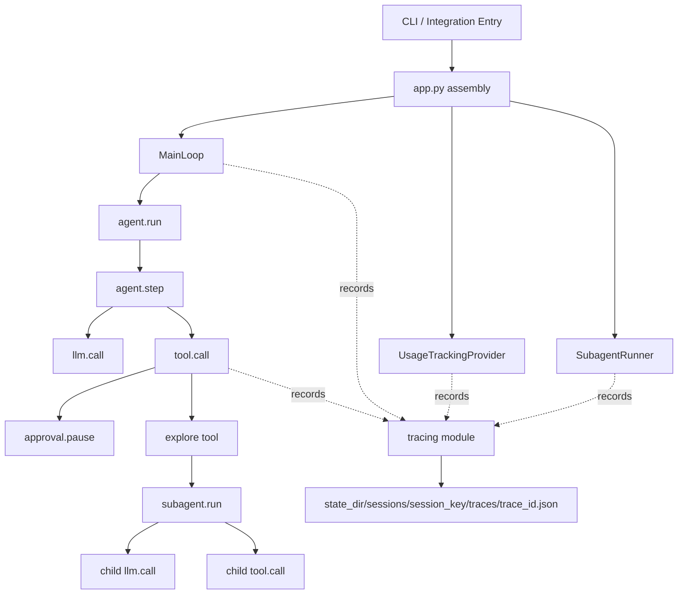

## 本节目标

> 导读：本篇属于第五部分「Subagent 与可观测性」的收束篇：把一次 Agent run 中的模型、工具、审批和 Subagent 行为记录成可回放的决策树。

本节要实现的是本地轻量级 Agent Tracing：把一次运行中的主循环、模型调用、工具调用、审批恢复和 Subagent 组织成 JSON 决策树。

完成这一节后，你会理解 tracing 应该插在运行时观测层，而不是污染 provider、tool 或 message 协议。

## 摘要

本文要说明如何在 `tiny-claw` 中实现一套本地轻量级 Agent Tracing，把一次 Agent 运行固化为可回放的 JSON 决策树。它适合 AI Agent 框架开发者、Python CLI 开发者和后续维护者阅读。读完后，你会理解 tracing 应该插在架构的什么位置、如何记录 `agent.run -> agent.step -> llm.call / tool.call`，以及如何在保护隐私的前提下保留足够的排障信息。

阅读提示：本篇内容较长。快速阅读时可以先看下面的“快速版”，再看“整体方案”“使用方式”和“总结”；需要维护实现时，再深入“核心实现”和“设计取舍与注意事项”。

## 快速版

Tracing 要解决的是“运行后无法复盘”的问题。日志能告诉你发生了什么片段，但很难还原一次 run 的树形结构：哪一步调用了模型，模型返回了哪些工具，哪个工具触发了审批，哪个 `explore` 又启动了子智能体。

`tiny-claw` 的设计选择是：

- Tracing 是运行时观测层，不进入 provider、tool 或 message 协议。
- 一次运行以 `agent.run` 为根，下面挂 `agent.step`、`llm.call`、`tool.call`、`approval.*` 和 `subagent.run`。
- 默认 `metadata` 模式只保存 hash、keys、chars、耗时等元数据，避免把 prompt、工具参数和模型正文写进 trace。
- 需要更强复盘能力时，`replay` 模式才保存脱敏和截断后的 payload。
- 并发工具调用必须显式传 parent span，保证 children 归属正确、输出顺序稳定。

如果你只想知道这套 tracing 为什么存在，可以读到这里再跳到“使用方式”。如果你要改实现，则继续看下面的 span 数据模型、注入点和并发处理。

## 背景与问题

Agent 系统很容易变成黑盒。用户看到的是最终回复，开发者看到的是日志，但一次运行内部到底经历了哪些模型调用、工具调用、审批暂停和子 Agent 探索，往往只能靠散落的日志还原。

这在引入 ReAct 主循环、工具系统、人工审批和 Subagent 之后尤其明显：

- 模型可能在同一步返回多个 tool calls。
- 工具可能成功、失败、被 deny，或因为高危操作进入审批暂停。
- 审批恢复会从 checkpoint 继续执行，而不是重新开始。
- `explore` 工具内部会启动一个 Explorer Subagent，形成嵌套运行链路。
- 并发 `read` 会跨线程执行，普通上下文变量不会自动传到 worker thread。

如果没有结构化 trace，维护者只能在日志、usage 记录、checkpoint 和 session memory 之间来回拼图。Tracing 模块的目标，是把这些运行时事件统一记录成一棵本地 JSON 决策树。

## 设计目标

- **架构边界清晰**：Tracing 是运行时观测层，不属于 provider、memory 或 tool schema。
- **不污染核心协议**：不向 `LLMRequest`、`LLMResponse`、`Message`、`ToolCall`、`ToolDefinition` 注入 tracing 字段。
- **默认保护隐私**：默认 `metadata` 模式只记录 hash、keys、chars 等元数据，不保存 prompt、tool args、assistant text 原文。
- **可回放结构**：输出 `agent.run -> agent.step -> llm.call / tool.call / approval / subagent.run` 的树形 JSON。
- **失败不影响主流程**：recorder 写入失败只记录 warning，不打断 Agent 运行。
- **并发安全**：并发工具 span 仍能挂到正确的父 `agent.step` 下，并保持 children 输出顺序稳定。
- **可测试**：span 父子关系、隐私策略、错误关闭、并发排序、审批和子 Agent 链路都有自动化测试保护。

## 整体方案

设计判断很直接：Tracing 不是 provider 功能，也不是 memory 功能。它是横切的运行时观测层，插在 `app.py` 装配出的运行链路旁边，由 `MainLoop`、provider decorator、`ToolExecutor`、审批恢复器和 Subagent Runner 在关键生命周期点写入 span。



整体链路分为三层：

1. `app.py` 创建并注入同一个 `Tracer`。
2. 运行时模块在关键边界创建 span。
3. `FileTraceRecorder` 在 trace 结束时把树写成本地 JSON。

典型输出结构是：

```text
agent.run
  agent.step
    llm.call
    tool.call
      approval.pause
  agent.step
    llm.call
```

当 `explore` 工具启动子 Agent 时，结构会扩展为：

```text
tool.call explore
  subagent.run
    llm.call
    tool.call read
```

## 核心实现

关键文件：

- `src/tiny_claw/_internal/tracing/__init__.py`
- `src/tiny_claw/_internal/app.py`
- `src/tiny_claw/_internal/engine/main_loop.py`
- `src/tiny_claw/_internal/provider/tracking.py`
- `src/tiny_claw/_internal/engine/tool_executor.py`
- `src/tiny_claw/_internal/engine/approval_resume.py`
- `src/tiny_claw/_internal/subagent/runner.py`
- `src/tiny_claw/_internal/settings.py`

### Trace 数据模型

Tracing 模块的核心是 `TraceSpan` 和 `TraceTree`。`TraceTree` 持有 root span，`TraceSpan` 用 `children` 直接保存树结构。

```python
@dataclass
class TraceSpan:
    span_id: str
    parent_id: str | None
    kind: str
    name: str
    started_at: str
    sequence: int
    status: TraceStatus = "ok"
    attributes: dict[str, Any] = field(default_factory=dict)
    children: list[TraceSpan] = field(default_factory=list)
```

`begin_trace()` 创建 root span，并把当前 trace state 和当前 span id 写入 `ContextVar`：

```python
_TRACE_STATE.set(state)
_CURRENT_SPAN_ID.set(root.span_id)
```

之后 `begin_span()` 会优先使用显式 `parent_span_id`，否则使用当前上下文里的 `_CURRENT_SPAN_ID`：

```python
parent_id = parent_span_id or _CURRENT_SPAN_ID.get() or resolved_state.tree.root.span_id
```

真正建立 children 关系的是这段逻辑：

```python
with resolved_state.lock:
    parent.children.append(span)
    resolved_state.spans_by_id[span.span_id] = span
```

这意味着 JSON 不是最后根据 `parent_id` 临时拼出来的，而是在 span 创建时就已经形成了树。

### 应用装配

`app.py` 根据 settings 创建 tracer：

```python
def _build_tracer(settings: Settings) -> Tracer:
    if settings.trace_mode == "off":
        return NullTracer()
    return Tracer(
        recorder=FileTraceRecorder(settings.state_dir),
        capture_mode=cast(TraceMode, settings.trace_mode),
        max_payload_chars=settings.trace_max_payload_chars,
    )
```

同一个 tracer 会被注入到：

- `UsageTrackingProvider`
- `SubagentRunner`
- `MainLoop`

这样 provider、tool executor、subagent 都能挂到同一棵 trace 树上。

### 主循环 span

`MainLoop.run()` 创建 root `agent.run`，每一轮创建 `agent.step`：

```python
trace_root = self.tracer.begin_trace(
    trace_id=run_id,
    session_key=session.key,
    session_source=session.source,
    kind="agent.run",
    name="tiny_claw.run",
)
```

每个 step 会记录当前轮次、phase、tool policy、可见工具数量和消息数量。上下文压缩发生时，会写入 `context.compacted` event。

运行结束时，`RunResult` 会带上：

- `trace_id`
- `trace_path`

这让 CLI 或集成入口可以向用户展示 trace 文件位置。

### LLM 调用 span

`UsageTrackingProvider.complete()` 在 provider 外层创建 `llm.call`：

```python
span = self.tracer.begin_span(
    kind="llm.call",
    name=f"llm.{self.inner.name}",
    attributes={
        "provider": self.inner.name,
        "message_count": len(request.messages),
        "tool_choice": request.tool_choice.value,
        "visible_tools": len(request.tools),
    },
)
```

成功时记录 model、token usage、tool call 数量、文本长度和 latency。失败时记录 `error_type`，并把 span 标为 `error`。

### 工具调用 span

`ToolExecutor._execute_one()` 为每个工具创建 `tool.call`：

```python
span = self.tracer.begin_span(
    kind="tool.call",
    name=f"tool.{tool_call.name}",
    attributes=attributes,
    parent_span_id=trace_parent_span_id,
    state=trace_state,
)
```

工具 span 会记录：

- `tool_call_id`
- `tool_name`
- `tool_call_index`
- 参数 hash / keys / chars
- observation hash / chars
- latency
- `is_error`
- `suspended`
- `denied`
- `approval_id`
- `checkpoint_id`

如果工具因为人工审批暂停，会在 `tool.call` 下创建 `approval.pause`：

```text
tool.call
  approval.pause
```

### 并发工具的 parent span

连续 `read` 可以并发执行，但 worker thread 不会自动继承 `ContextVar`。因此并发前要捕获当前 trace state 和当前 span id：

```python
trace_state = self.tracer.current_state()
trace_parent_span_id = self.tracer.current_span_id()
```

线程里创建工具 span 时显式传入：

```python
trace_state=trace_state,
trace_parent_span_id=trace_parent_span_id,
```

这样多个并发 `read` 都会挂到同一个 `agent.step` 下。实现还会保留原始 `tool_call_index`，确保 JSON children 输出顺序与模型 tool call 顺序一致。

### 隐私模式

Tracing 支持三种模式：

- `off`：关闭 tracing。
- `metadata`：默认模式，只保存 hash、keys、chars。
- `replay`：保存脱敏、截断后的 payload。

`metadata` 模式下不会写入原始 prompt、tool args 或 assistant text：

```python
return {
    f"{prefix}_hash": _sha256(serialized),
    f"{prefix}_keys": keys,
    f"{prefix}_chars": len(serialized),
}
```

`replay` 模式会经过敏感字段脱敏和长度截断，例如包含 `token`、`secret`、`password`、`authorization`、`api_key` 的键会被替换为 `[redacted]`。

## 使用方式

默认配置已经启用 `metadata` tracing。普通用户无需额外配置，只要运行 Agent，就会在 state directory 下生成 trace JSON。

运行一次 echo provider 冒烟：

```bash
TINY_CLAW_PROVIDER=echo \
TINY_CLAW_STATE_DIR=.tmp-state \
uv run tiny-claw run "hello tiny claw"
```

trace 文件路径形如：

```text
.tmp-state/sessions/<session_key>/traces/<trace_id>.json
```

关闭 tracing：

```bash
TINY_CLAW_TRACE_MODE=off uv run tiny-claw run "hello"
```

开启 replay 模式：

```bash
TINY_CLAW_TRACE_MODE=replay \
TINY_CLAW_TRACE_MAX_PAYLOAD_CHARS=4000 \
uv run tiny-claw run "请读取 README 并总结"
```

注意：`replay` 模式会保存脱敏和截断后的 payload。它适合本地调试和回放，不建议在不受控环境中默认开启。

一个简化后的 trace JSON 结构类似：

```json
{
  "trace_id": "trace-id",
  "capture_mode": "metadata",
  "root": {
    "kind": "agent.run",
    "status": "ok",
    "children": [
      {
        "kind": "agent.step",
        "children": [
          {"kind": "llm.call"},
          {"kind": "tool.call"}
        ]
      }
    ]
  }
}
```

## 测试与验证

Tracing 模块有独立单元测试：

```bash
uv run pytest tests/test_tracing.py
```

Provider span 和错误路径：

```bash
uv run pytest tests/test_provider_tracking.py
```

工具调用、并发 parent span 和 children 顺序：

```bash
uv run pytest tests/test_tool_executor.py -k tracing
```

主循环、审批暂停和审批恢复 trace：

```bash
uv run pytest tests/test_engine.py -k trace
uv run pytest tests/test_engine.py -k approval
```

Subagent trace：

```bash
uv run pytest tests/test_subagent.py -k trace
```

完整验证命令：

```bash
uv run ruff check .
uv run ruff format --check .
uv run mypy src
uv run pytest
```

CLI 冒烟：

```bash
TINY_CLAW_PROVIDER=echo \
TINY_CLAW_STATE_DIR=.tmp-state \
uv run tiny-claw run "hello tiny claw"
```

手动检查 trace JSON 后，删除临时状态目录：

```bash
rm -rf .tmp-state
```

已验证的行为包括：

- `metadata` 模式不保存 prompt 原文和 assistant 输出原文。
- `agent.run -> agent.step -> llm.call` 基础链路可生成。
- 工具链路会生成 `tool.call`。
- 审批暂停会生成 `approval.pause`。
- 审批恢复会生成 `approval.resume`。
- Explorer Subagent 会生成 `subagent.run`，内部 LLM/tool span 挂在其下。
- 并发 `read` 的 tool span 挂到同一个 `agent.step` 下，并按原始 tool call 顺序输出。

待确认：真实 OpenAI / Claude provider 下的 trace 结构建议在有凭据的环境中补充一次 live 验证。当前实现通过 provider decorator 接入，理论上与具体 provider 无关。

## 设计取舍与注意事项

### 为什么不是 provider 功能

Provider 只应该负责把统一的 `LLMRequest` 转成厂商 SDK 请求，再把响应转回统一的 `LLMResponse`。Tracing 如果塞进 provider 协议，会让所有厂商适配器都知道运行时观测细节，破坏 provider adapter 的边界。

因此，模型调用 tracing 放在 `UsageTrackingProvider` decorator 中，而不是放进 OpenAI 或 Claude provider 里。

### 为什么不是 memory 功能

Memory 保存的是 session 维度的长期状态，例如最近 prompt、response 或计划文件。Trace 保存的是一次 run 的执行树，生命周期不同，读取方式也不同。

因此 trace 文件写在 session 目录下，但不进入 memory store 的读写协议。

### 为什么不引入 OpenTelemetry

OpenTelemetry 更适合跨服务、集中采集和平台化观测。当前目标是本地轻量 JSON 决策树，不上传外部平台，也不增加运行时依赖。

这个取舍让 v1 更简单：

- 本地文件可直接查看。
- 测试不需要外部服务。
- recorder 失败不会影响主流程。
- 后续如果接入 OpenTelemetry，可以把 `TraceRecorder` 扩展成新的 recorder，而不改核心调用点。

### 为什么默认 metadata

Agent 的 prompt、tool args 和 tool observation 可能包含源码、路径、业务信息或用户输入。默认保存原文会让 tracing 从排障工具变成隐私风险。

所以默认 `metadata` 只保存：

- hash
- keys
- 字符数
- 状态和耗时

只有显式设置 `TINY_CLAW_TRACE_MODE=replay` 时，才保存脱敏和截断后的 payload。

### children 如何关联

Span 创建时直接挂到 parent 的 `children`，同时写入 `spans_by_id` 索引。普通调用依赖 `_CURRENT_SPAN_ID` 找到父节点；跨线程工具调用显式传入 `parent_span_id` 和 trace state。

这个设计让大部分调用点不用手写 parent，同时保留了并发场景下的显式控制。

### 后续扩展

可以继续扩展的方向包括：

- 增加 CLI trace 查看命令。
- 增加 HTML / TUI trace viewer。
- 为 JSON schema 写稳定性文档。
- 增加 OpenTelemetry recorder。
- 对 live provider 运行 trace 做单独验收。

这些都不需要改变当前 `TraceSpan`、`TraceTree` 和 recorder 的基本边界。

## 总结

- Tracing 是运行时观测层，应该插在 engine 编排链路旁边，而不是污染 provider、tool 或 message 协议。
- `TraceSpan` 和 `TraceTree` 把一次 Agent 运行表达成可回放的 JSON 决策树。
- 默认 `metadata` 模式保护隐私，`replay` 模式才保存脱敏和截断后的 payload。
- 主循环、模型调用、工具调用、审批暂停/恢复和 Subagent 都被纳入同一条 trace。
- 并发工具调用需要显式传递 parent span，才能保证 children 归属和输出顺序稳定。

到这里，教程主线已经覆盖基础运行时、工具安全、上下文状态、外部集成、Subagent 和可观测性。按模块回看时，可以回到 [教程索引](README.md)。

---

> 来源：本文整理自 `tiny-claw/docs/tutorial/29-agent-tracing-json-decision-tree.md`。
> 项目地址：[barry166/tiny-claw](https://github.com/barry166/tiny-claw)。
